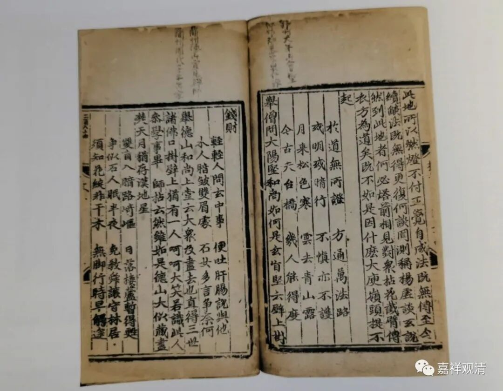
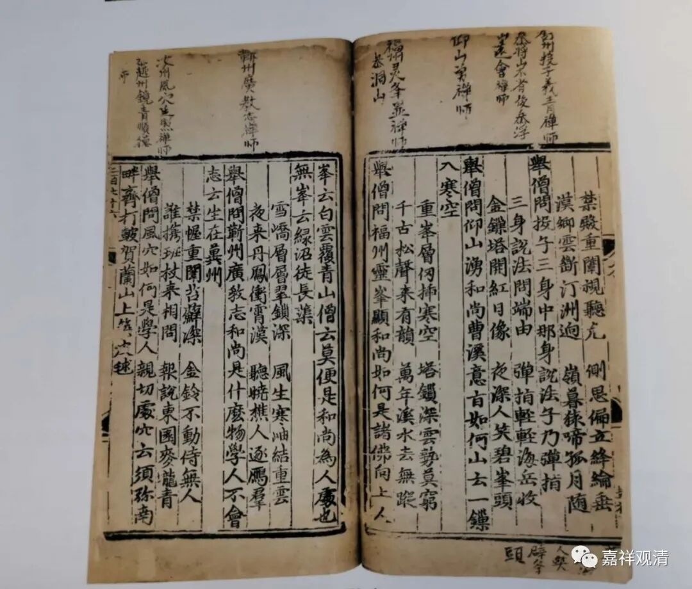

——投子义青禅师的嗣法因缘

前几天参加了德宝的一场古籍拍卖会，会场有一本元刻本的《投子青禅师颂古》一卷，起拍价八万，最后拍出了十五万。说实话，我认为这个价格绝对有上升空间，因为目前看来这书是海内孤本。

投子义青禅师（公元1032-1083），俗姓李，北宋舒州（今安徽安庆）人，七岁出家，十五岁“试《法华》得度”，应是凭背诵《法华经》而出家。受具足戒后，后先学唯识，后学华严，再参宗门多方，最后在浮山法远禅师处锤炼悟入。

但据记载，义青禅师嗣法（继承的法脉传承）却不是在浮山法远禅师门下，而是嗣法于大阳警玄禅师。浮山法远禅师曾经问学于大阳警玄禅师，但嗣法于叶县归省禅师。大阳警玄禅师要求浮山法远禅师为他找一个嗣法弟子，并做了一番授记（预言），而此授记恰恰应在投子义青禅师身上……

所以浮山法远禅师就把大阳警玄禅师的信物交付给了投子义青禅师，令他接大阳警玄禅师的法脉。所以，在禅宗灯录里（传承史上），浮山法远禅师法嗣（门下得法弟子）中并无投子义青禅师，大阳警玄禅师法嗣则有投子义青禅师而无浮山法远禅师。这也是一件比较有趣剧情了——浮山法远禅师做了二传手。

但日本曹洞宗名僧道元禅师却据其师说，说投子义青禅师曾得大阳警玄禅师面授，是亲承的得法弟子……

这是又要劳烦考证一番吗？在这篇小文章里就不继续进一步地探究了。

