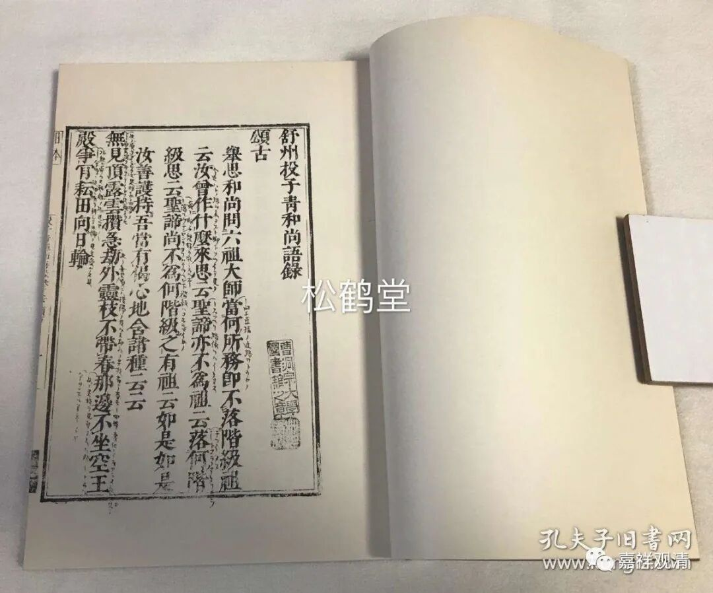
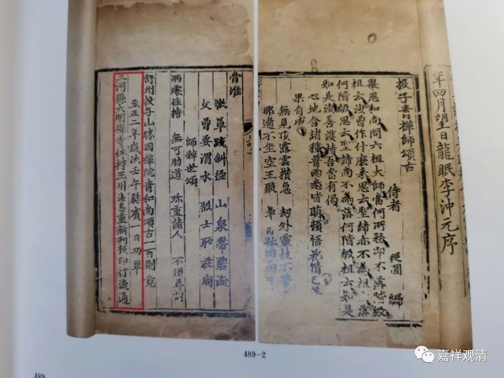
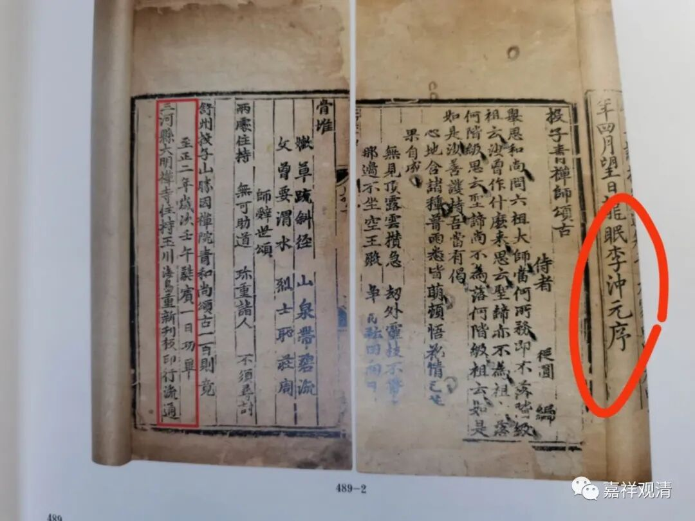
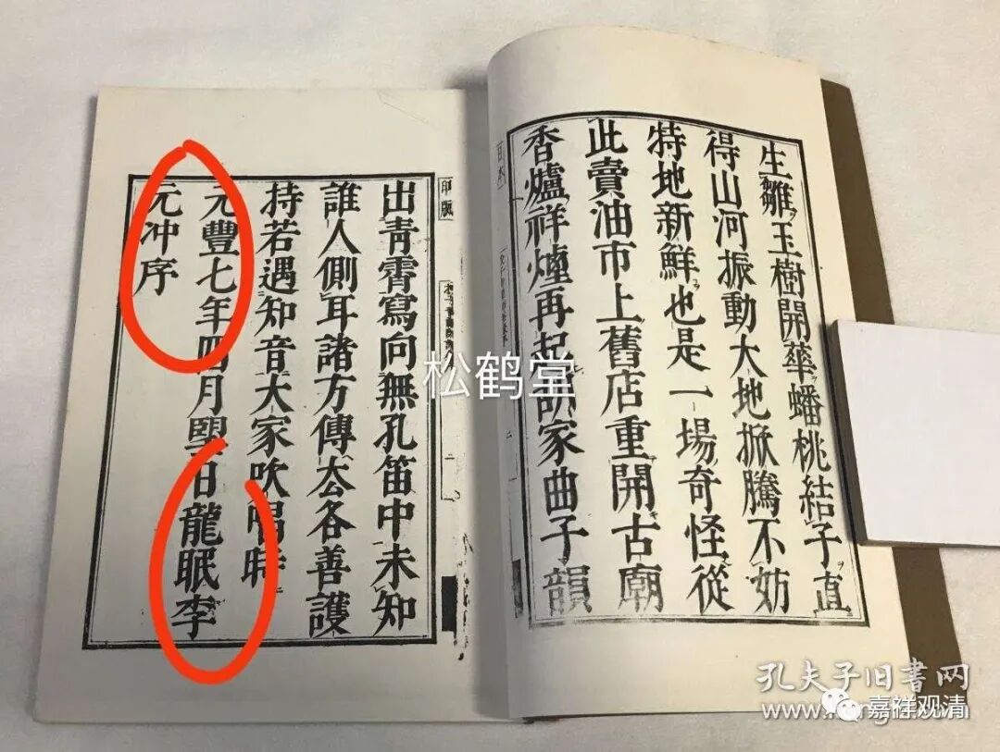

《投子青禅师颂古》与龙眠李元冲之作《序》

《投子义青禅师语录》，又作《舒州投子青和尚语录》、《投子青和尚语录》、《舒州投子青禅师语录》，上下两卷，收入《卐字续藏经》。孔夫子上也曾有个《日本江户本》出售。

上周德宝拍卖成功的《投子青禅师颂古》一卷，实即此《投子义青禅师语录》的下卷《颂古（一百则）》。

按：此件拍品颇有可资于考证者。

《投子青禅师颂古》有序言，为龙眠李冲元撰。

李冲元，字元中，舒州龙眠（今安徽桐城）人。熙宁三年（1070）进士，与李公麟（1049-1106）、李亮工同时登第，号为“龙眠三李”。此李冲元为投子义青禅师之同乡、同姓（投子义青禅师俗姓李），而李公麟据考证为投子义青族兄，有这几层关系，李冲元为投子义青禅师作序就很自然了。

《投子青禅师颂古》卷首之李冲元序言，与《投子义青禅师语录》之卷首序言全同，当为单行之《颂古》沿用了《语录》的序言。而其中有异者，《续藏经》本《投子义青禅师语录》与今见之日本江户印本，皆谓“龙眠李元冲序”。

而李冲元，字元中，实非“李元冲”，故《续藏经》本及《江户本》此处皆误！

此元刻本（至正二年）《投子青禅师颂古》或可稍勘定《投子义青禅师语录》之误。

