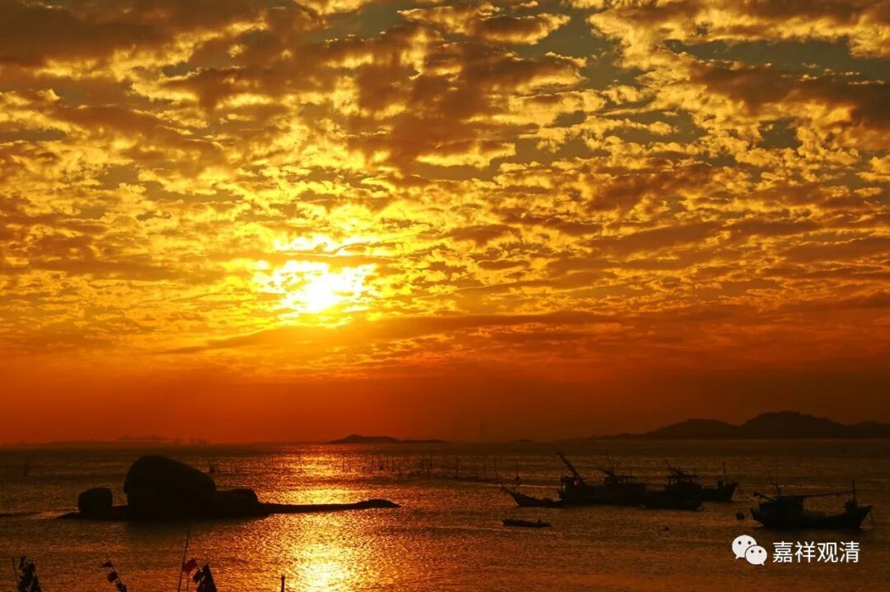
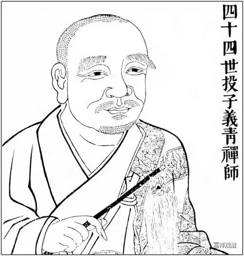

与禅宗内部宗派意识的高企

日僧道元为曹洞宗门下巨匠，道元传师（天童如净）之口义，谓投子义青曾得太阳警玄之面授，其门下亦为其辩证非一，但鉴之史传，不论是说大阳警玄面见过还是指导过投子义青皆无可能，我们列一下大阳警玄、浮山法远、投子义青的生卒年便知——

大阳警玄（公元948－1027）

浮山法远（公元990-1067）

投子义青（公元1032-1083）

大阳警玄之终世之时，投子義青尚未出生，此二人是绝无可能相见的。

其实《投子义青禅师语录》里已经很直白了。

禅宗规矩，最初开堂出山，必须公开表明师承，投子义青禅师最初住持白云山海云禅院，开堂之初，投子义青禅师便谈了自己师承：

《投子青和尚語錄》卷上：

“**此一瓣大众还知来处么？** （这一瓣香来处，是指自己的传承来处。）

**非天地所产，非阴阳所成，威音已前不落诸位，然灯之后七佛传来，直至曹谿分派大夏。** （这是略说禅宗传法。）

**山僧向治平初，在浮山圆鉴禅师亲手传得，寄付其宗，颂委证明。** （这是说自己在浮山圆鉴禅师处学得。）

**慈旨云：代吾续大阳宗风。** （这是说，浮山圆鉴禅师命其接续大阳警玄禅师法脉。）

**山僧虽不识大阳禅师** （这一句明说没见过大阳警玄禅师），**凭浮山宗法识人以为续嗣。** （凭浮山圆鉴禅师指示继承大阳警玄禅师法嗣。）

**如此更不违浮山圆鉴禅师法命，付嘱之恩，恭为郢州大阳山明安和尚。** （意思是，我这样听师父话，所以继承大阳警玄禅师法脉。）

**何故？父母诸佛非亲，以法为亲！** （亲师父说了算。）”

再看李冲元（同时、同乡、同宗）的序言，也是满篇都在大谈特谈投子义青师从浮山禅师而嗣法于大阳警玄禅师一事，可见此事全无可疑之处。

道元禅师之所以拒绝这个“故事”（历史事实），是和禅宗鼎盛时期的宗派意识抬头有关。道元禅师自身为曹洞宗巨匠，大阳警玄禅师也是曹洞宗，而浮山圆鉴禅师为临济宗。若依《投子语录》之故事，则成为，曹洞宗的法脉要靠临济门下来救济（过继来一个高僧），这对于旁观者可能会留下曹洞宗无人的观感，所以道元禅师及其门下在这件事情上要“强出头”，其实是为了自宗争地位、争面子。

