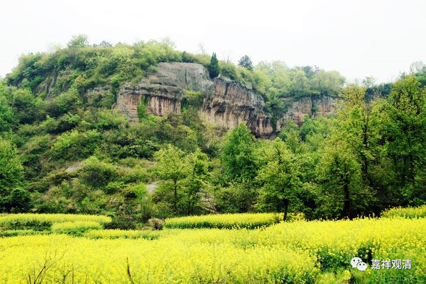

**《微课佛教史》93·3**

从凉州城偷偷跑（tao）出来，玄奘法师来到了瓜州——就是今天的酒泉市，也是我们国家的一个卫星发射基地，对吧？酒泉市当地的刺史独孤达见到玄奘法师非常高兴，还留他讲经，也帮他去安排西行的路线。

突然之间，这个时候就接到了从张掖发过来的“文件”，说是要抓捕玄奘法师，罪名按照今天的说法就叫偷渡。

玄奘法师在瓜州待了这几天以后呢，也结识了一些新人，也有人崇拜他。瓜州当地的一个公务员，就当着玄奘法师的面，先把要抓捕他的公文给撕毁了——哇！这胆子也太大了。他告诉玄奘法师：“你赶快走吧。我现在先帮你把这份公文撕了（就说没收到），但是接下去不知道会不会再补发来一份或者两份公文的。而且你在这里待的时间再长的话，我也瞒不下去了。”

发现事情已经越来越严峻，玄奘法师就又从瓜州离（tao）开（zou）了。走在路上的时候，碰到一个应该是新疆人吧，反正不是汉人，玄奘法师就得到了这名外族人石磐陀（有些地方把他当作孙悟空的原型，这差别有点远啊！）的帮助。玄奘法师给他授了戒，然后就一起到了玉门关……

我们知道玉门关就在敦煌的西面一点。到了玉门关之后呢，石磐陀也回去了，他说不再帮忙了。此后玄奘法师就自己一个人独行于沙漠之中。我们大家都去过敦煌，就知道敦煌这里都是沙漠。玄奘法师这一路上是非常的狼狈，但是他又幸运地得到两个人的帮助，奇迹般地走出了沙漠……

再以后的故事就更多了。

今天我们先讲到这里吧，玄奘法师已经到了敦煌，接下去就是徒步穿越大沙漠了。

