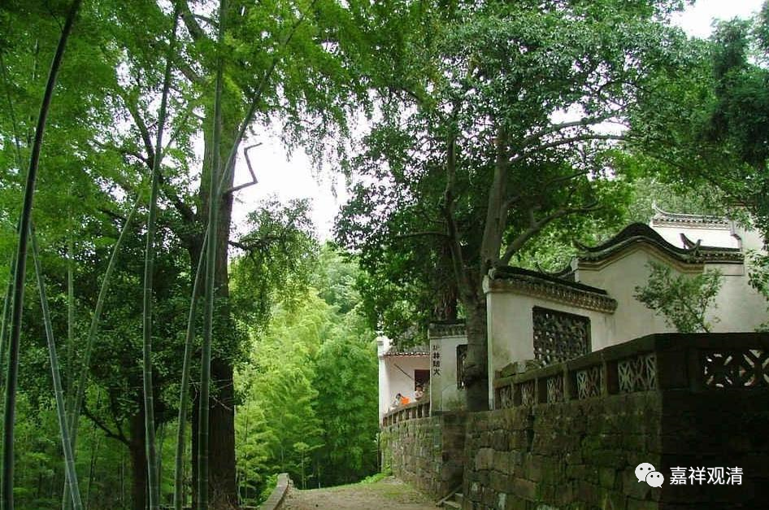

今天是七月二十八，下午，下着小雨，我正在诵经，有一辆车开进寺院，下来五个老人……他们来了！

这是贵溪（属于鹰潭市）的居士来朝拜寺院的，今天来了十一个。

贵溪离这里隔了一个整个景德镇市，我估计最近也要离我们一两百公里，不知历史上出于什么原因，每年七月二十八，都会有一批贵溪的老居士老远地赶来我们这个山路尽头不出名的小庙来烧香。虽然我们寺院也有从海南、四川、甘肃来的居士，但这种步行加长途车并且有特定日期的朝拜，贵溪的这些人是独一份的，给我留下很深印象。

也许由于疫情的原因，今年来的人很少（11个）。往年多的时候要来四五十人，把我们的地藏殿或者观音殿都睡满。水泥路还没打通的时候，他们是扛着大旗（很有仪式感地）从山下浮梁方向的那条路走上来的。很有趣，一群老人，会有人打着红旗朝山的。

据说以前他们来庙里朝拜，最high的时候会“带戏来”。我没有问清楚“带戏来”是带着戏班子来还是他们自己来唱戏，但我是遇到过他们带着胡琴鼓板来的（最近几年都没见），那一次，晚上他们玩的很high，但限于自己唱（我录过视频，老人应该见过），并没有出现我想象中的“在菩萨面前搭台、唱戏”的情况。据本地居士说，原先有“在菩萨面前唱戏给菩萨听”的，但我没遇上。

去年这时候正好有个黄梅戏班子在村里“社戏”，我就恢复了一下“古制”，点了一堂《观音出世》，村民来了很多，我也在微信“直播”了。黄梅剧团有任自己也在做直播，网上也有打赏的。

那年在老的饭堂里面，老居士们手里的乐器可比嘴上唱的响，有点闹，据说唱的是赣剧，反正我是一句都没听懂。我后来问了黄梅戏班子的人，他们说“赣剧属于小剧种，黄梅戏是大剧种”，颇有点不屑谈起……

这些贵溪来的老“居士”很“民间”，管菩萨叫“观音老母”，也不懂啥叫“归依”，那年给他们讲了归依、讲了“佛教修行之路”，后来那一拨都参加了归依仪式。我不知道他们听懂多少、有多少人听明白，在我这边已经尽力讲得符合他们的理解力了。

其实从昨天起我们就在“等”他们，还怀疑疫情会不会影响这个“传统”。今天，“传统们”一如既往地到了，不知道这一“传统”还会延续多久。有统计说，一般这类“团队”生存期是30年，不知道他们会延续多久……

