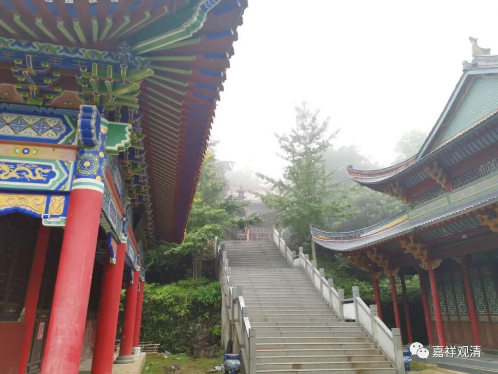
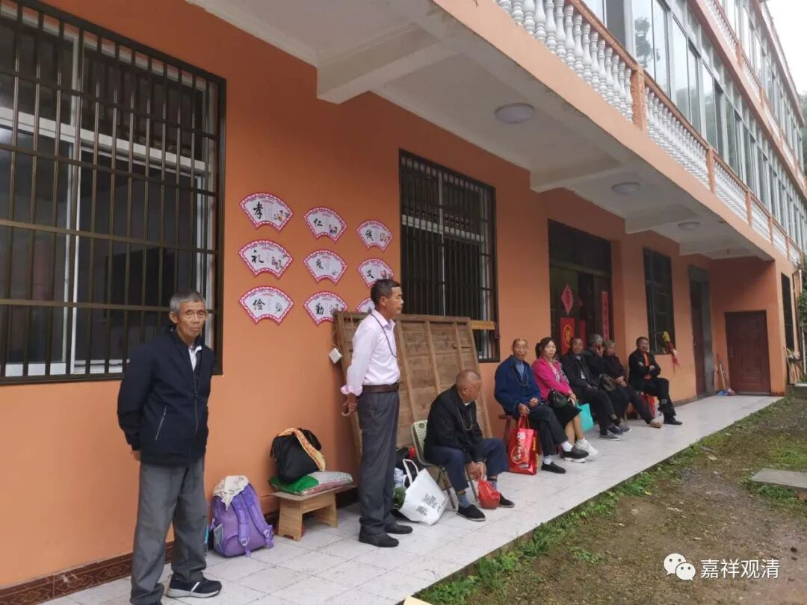
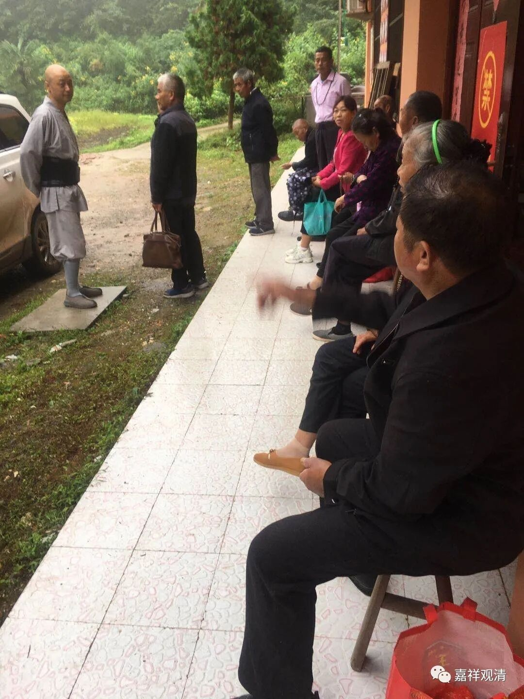
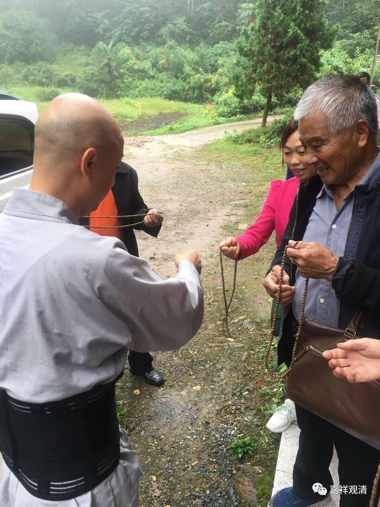
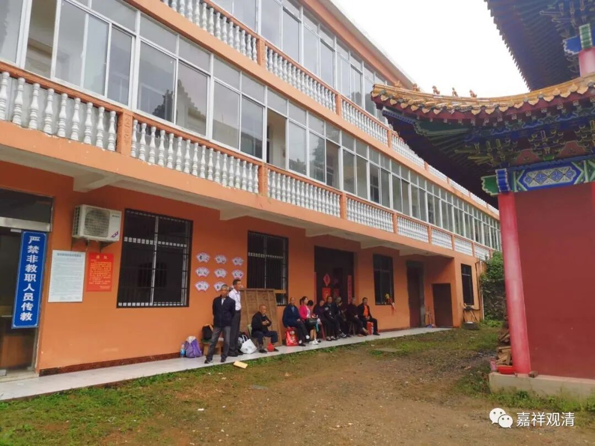
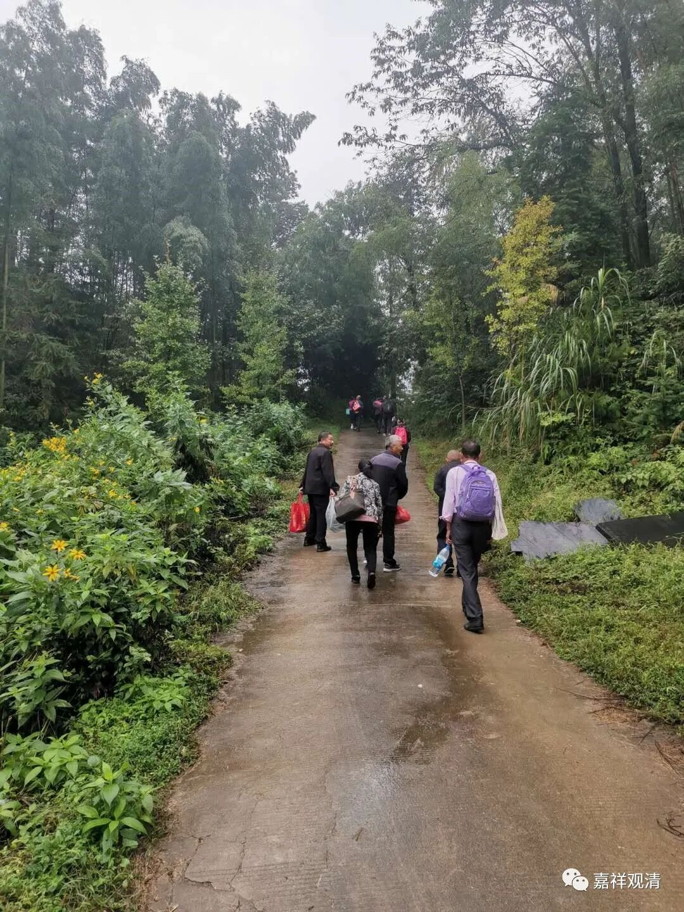

今天早上又和贵溪的居士们聊了会儿，原来“传统”比我想象的要古老。

这次有一个八十三岁的老先生已经连续来了30次了——五十三岁开始，今年整整满三十年了。

另一个老先生说，他小时候“国民党那时候”（也就是解放前就来过，那时候可很小啊），路上要走大约半个月，走路，还要坐船，顺流还轻快些，逆流就要撑竹篙、要拉纤了。他们说，很辛苦啊，顺风顺水要好些。

后来，大约要走一周左右；再后来，坐车到鄱阳，再到乡里，走上来，路上大约需要两三天；前些年改直接走景德镇，从浮梁境内走小路上山，免了去鄱阳县绕个路，裁弯取直了；前年头里，鄱阳和景德镇的“毛细血管打通”，村路接上了，就不再爬山，坐班车到莲花山浮梁那边的山脚下，再包个小车上山——这样，现在从出发到庙里，八个小时就到了。

送他们每人一条念珠

今年有几个八十多岁的老人没来，让他们“把香带来”，意思是替他们还愿。他们中一个最年轻的（大约四五十岁的女居士）说，“莲花山的菩萨很灵，我们许了愿一定要来还愿的。”

龙智师说：“据说先前某处有妇新产一子，忽然啼哭不止。妇特到山上许愿，如果我儿不再哭了，我就年年拉戏来唱。不知是不是就贵溪的。”结合唱戏的那段，还真有可能。

我问了贵溪这帮人的“居士头”（口音下的赣普我只能听个大概），他的意思，唱戏应该是他们自己娱乐的，我估计是因为一路走过来蛮远，带上敲打的家伙事儿，一路上也有个消遣（毕竟“国民党那时候”要走半个月呢），以他们的经济情况，不太可能请一个戏班子来搭台唱戏——农闲的时候这边“唱一台戏”至少要大几千，他们是花十几块钱吃个饭都嫌贵的。

一早，上完殿、吃了饭，和我聊完，他们就下山“拜玉观音”去了，他们联系的车也在那里等着。车不开上山，他们走过去“拜拜”，表示虔诚。

他们是非常自发的信佛，管我不叫“师父”而叫“老板”，找不到我的时候，追着义工问：“你们老板呢？”

“老板”在房里打字记录他们……

