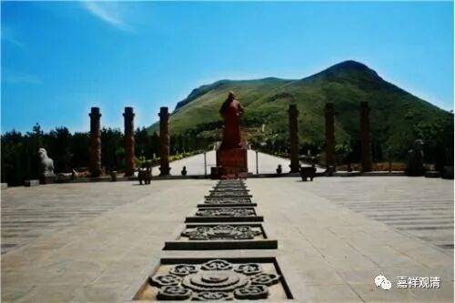

**《微课佛教史》94·2**

第二条路线就是法显法师回国走的南路，也就是海路。走这条路的人当中，早期比较有名的就是法显法师，还有后来的义净法师。真谛三藏也算是走的这条路。

在唐朝的时候，走这两条路的人是比较多的，但走海路的相对少很多。

第三条路线，是在玄奘法师回国以后才被打通的，就是吐蕃的这条路，是从青海西宁这一路经过青海湖到达拉萨，再从拉萨经过尼泊尔去到印度。这条路后来就成为中国官方使节去中印度的一条主要的路线，比如后来的王玄策就是从这条路去印度以及回长安的。

王玄策这个人呢，在中国历史上或者说在大唐和印度的历史上，在那一段时期里面还是蛮重要的一个人。他本来只是一个县令级别的官员，然后唐太宗派他出使印度（他先做为李义表的副使，后来担任正使），他出使以后发生的一些事情其实对当时的中国和印度历史都产生了很大的影响。他后来到吐蕃去借兵，还把当时中印度的国王都给抓回来了。

我记得好像前一段时间有播放过一个电视剧，专门讲王玄策的，好像是叫《大唐御使王玄策》，我也没太注意。后来成龙拍了个片子《功夫瑜伽》也有相应的史实在里面。

王玄策这个人在中国和印度历史上，真的是蛮值得记一笔的。当时印度的戒日王死了以后，曾经在国内出现过内乱，然后新的国王（原先的一位将军，阿罗那顺）上位以后，脑子一热，把大唐使节的驻地给洗劫了（相当于我们今天的“中国大使馆”被新国王给端了）。王玄策被囚禁，后来逃了出去，到吐蕃去借兵，文成公主不是在那边吗……

实际上借来的兵力好像也不多，但都是骑兵（这是关键），又去尼泊尔借了兵……带着三千铁骑就下山了……就直接冲到印度的首都，把人家的新国王阿罗那顺给抓了（朱棣那次“靖难之役”的用兵和这个也有点像啊，路上不纠缠，直接斩首行动……怀疑道衍禅师就是学的王玄策【坏笑】），献俘长安。李世民也没太难为他，没杀，封了个官，最后给他搞了个石像杵在昭陵，算是他一生里的一件大事。

这个事情也是挺厉害的，王玄策在出使之前的等级并不高，只是个小等级的官员。

那么这条路呢，是继玄奘法师以后走得比较多的一条路线。我曾经不是很仔细地查了一下，王玄策走得最快，好像是只花了三个月就从长安到了中印度。我记得自己不算是很仔细地去查过……这条路的确是比较直接的。

海路其实也比较危险的，玄奘法师那条路也是艰险倍至。这样看起来，唐初的时候，最快捷的一条路实际上是从长安经河西走廊的一部分到达西宁，然后从西宁到拉萨，再经尼泊尔去到印度。这就算是第三条路。

