佛道儒三家的“三宝印”

佛教进入中国以后，给中国的文化带来很多新鲜的“材料”，导致中国文化开始大量借鉴印度佛教元素。上次我们聊到过“斗姆”。道教的斗姆来源于佛教的摩利支天，今天汉地佛教已经很少见到供奉摩利支天（日本摩利支天信仰还很兴盛，我们之前也谈到过），但道观甚至城隍庙里的“斗姆”却很常见。

佛教有“三宝”一说，最初佛陀释迦牟尼在鹿野苑仙人堕处给“五贤者”（后来就是最初的五比丘）开演四谛（苦集灭道），不久后，五人都证了四果阿罗汉——此时，在大地上最初有了“佛法僧”三宝的出现。佛教并以是否归依三宝（依靠大师佛、依靠引领大众趋向于解脱的教法，依靠修行路上的看护）来作为判定是否为佛教徒的标志。

佛教传入中国以后，的“三宝”定名影响了道教和儒家，道教先是举出“三清”来对应，《济公传》里经常说济公是“兴三宝、灭三清”，可见在民间这就是对称的。

大概在明以后，“三宝”这个词道教也用了，而且儒家也用了。借用佛教的思路，道教的三宝是“道经师宝”，儒家的三宝是“儒书贤宝”。

我们来看看三家各自的“三宝印”。

首先，佛教的三宝印：

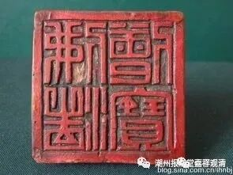

佛法僧宝（木印）

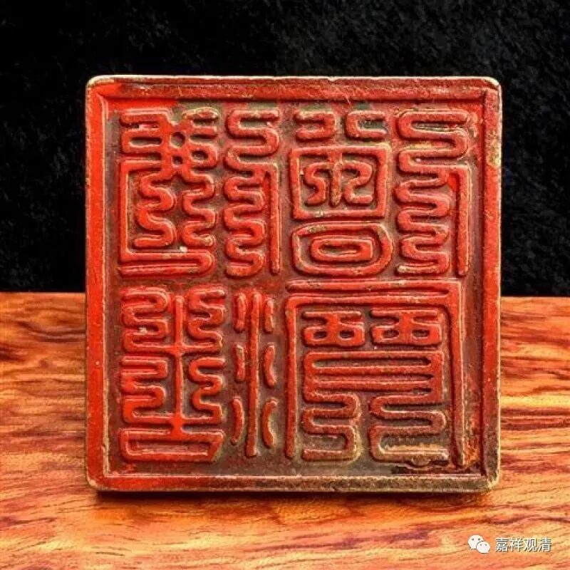

佛法僧宝（铜印）

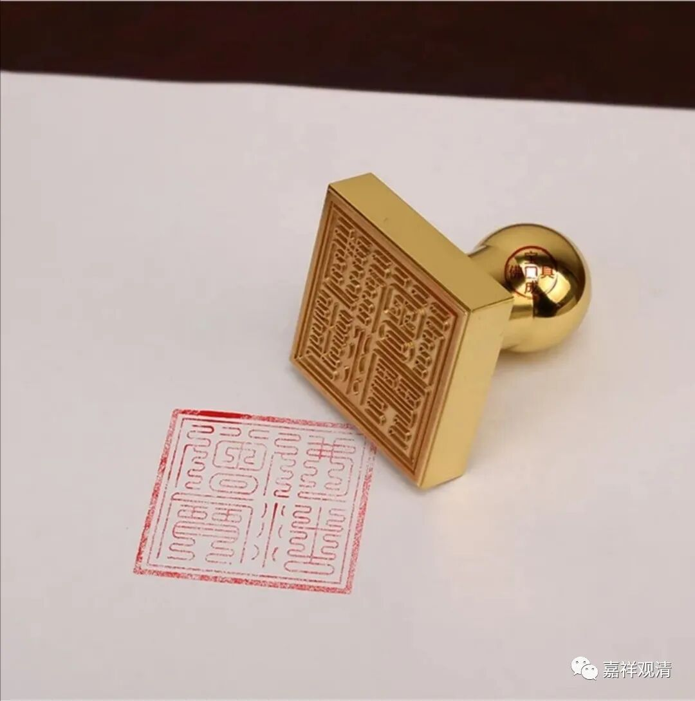

佛法僧宝，铜印

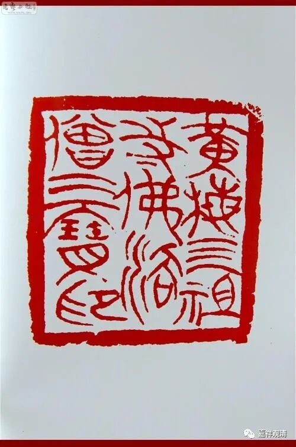

黄梅三祖寺佛法僧三宝印

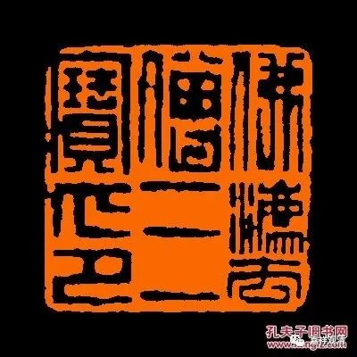

佛法僧三宝印

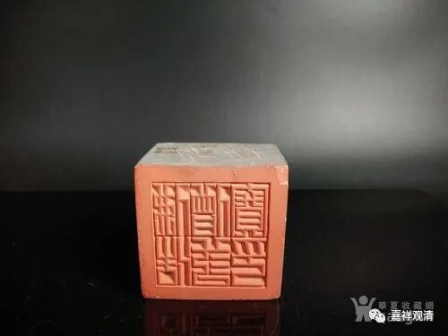

佛法僧三宝印（石印）

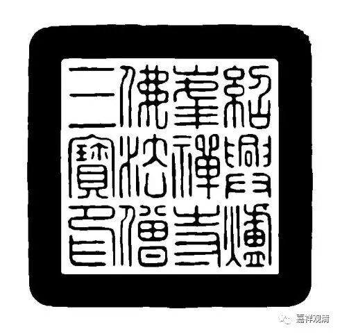

绍兴炉峰禅寺佛法僧三宝印

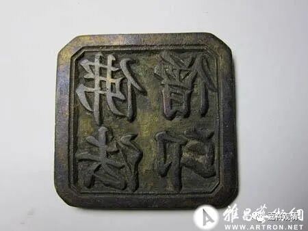

道教的三宝印，道经师宝:

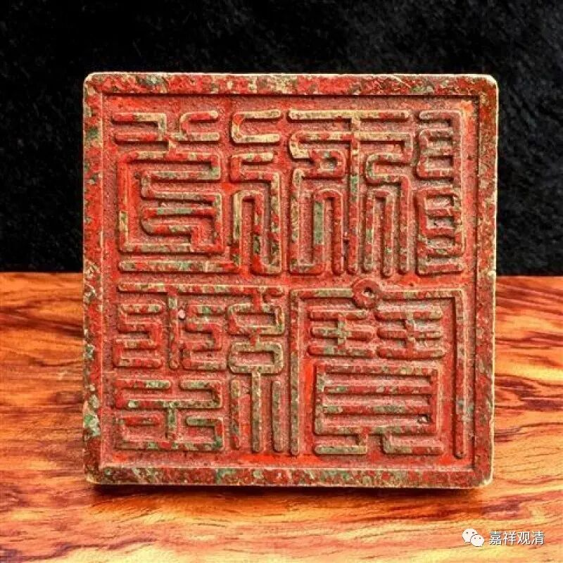

道经师宝，铜印

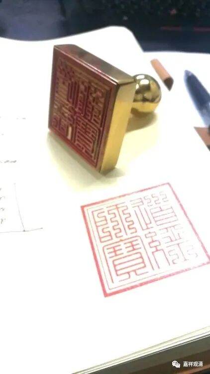

道经师宝，铜印

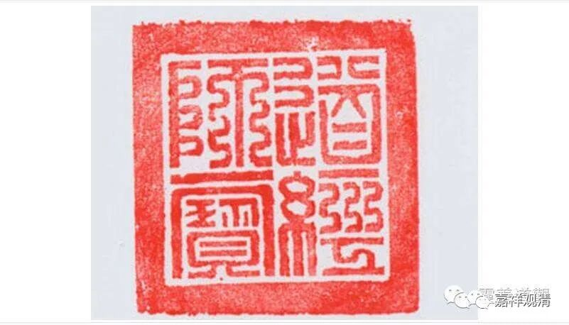

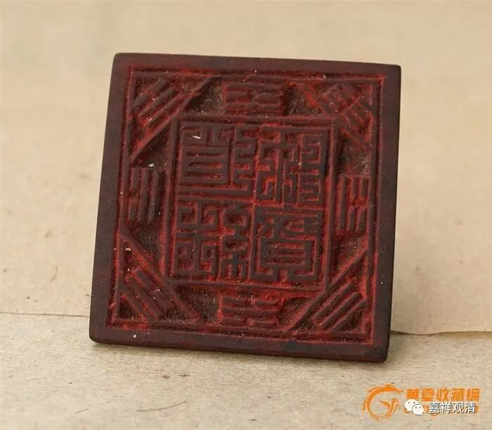

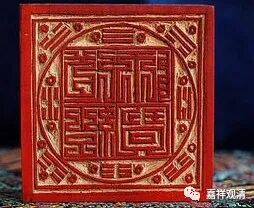

道经师宝，木印

儒家的三宝印，儒书贤宝：

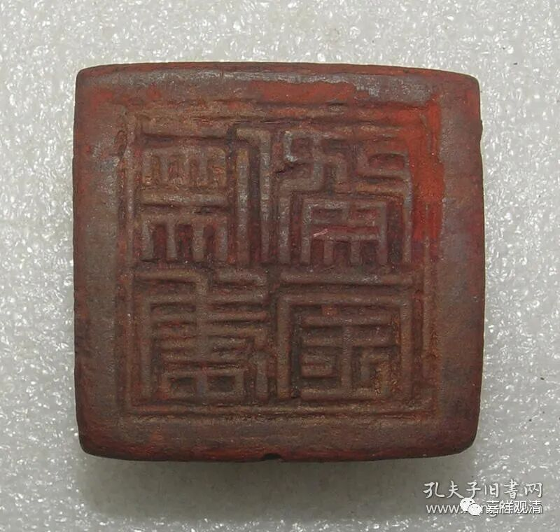

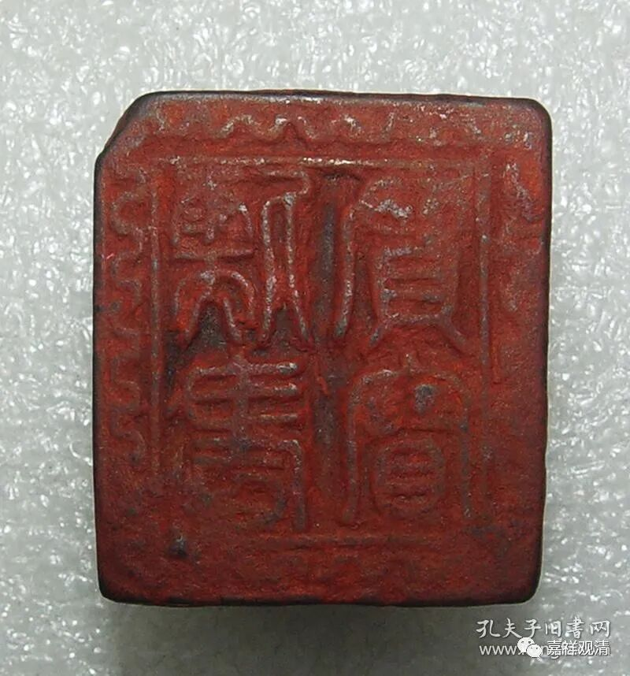

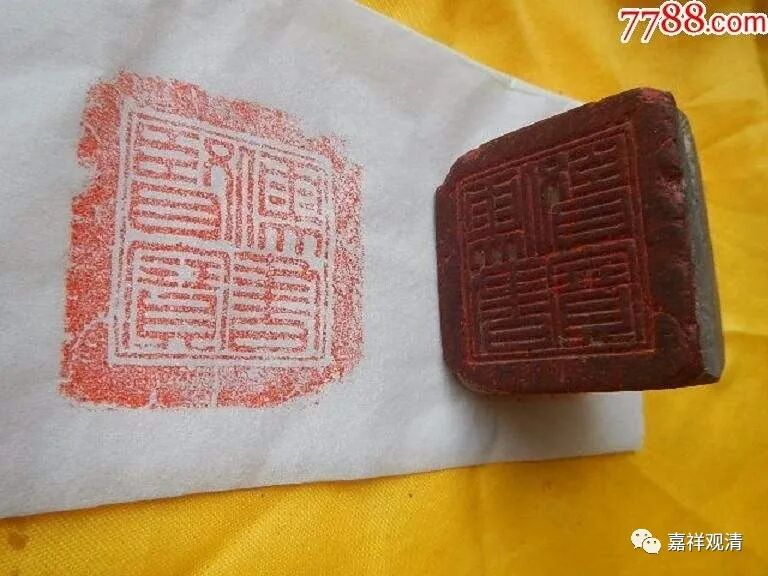

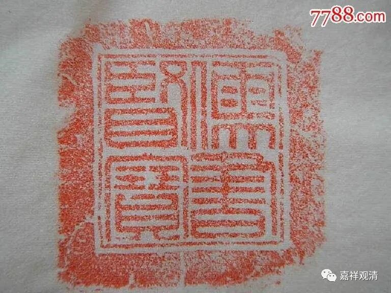

三家的三宝印，是不是很有趣？

