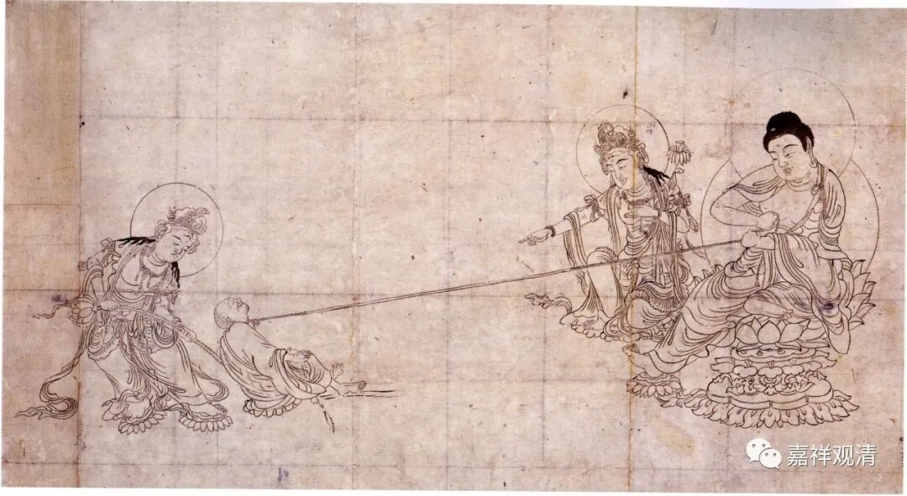
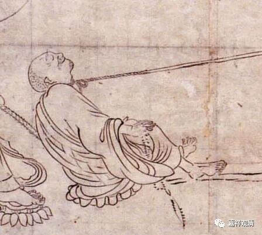
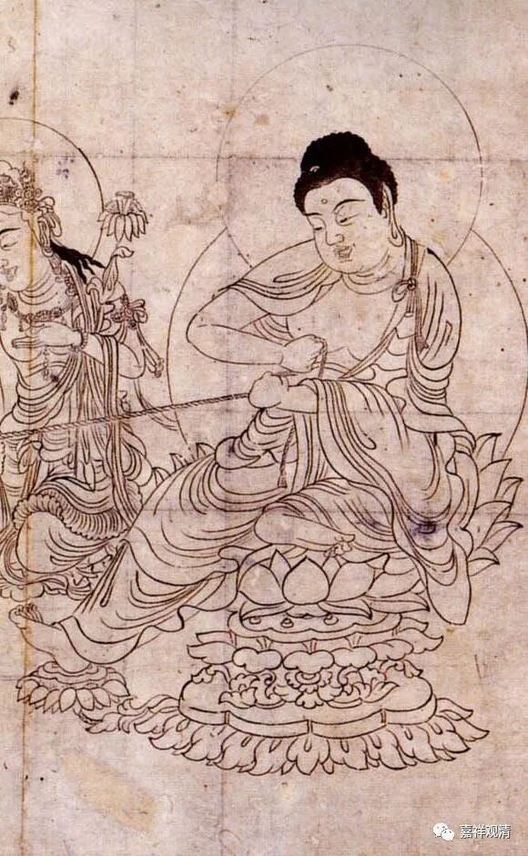
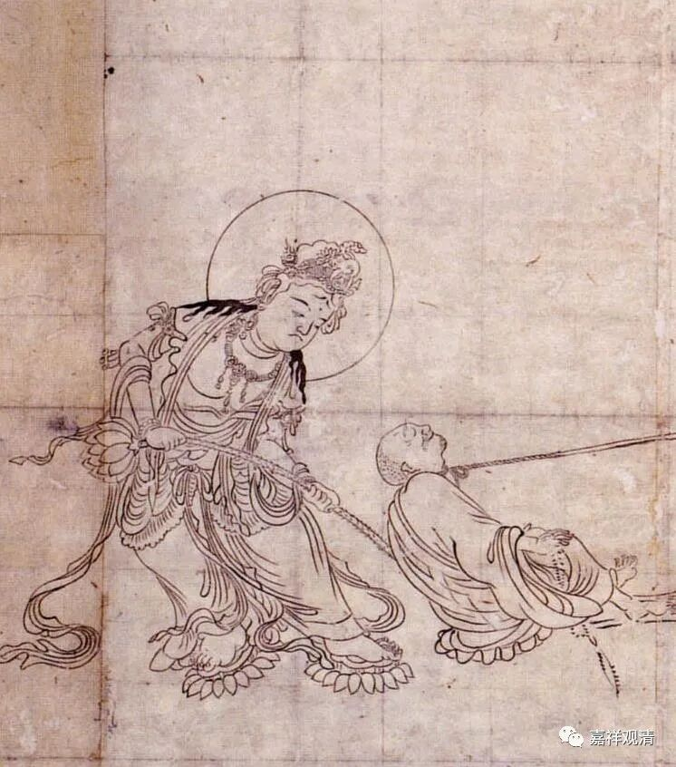
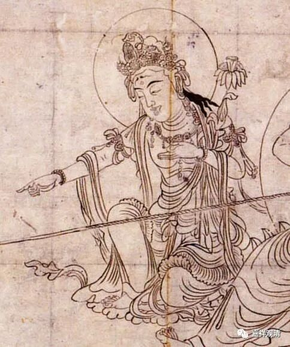
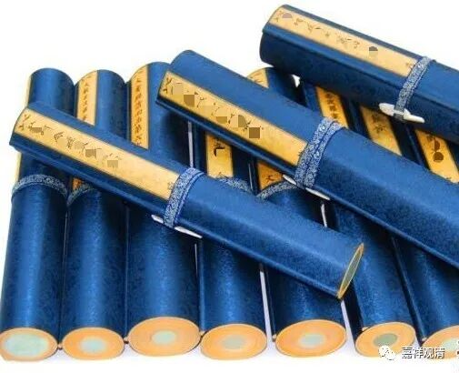

这张图，叫《玄证本阿弥陀钩召图》，是日本国宝级文物，平安时期（794年-1192年）所画。

画面里，西方三圣（阿弥陀佛、观世音菩萨、大势至菩萨）不复以标准的庄严形象示人，而是生拉硬拽，救度一个僧人。那个人……应该就是我吧。

画面很生动：

和尚（我，就是我）脖子上套着绳索，

绳子的一头在阿弥陀佛手里，老佛爷使劲在拽；

观世音菩萨（有说这是大势至菩萨，但看头顶上有佛像，这个应该是观世音菩萨，或者称观自在菩萨）在使劲推；

大势至菩萨在边上出主意、喊号子，有人说是在斥责那个和尚，也可能在开示啥。

整个画面和人物都表现得很传神，“我”的不听话，佛菩萨们的“各种善巧”都表现得很细致。

真的很喜欢这幅画。有两位法师也在找人复制（画）……

我联系了做雕版印刷的非物质文化传承机构，着手把这幅画复制成版画，预计大约十天左右出图，审稿合格后上板，做成佛教的版画。

后续装帧可能做成卷轴装或者经折装。先做几个样品试试看。我准备再刻几个菩萨的名章。盖在几个菩萨图像的边上。那个“我”的边上也准备盖一个自己的章。

做成卷轴的话，前后可以留白，给大家留着题跋用。

一两个月内，希望成品能和大家见面！

