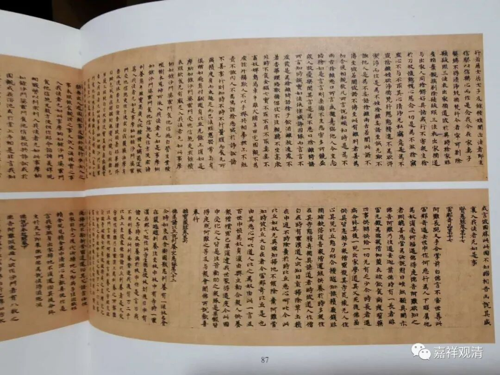
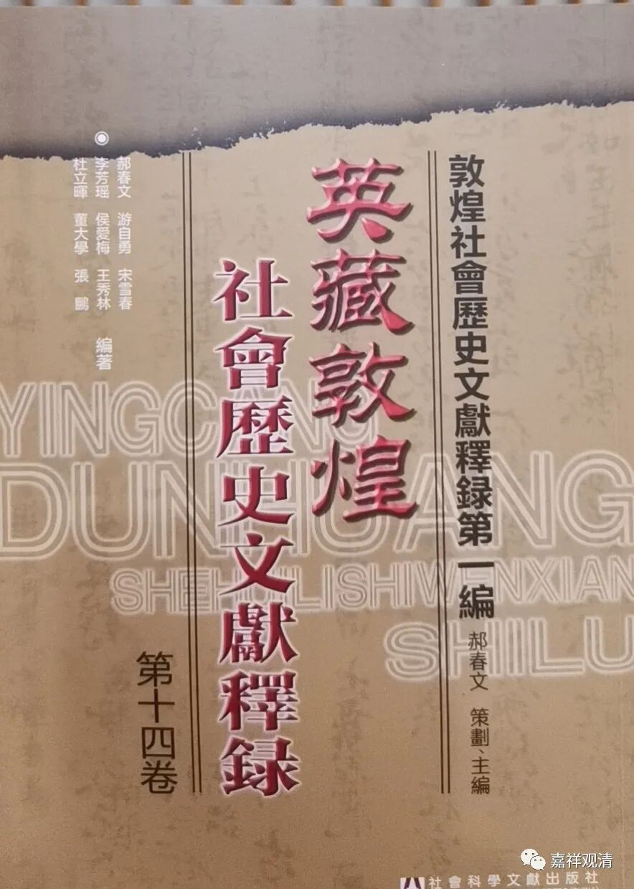

佛门内部的“避讳”习惯

中国历史上一向有个“避讳”的传统，不敢写生人的名号（孔丘），故意地少写一笔；乃至皇上的名字，要避讳的话就要改字。因为“李世民”，所以“观世音”也简化成“观音”；因为有“李治”，所以“治国”就变成“理国”，因为皇帝的爷爷叫“李虎”，于是老虎变成了“大虫”。

其实佛教里也有类似的情况，比如说在不正式的场合，用到佛菩萨名号或者经论名字的时候，回存心少写几个字，其实就是怕“冒犯”（写下来的字纸将来不好处理），是一种原始的“避讳”。比如我在请佛像，自己登记的时候就会出现类似这样的文字：黄文一张；白玛哈三幅；日本财一尊；大势一尊；阿弥一窟……

有些敦煌文献也有这样的情况，满纸的经论名称全都漏字，这里千万不要误解为抄写的人没文化，而要理解为这是一种佛门内部的避讳习惯，是故意的省略。

敦煌文献《斯二七一二背·沙洲诸寺付抄经历》就是一个代表，举里面的一部分做例子（【】内是我补齐的。）

“……

大云寺：《阿毗达摩【大】毗婆沙【论】》……《摄大乘【论】》……《**般【若】灯** 论》……《阿毗昙八揵【度论】》、《舍利弗【阿毗昙论】》……《品类足【论】》……《大智度【论】》……《阿毗达摩显宗【论】》……”

这一件里面，基本每一部都缺漏一两个字，很显然，这是故意的缺笔、有原因的省略，而非真正的错抄。

很可喜的，这里发现了咱们北塔“般灯”大师的名字，难道敦煌的这件也是一个预言吗？

