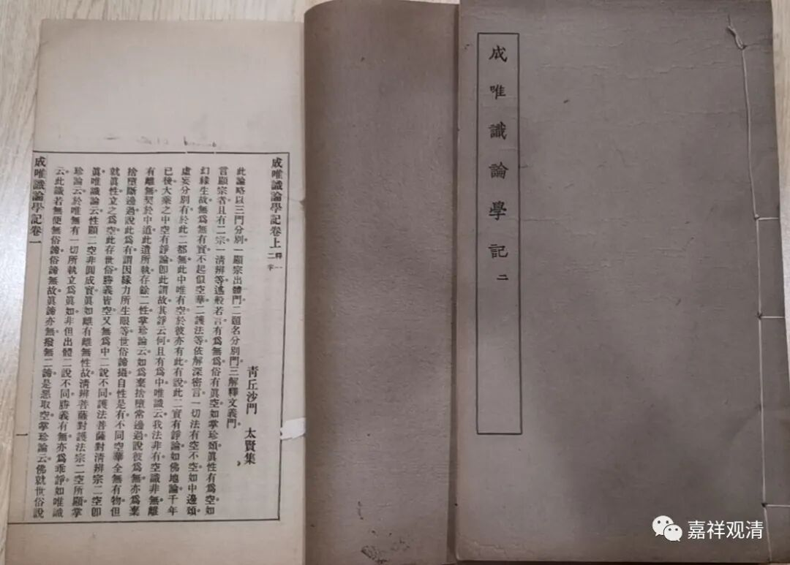
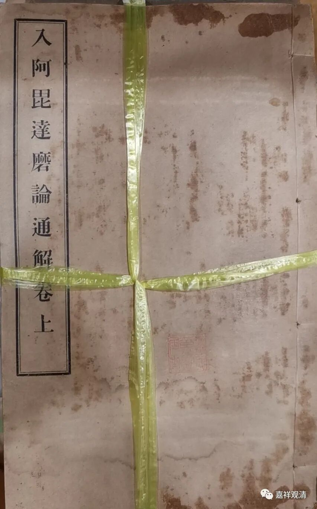
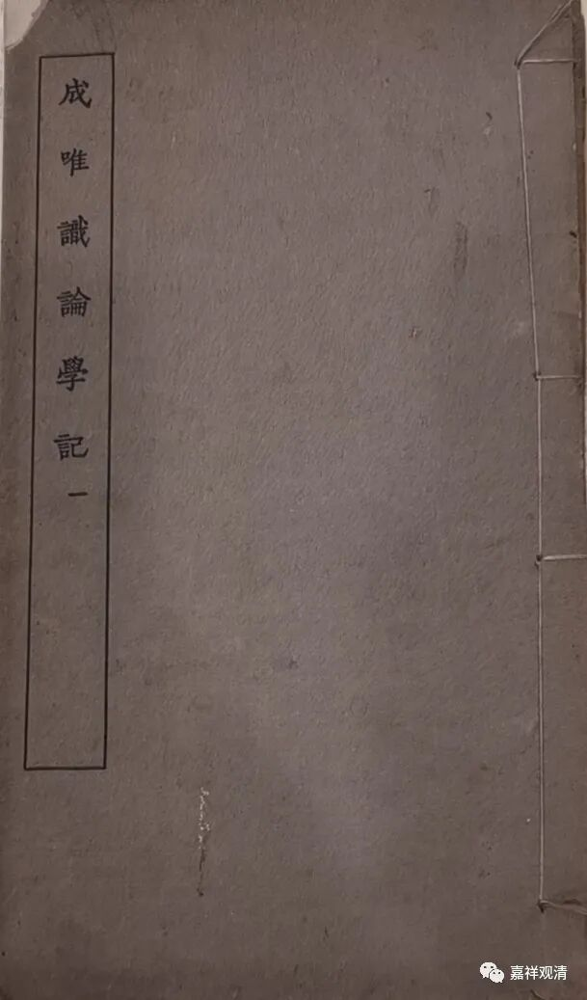
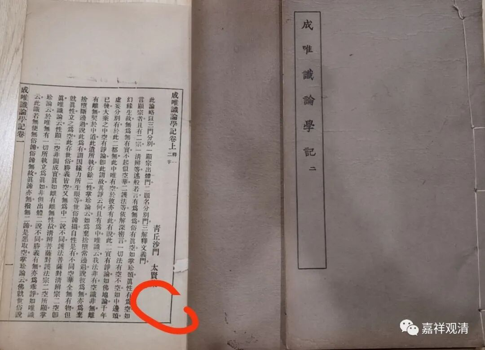

顾老和倪维全的斗气故事

这个月北京德宝的拍卖会上，拍到了一件《入阿毗达摩论通解》（日本·鸟水宝云讲述，小山荣宪补辑，邓镕译）和《成唯识论学记》（新罗·太贤著）。般灯法师和宗杰法师都在讲《入阿毗达摩论》，这一本《通解》或者可以给他们提供一点参考。

这个《成唯识论学记》，我也有个故事。

以前在跟顾老学唯识的时候，会习惯性的看架子上的书，就翻到这本太贤的《成唯识论学记》，顾老那本，第一页盖了一枚印，“倪维全印”。我就问顾老：这里怎么会有倪维全的印？顾老说这还有个故事……

记得就在这个位置

这本书是他年轻时候在书店买的。（那时候他和倪维全都在范古老（范古农先生）那里学唯识，两家的大人也很熟悉。）他买的书里面就有这个印了。（那个时候这个书很少见，连唯识的书都很少见。）后来倪维全去他家里翻书的时候看到了，说这书是他的，说顾老偷了他的。顾老就说这是自己在某某书店买的，你自己的书被别人偷了已经卖到书店里去了，我买的跟你没关系……

后来两个人吵到大人（两家家长）那里去。倪老先生最后总结说：“你的书是被偷了一批呀，这个书是人家买的，已经是人家的了。”

就这样定下来了。

倪维全赌气，说：“那印章是我的！你把印章抠下来给我！”

顾老说：“我自己的书，我为什么要剪坏掉？！”

两个青年为此还不快了一段时间。

……

我问顾老：“那文革以后，这个书怎么发回来了？”

顾老说：“对呀，很多书都不见了，这本倒是发回来了。”

前几年在某拍卖会上，我看到过有倪家人的藏书，那应该就是文革时候被抄没的一部分了。

