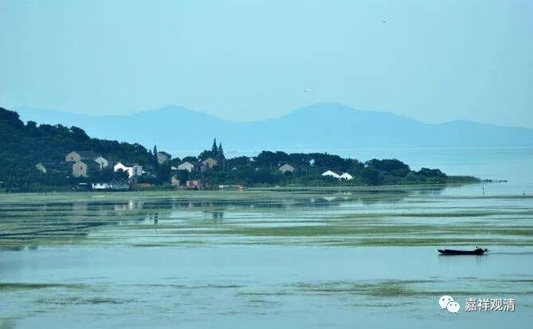

**《微课佛教史》96·1**

我们一点点来谈谈这首诗。

不管义净法师也好，玄奘法师也好，他们都是唐代人。那么在唐以前，包括唐代，都有一个什么情况呢？就是大家一代一代地去往西域或者印度取经。为了能够把真正的佛教带回中国，一代一代的人都是这么做的，都有西行取经的人。

取经人中比较著名的，最早的有朱士行（公元203年～公元282年），中间的有法显法师（334年～420年），最著名的就是玄奘法师（公元602年～公元664年）），之后还有义净法师（公元635～公元713）。在玄奘法师之后其实还有很多西行求法的，义净法师为此专门写过一本书，叫《大唐西域求法高僧传》，大家可以去看看，里面有一大批的人，从各条路去印度取经。

那么，有些局外人可能会认为这不过只是一种宗教热情。应该说，在这种宗教热情的背后，实际上是有一种求法或者求知的欲望，如果我们今天仅仅把它看作是宗教热情，可能是太简单化了。这个背景确实是因为佛教的这些内容真的把大家给吸引了。如果单单是宗教热情的话，那就去到那里磕头就行了。但是取经僧给我们带来的是大量的佛教文化，特别像玄奘法师带回来的，是中国比较欠缺的佛教哲学、因明学——逻辑学等等。

** “晋宋齐梁陈隋间”**，之前是从东晋开始的，历经宋、齐、梁、陈，一直到隋代，都有这样一代一代的人去西行求法。（这是唐人的口吻。）

** “高僧求法离长安”**，取经僧一般都是从北方走的，就是走玄奘法师取经的这条路。长安是当时的国都，他们都离开长安西行，放弃了比较优渥的生活。

** “去时成百归无十”**，去的时候有一百人，回来连十个人都没有。这一句翻译成现代汉语是什么意思呢？九死一生！真的是九死一生，都是踩着前人的尸骨作为路标而前行的，非常非常地困难。

以前可不像今天，今天搞个签证、搞个飞机票就去了。而且今天有很多人在走的时候，后面还有人跟着。所以今天的走，和以前人的走是不一样的。说实话，我看到今天很多重走玄奘路的人，水平和玄奘法师真的是实在没有办法比，差得太远了，这种人怎么说呢？完全是噱头，水平太差了。（有些和尚不是“走玄奘路”，是在“走秀”。*一样的脑子，走十遍也是个半文盲。）

**“后人焉知前者艰”** ，没有亲身经历过的人，怎么知道前人的艰难呢？大家如果去河西走廊的话，可以去看一下。

