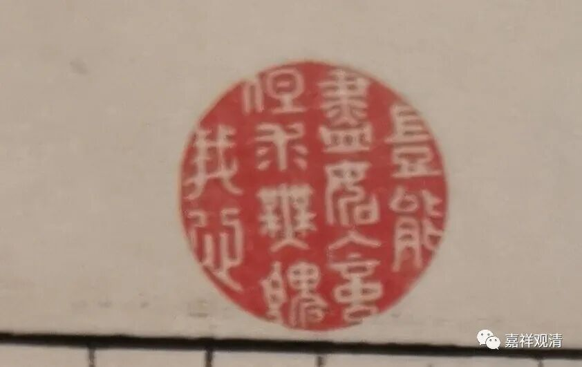
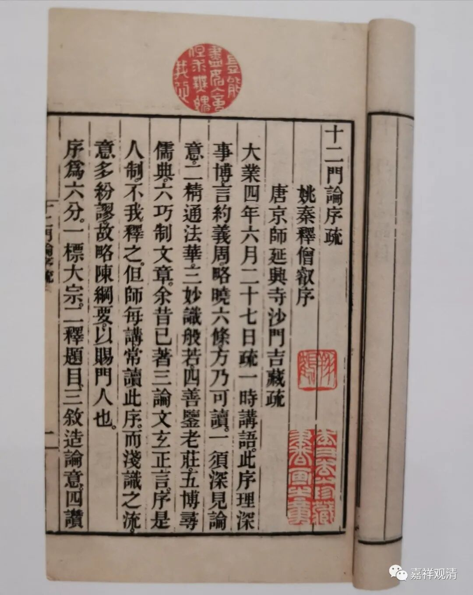
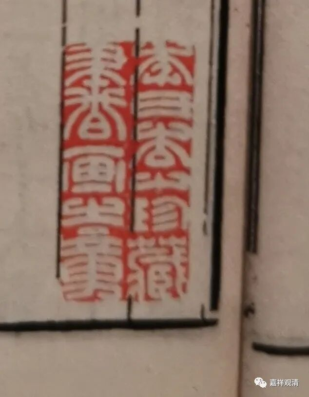
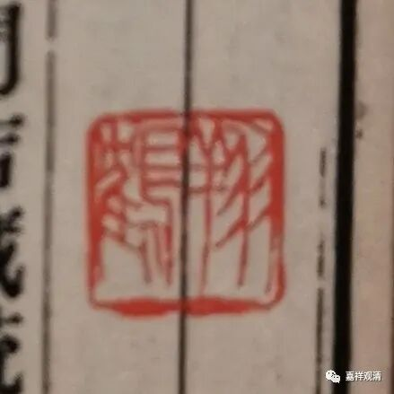
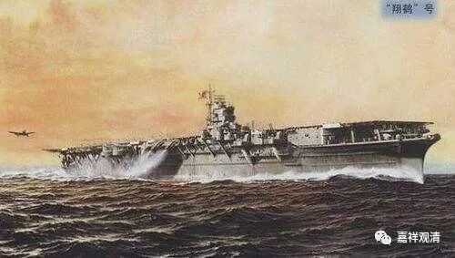

随便翻翻古籍拍卖的图录，看到某拍品上有这样一枚印。

“岂能尽如人意，但求无愧我心。”

最早应该是在高中的时候，听成龙说过这句话，一直很喜欢这句（现在大哥的人设塌了，但这句话并没有过时）。这次又看到，查了一下，原来语出刘伯温。据说林则徐也拿它当座右铭。

有兴趣也去刻这样一枚闲章。

这是一件金陵刻经处版的《十二门论序疏》，三论宗吉藏大师撰。

说起来，第一页的三枚印章里，两枚闲章和这本书都不是很搭。“岂能尽如人意，但求无愧我心”，用在佛教书籍里面，一点儿也不合适。另一枚是“李氏杏山珍藏书画之章”——这本书也不是书画呀。所以，闲章还是得多备一点——前几年我听说嘉兴某大和尚有一千多枚闲章……

另一枚印是“翔鹤”，不知道是不是“李杏山”的名号，

可是“翔鹤”这个名字，对我（这个曾经的二战迷）来说不能再熟悉了——二战日本有艘航母就叫“翔鹤号”，参与了偷袭珍珠港的行动，在之后数次海战中都有出战，最后被一艘美国潜艇炸沉。

考虑多刻几枚印章，准备像乾隆一样疯狂地在书上盖……万一哪一天出名了，这些书也借我的图章能升值不是！

你们谁的书愿意拿给我来祸害？

