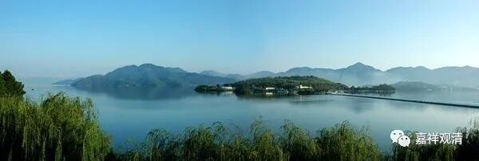

**《微课佛教史》96·3**

** “路远蔽天唯冷结，沙河遮障力疲殚”**，路远那就不用说了，远的话要走几年。这还是在说能走到终点的人，中间还有很多在路上就病死的。大家可以去看看玄奘法师的传记，前面我们已经讲过了，后来他过帕米尔高原，带着大批随从，带着骡马，有很好的补给，在经过雪山的时候都要死将近一半的人。十之四五都死掉了，骡马也死了无数。这还是有强大补给的情况下，如果没有强大补给的，那真的是太困难，太困难了。

一直支撑他们坚持下去的力量是什么呢？是真的为了求法，为了能够把真正的佛法带回来。玄奘法师在印度的时候曾经找了一个人（耆那教的）打卦，打卦的结果说什么呢？说是玄奘法师如果留在印度的话，情况会非常好。虽然回国也很好，但是留在印度的话会更好。但玄奘法师还是毅然地选择了回国。

玄奘法师选择回国，因为他去印度就是为了求法，然后要传回大唐的。这样的求法高僧的热情，真的是非常非常少见，真的非常令人感动。玄奘法师是一个典范，那么还有另外一种，这个我后面再讲吧。

** “路远蔽天唯冷结”**，这个怎么说呢？气候不好，天都被障蔽住了——当时他们要爬雪山。以前又没有知识，不知道什么高原反应、雪线，也就不知道怎么对治……

** “沙河遮障力疲殚”**，沙河，就是指大沙漠。几百里的大沙漠，稍微走走就不知道东南西北了。今天我们带着补给、带着最好的装备、有精确的地图……都难保成功，更别说一千四百年前了……

** “力疲殚**”，缺水、少食、长时间地行走，迷失路途的恐怖，耗尽了精力。而且取经路由于充满了未知（对取经路上的行走来说，再专业的取经人都最多算是业余选手），身心都会处于紧张状态（最初是过于兴奋），实际的体力消耗要比正常（同样的情况下的实验结果）情况下的体力消耗要大许多倍，就像一个拳击手在拳台上，业余选手一般在第一个回合（两分钟）过去以后，就基本上累瘫了，但这个业余选手很可能每天还坚持长跑一两个小时……

        修改于