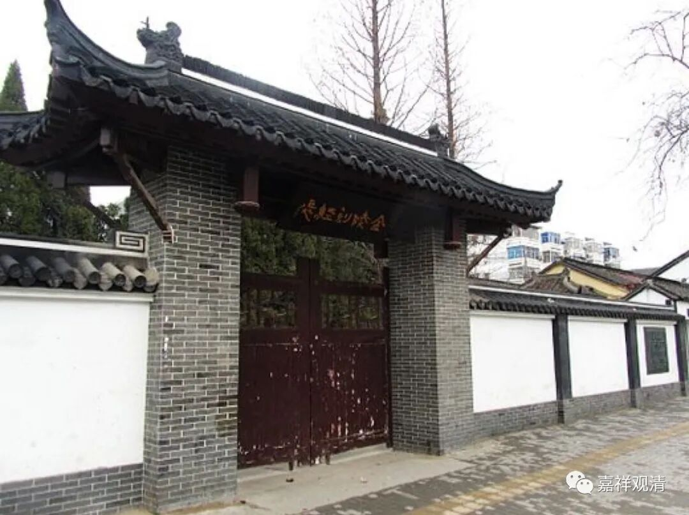
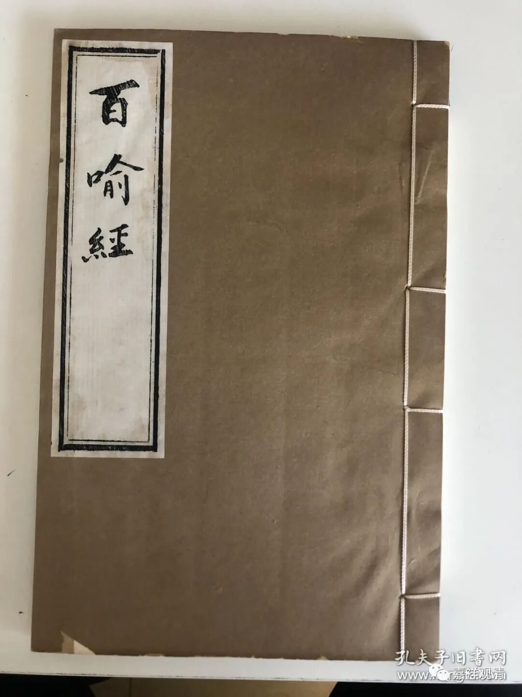
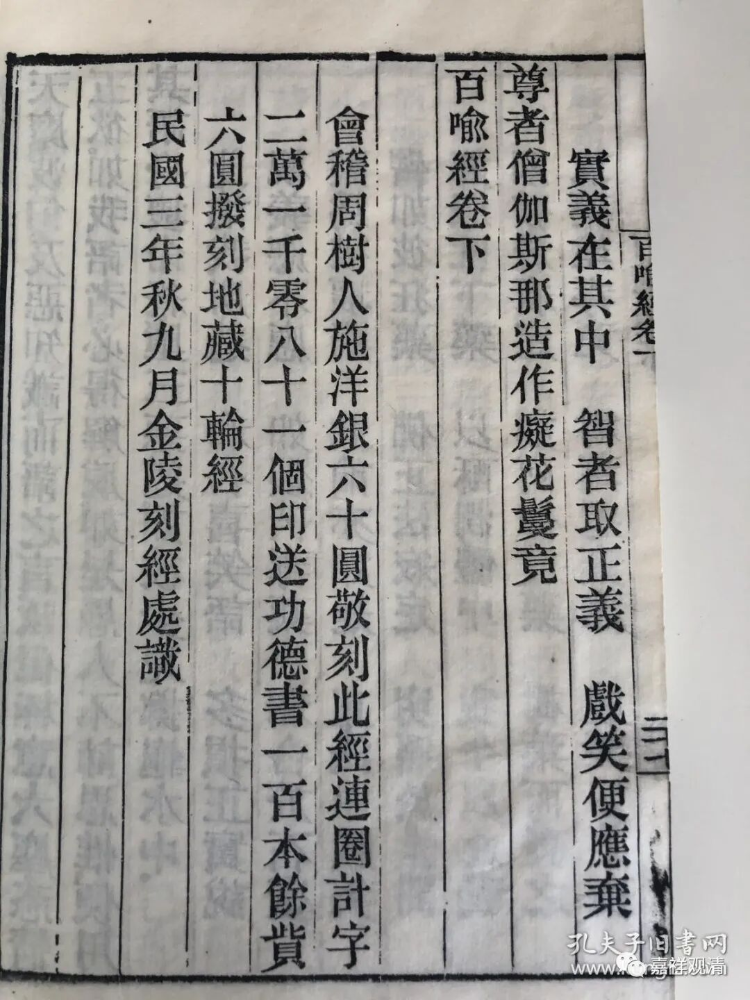
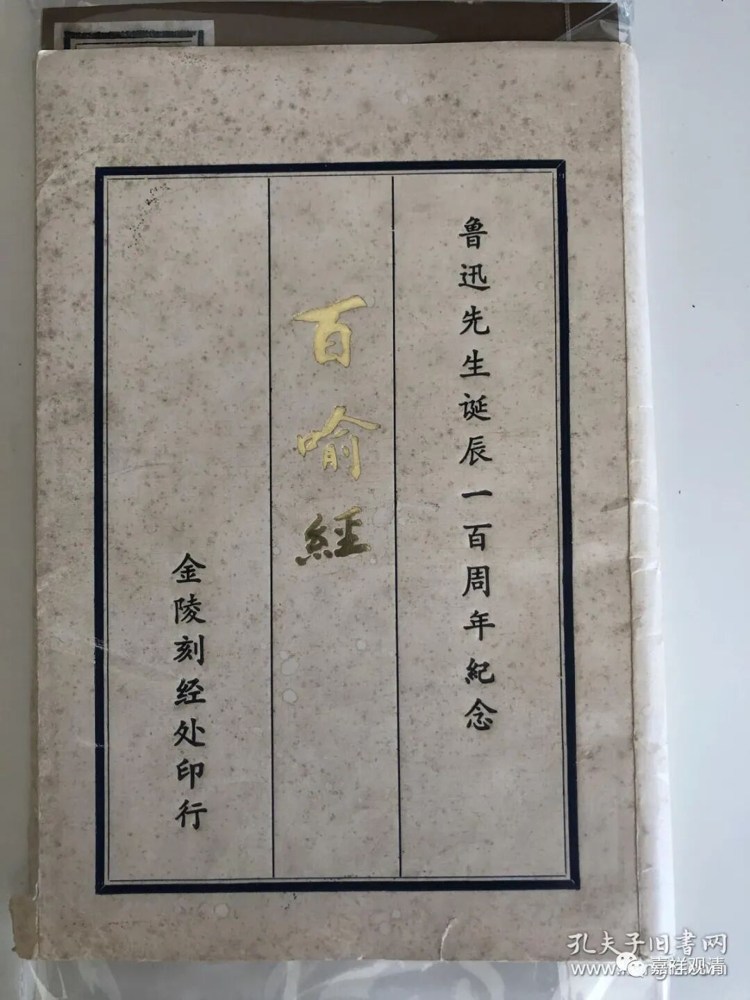
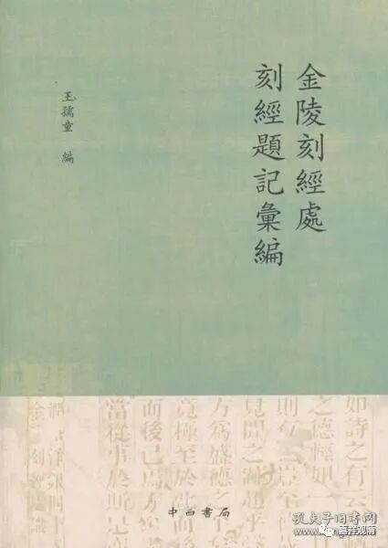
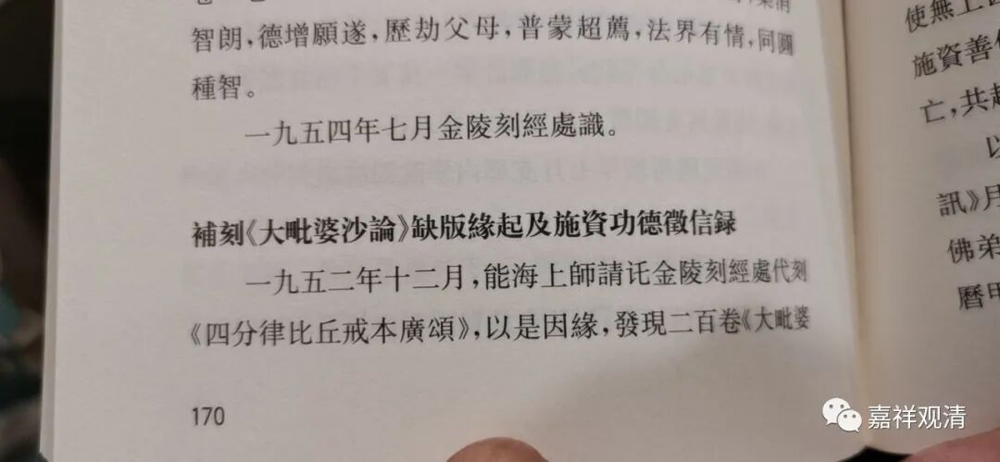
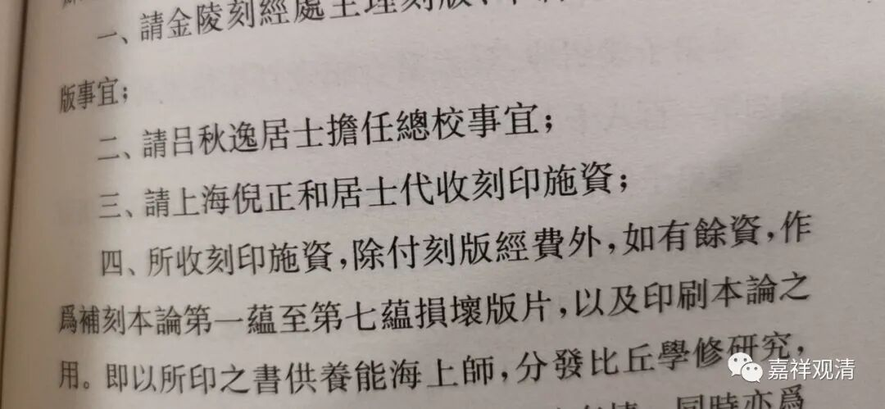
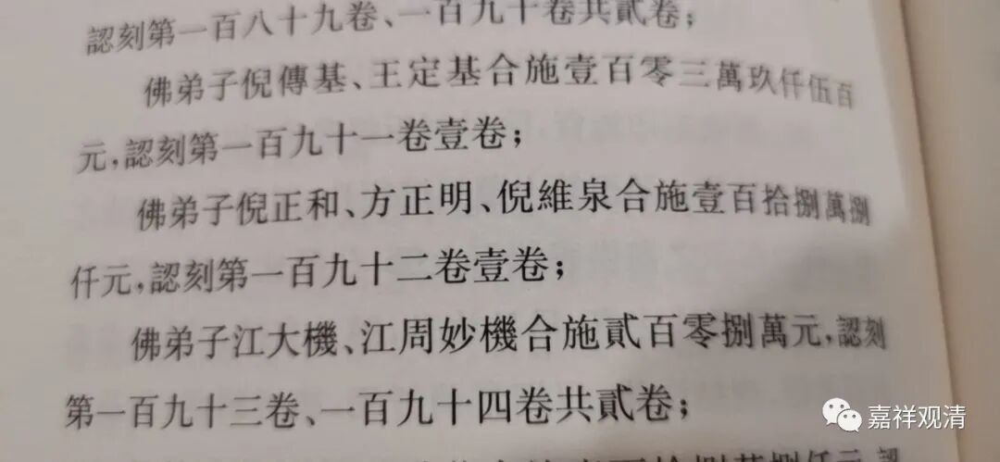
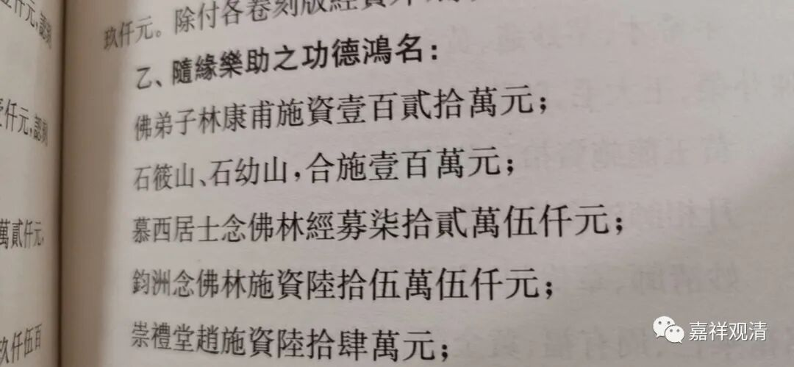

——鲁迅、石筱山和倪正和

金陵刻经处刻印佛经是近代以来最有名的了。它在经文之后有大量刻经题记可供研究

比如鲁迅捐资刻过《百喻经》，就有明确题记。鲁迅给的钱刻完《百喻经》还有富余，又刻《地藏十轮经》。

金陵刻经处后来为此还出了一版纪念鲁迅先生诞辰一百周年的本子。

随便翻翻（最近好像都是“随便翻翻”）《金陵刻经处刻经题记汇编》（王儒童），发现《阿毗达摩大毗婆沙论》（共两百卷，根本说一切有部核心论典）的题记里，提到几个“熟人”。

首先是能海上师。题记说他为补足刻印《阿毗达摩大毗婆沙论》的资金而筹款而筹款。（赵朴初居士和吕澄先生咱就不提了。）

又看到前两天刚说到的倪维泉。倪维泉的父亲叫倪正和，也是能海上师和范古老的弟子，在上海也是“大居士”了。

倪正和是此次筹款（补足《大毗婆沙论》刻印募款）的负责人。而且他们一家——倪正和、方正明、倪维泉——独立捐资刻印了《阿毗达摩大毗婆沙论》第一百九十二卷。

还有两个名字我没想到——

石筱山、石幼山也在施资刻印的人名里。

石筱山（1904-1964）、石幼山（1910-1981）两兄弟是上海石氏伤科第三代传人，祖上是走镖的，后来石家来上海行医，在上海是骨伤科“第一块牌子”，至今还有传人。

我们（上海中医药大学）的老师曾经提起过一些中医系统的老先生都有点信佛，这回见到真凭实据了。

