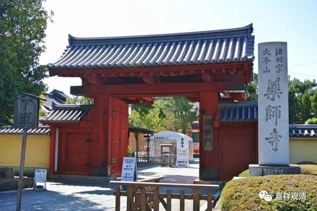
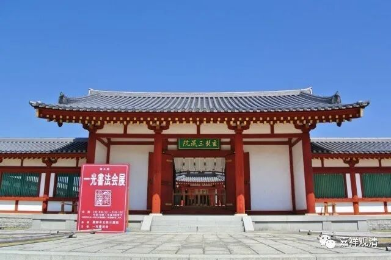
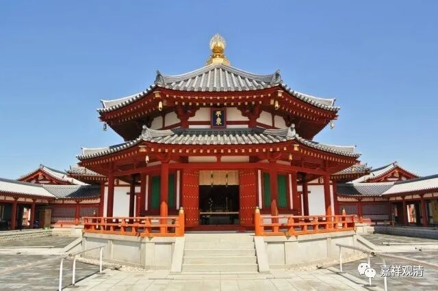

**《微课堂佛教史》097·1**

我第一次去敦煌的时候，一阵沙暴吹过来，人那时候还是躲在敦煌的藏经洞里面得，等到从洞里出来讲话的时候，嘴巴里面全都是沙子——这还是我们待在洞里面呢，如果我们是直接暴露在露天的沙漠里，那估计人都没了。

可以想象，“取经人”当时是完全抱着“有死无生”的态度才会去取经的，这有点像我们今天的杨利伟，他上天的时候也是带着“可能会回不来”的态度……所以英雄的背后确实是非常非常的伟大，我们今天应该要非常非常地珍惜现在的这些经典。

** “沙河遮障力疲殚”**，对于我们今天来讲很简单的事情，放在以前却是很困难的事情。哪怕河流也是一样，今天来看，长江也就那么一点点，但对以前来讲就是“天堑”。我们今天觉得这些都没什么，以前真的很困难。我曾经碰到过一些藏人，他们说：“这条河，我就没有见过下了河以后还能活着出来过的人！”（流沙河的沙悟净可能就是这样创作出来的。）——当时他看到某某老年冬泳队下河吓傻了，后来这些“冬泳健将”是都活着出来的奇迹s。

古时候的这些僧人取经的艰苦、困难恐怕是大家不能想象的。真的，不止是一条河，很多地方都是这样的，过不了这条河（应该过不了，咱玄奘法师之前肯定没训练过冬泳）都得绕很远的路才能走过去。

** “遮障”**就是障碍、阻碍。走啊走啊，疲乏得力气都没有了，最后倒下来，有些人甚至倒下来以后就再也站不起来了——冻死了、渴死了，或者被野兽吃了。

即使是这样，玄奘法师仍然发誓：“宁可西进一步而死，也不后退一步而生！”这种态度，在今天的人身上，太少见了，太少见了。像我们这些人都没有，所以成不了大师的原因也在这里。这都是用生命换来的，拿今天的话来讲，都是用执着的念头换来的。有了这个执念，中国的佛教才会出现后来玄奘法师翻译的经典——一千三百三十五卷，共七十三种。

我去过日本奈良一个法相宗的寺院——药师寺（法相宗大本山），那个寺院有玄奘纪念馆。

纪念馆有个匾，就两个字——

** “不东”**！

这就是玄奘法师出发取经时的誓言！

