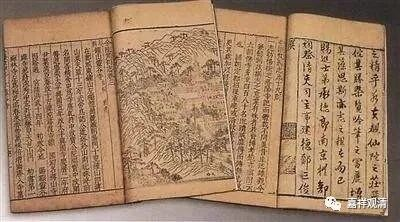

摄山慧布，南朝著名僧人，为摄山僧诠法师弟子，被称为“得意布”。作为三论宗的高僧，他曾与禅宗慧可禅师、天台慧思禅师、僧稠禅师交流，后在今南京栖霞山建寺，南朝（陈）君臣奉之如佛。

据《续高僧传》记载，慧布的卒年为陈祯明元年，即隋开皇七年，公元587年。《续高僧传》说：

“**……（慧布）以陈祯明元年十一月二十三日卒于栖霞……** ”

《释氏六帖》、《古今图书集成》等皆同。

然，据《金陵梵剎志》，江总“营涅槃忏”，谓慧布法师卒年为“祯明二年”，则与《续高僧传》不同。

《金陵梵剎志》卷四：

“**营涅槃忏（并序）·陈·江总**

** **

** （祯明二年仲冬，摄山栖霞寺布法师倐尔待终。余以此月十七日宿昔入山，仰为师氏营涅槃忏，还途，有此作**）** ……**”

《江令君集》作：

“** 祯明二年仲冬，摄山栖霞寺布法师只尔待终……**”

《广弘明集》作：

** “祯明二年仲冬。摄山栖霞寺布法师。某尔时终。余以此月十七日宿昔入山，仰为师氏营涅槃忏。还途，有此作……”**

（《金陵梵剎志》“倐尔待终”，《江令君集》为“只尔待终”，《广弘明集》作“某尔时终”，当以《金陵梵剎志》本为是。）

如此，则慧布卒年有“祯明元年”与“祯明二年”二说。若不是版本抄写的讹误（二、元或误），则当取江总“祯明二年”之说。《续高僧传·慧布传》“太史”云云，若据江总记载，则似非可能（南朝君臣皆知慧布圆寂事，非猝尔）。

（明天再查一下《释氏疑年录》看看。）

        修改于