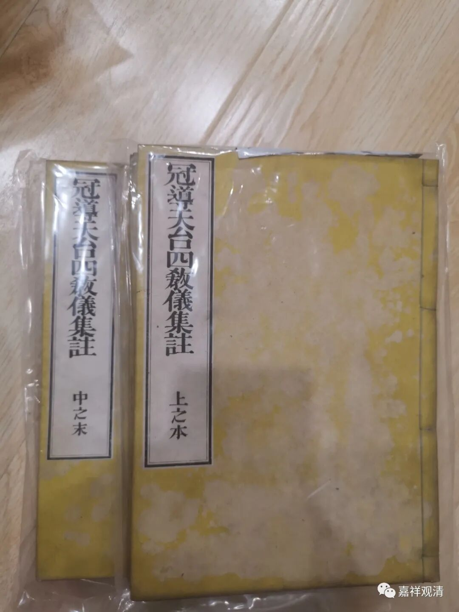
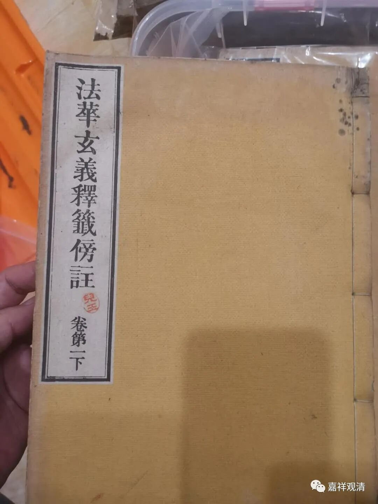
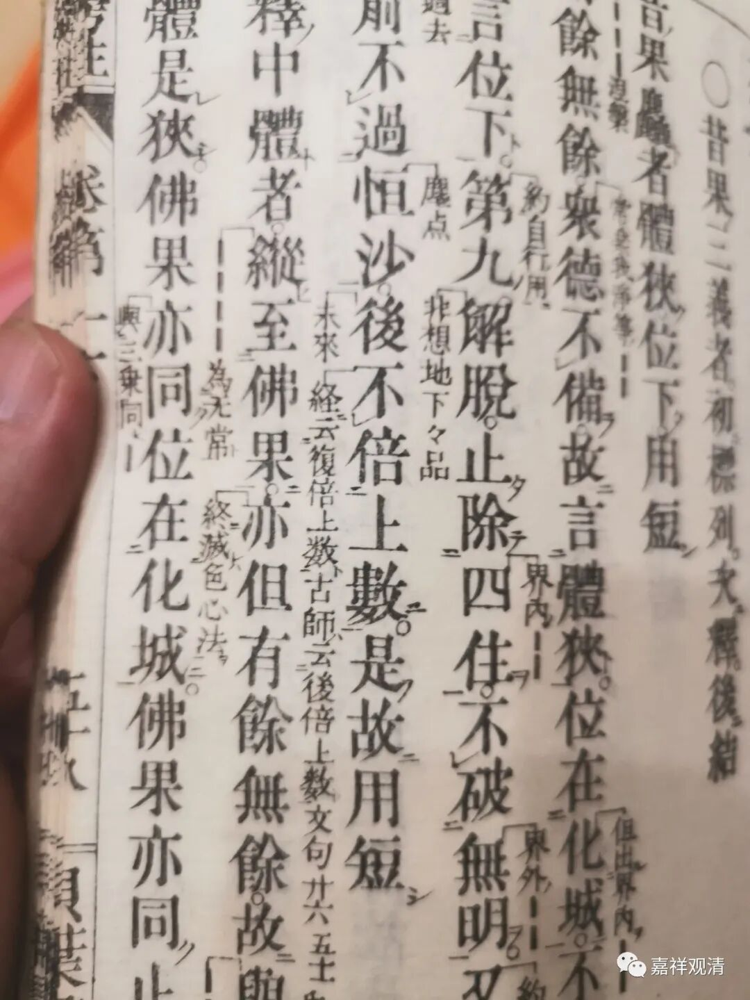
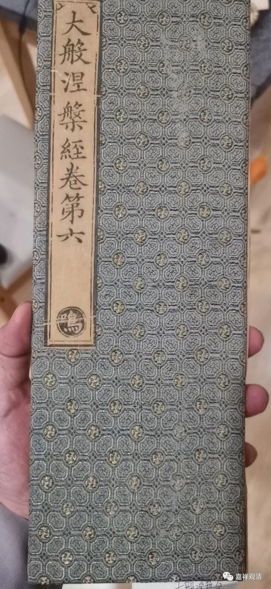
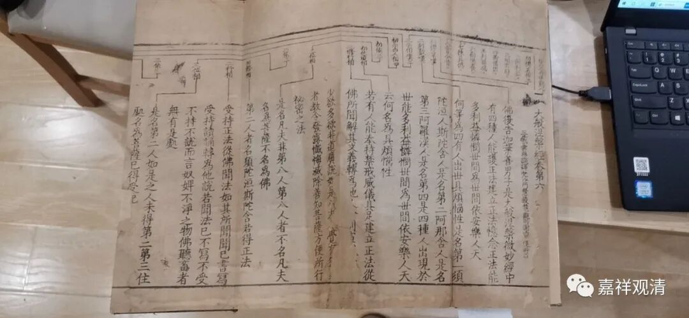
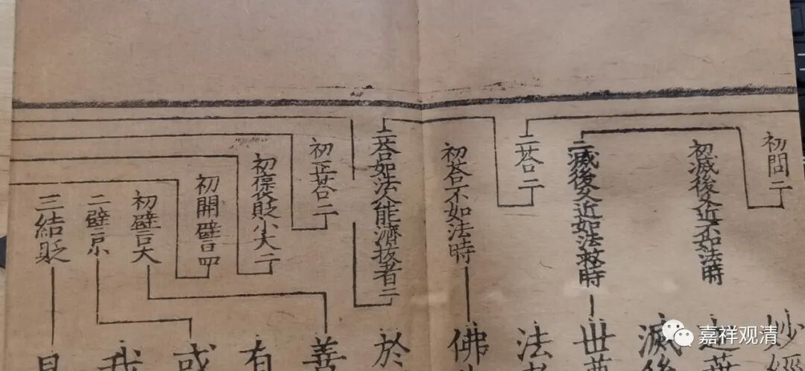
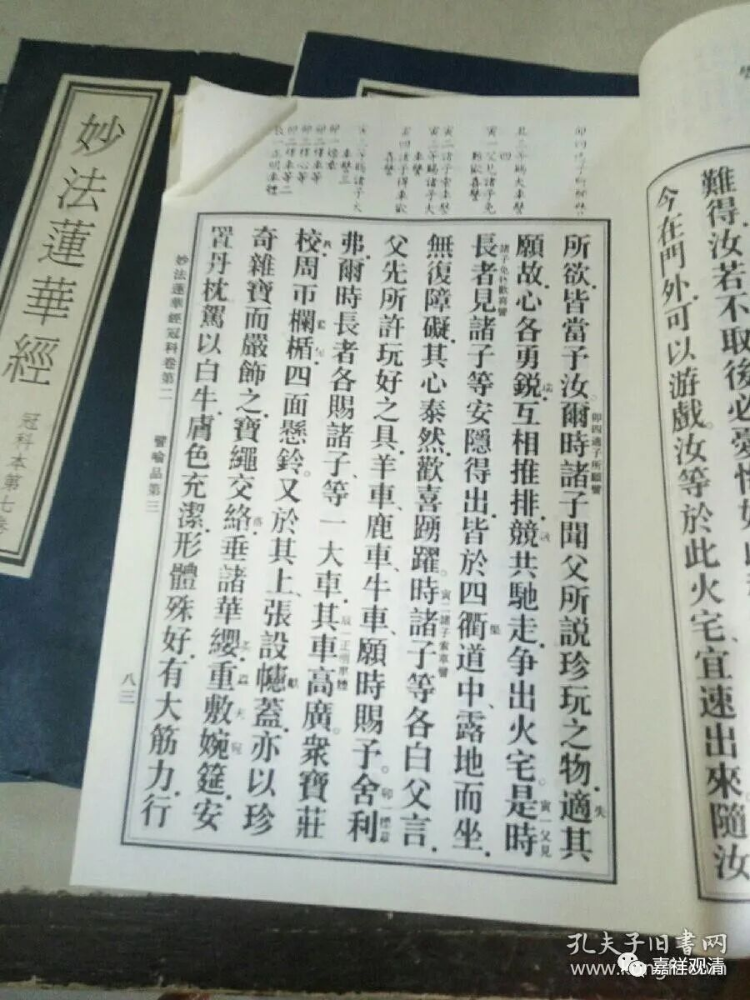

新知——

整理一些日本佛教书，经常可以看到有“冠注”、“冠导”、“新导”这类字样。

原先也都没太注意，但收拾起来，就觉得有好多这样的用法，不理解，上网也没查到，于是找了几个和尚兄弟和几位大学教授“求索”……终于有了答案。

原来，这是一种注释方法。“冠”，就是一本这样的书，正文得上头，称书之“头”或“冠”。在正文上面留出地方来写注解，就叫“冠注”；在正文的上方“导”入（别人的）相关的注疏，叫“冠导”；新的“冠导”，就叫“新导”。所以“冠注”、“冠导”、“新导”这些都是刊本的一种，在日本明治以前就有，集中出现在明治二十年前后，而且在佛教的注释本中出现得比较多。

索嘎！原来是这样，就是注解的一种嘛！中国人用得比较多的是夹行小注，也有在“冠”（正文的上方）的地方摆上科判的，但基本没见过“冠注”、“冠导”、“新导”这种用法。

我又翻检了一下手里有的日本佛教注释，发现“冠导”，又叫“鳌头”。

类似的还有“旁注”。

我记得刚买了几本明刻本的《大般涅槃经》，这个经的版式还引起了我的注意，专门买下来……

这书的正文上方留出很多地方做科判，按照日本人的说法，这就是“冠科”了。好像日本人确实也有“冠科”的书。

还真有“冠科”，还是中国人的……这样，可能真的是中国先有的“冠科”慢慢传到日本。

另外，“冠导”、“冠科”好像都是天台宗的书嘛，说不定唯识宗叫“鳌头”而天台宗叫“冠导”。（再找找看，）

很有可能，最早出现的是“冠科”，然后是“冠导”、“冠注”，后来是“新导”。（欸，为什么不是“新冠”？）

不知道还有没有其他的说法，我以后要多留心一下啦。

新的知识又增加了……

多谢傅老师、张老师让我获得新知！谢谢！

