——再谈“鳌头”

昨天谈到“冠导”“冠注”，后来又提到，还有个“鳌头”。

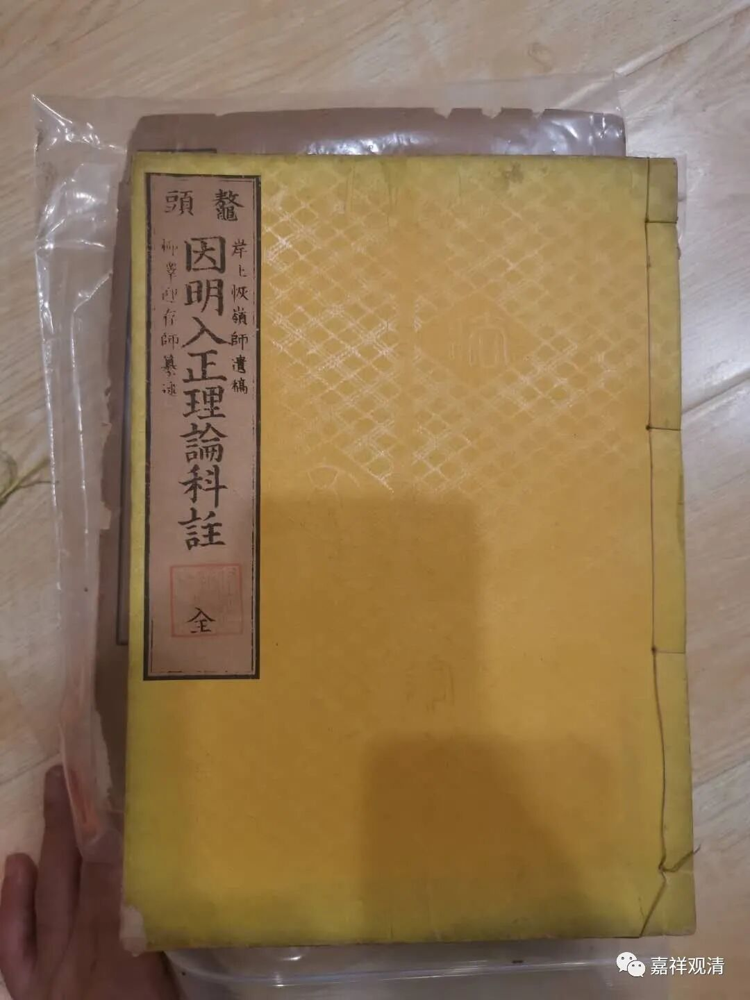

手里面有《鳌头<因明入正理论>科注》，今天查了一下，发现注解用“鳌头”不仅仅在法相宗，禅宗也有。

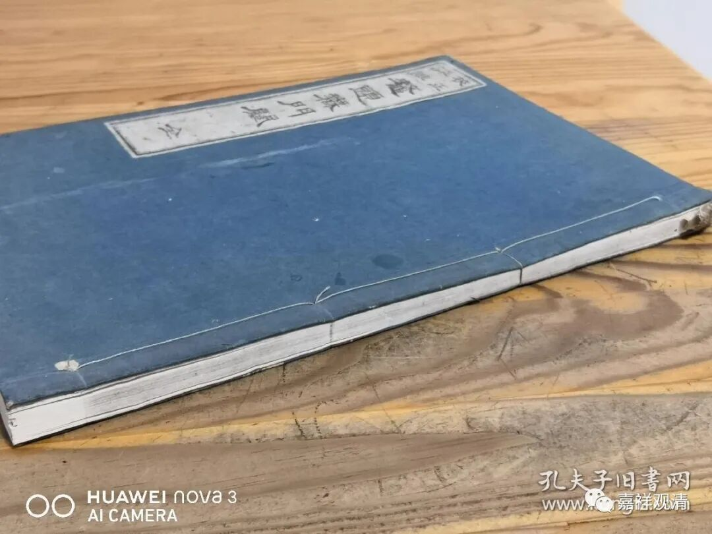

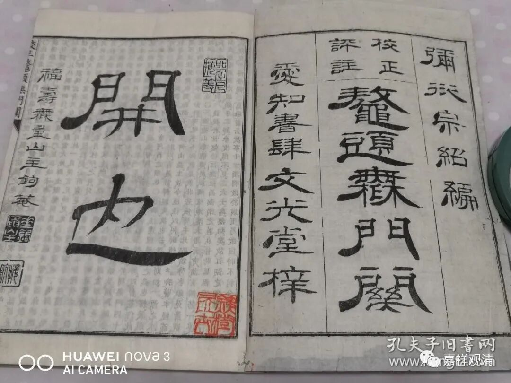

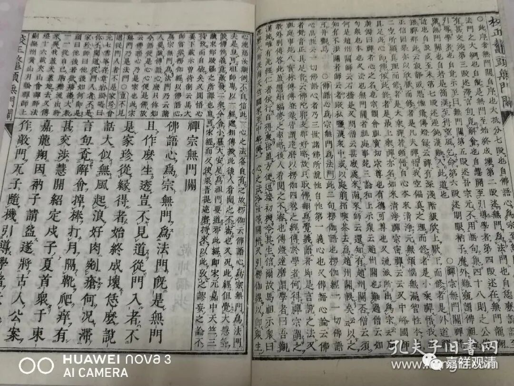

《鳌头<无门关>》

也是日本人写的注解。《无门关》是无门慧开禅师作的禅宗著名的作品。

顺带介绍一下，无门慧开禅师的师父是月林师观禅师，在苏州（平江府）住持过六家寺院……我也给他做过《年谱》。月林师观还有一位弟子德秀禅师，名气远不如慧开禅师大。（所以还是要多写东西啊。）

无门慧开最著名的颂子就是——

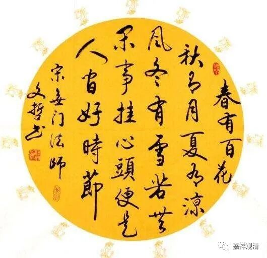

**春有百花秋有月，**

** 夏有凉风冬有雪；**

** 若无闲事挂心头，**

** 便是人间好时节！**

我比较喜欢这一颂：

** 路遇剑客须呈（剑），**

** 不是诗人不献（诗）；**

** 逢人且说三分（话），**

** 不可全施一片（心）。**

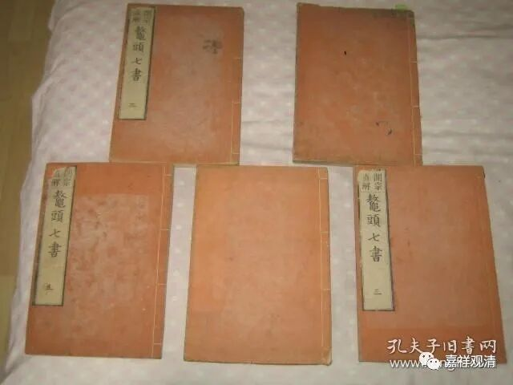

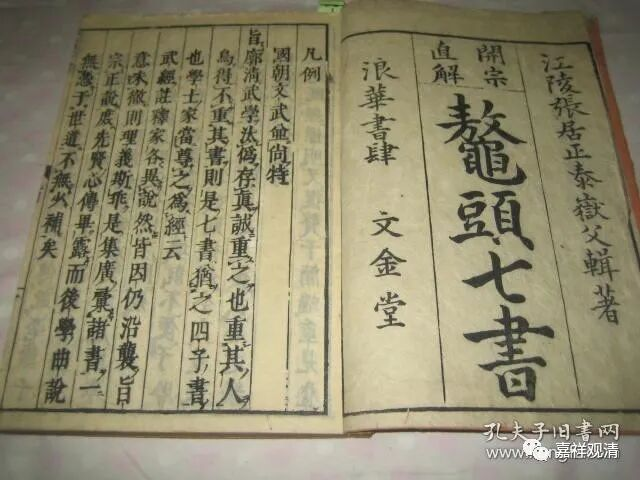

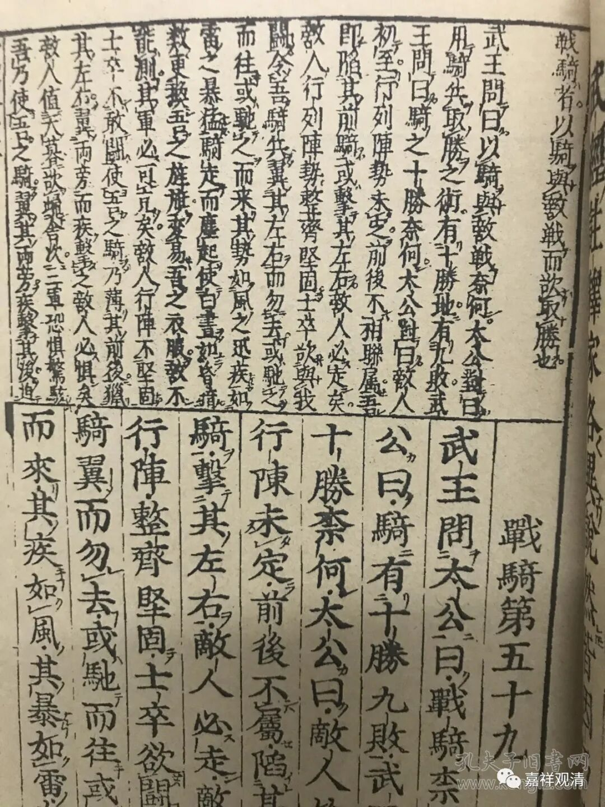

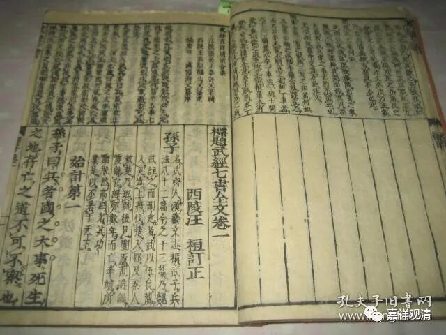

叫鳌头的，还有《鳌头<（武经）七书>》。

《武经七书》是中国古代著名的兵书集成。这本和刻本的《鳌头（武经）七书》，是复刻清顺治年间的清刻本。版子里看得出来，清刻本的书名原来叫《标题<武经七书>全文》。这个“标题”的版式，和刻本就叫“鳌头”。

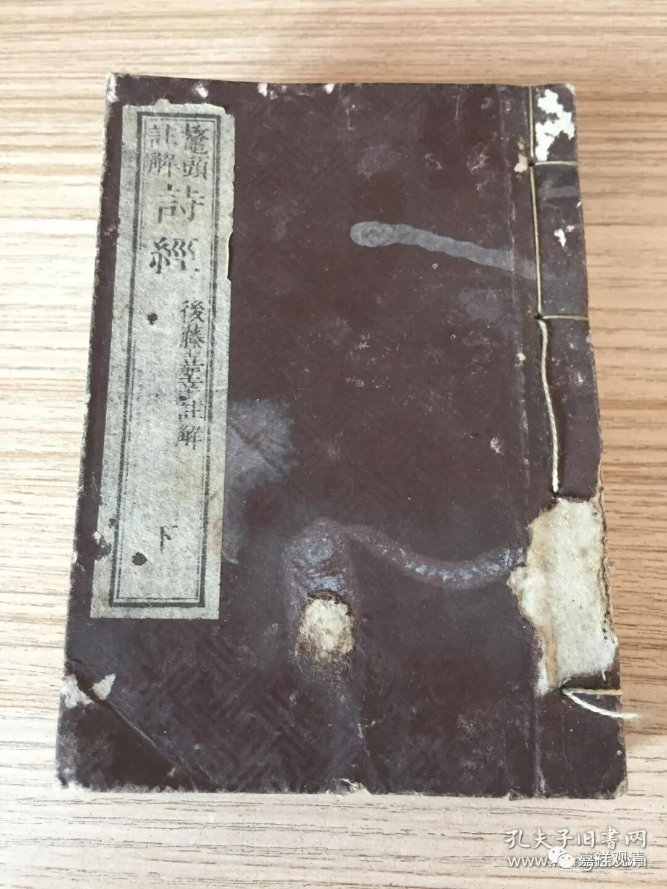

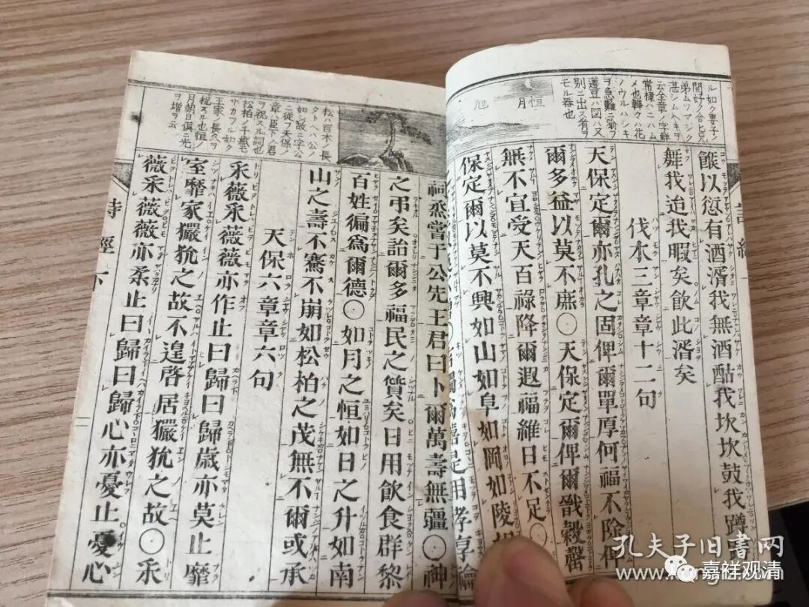

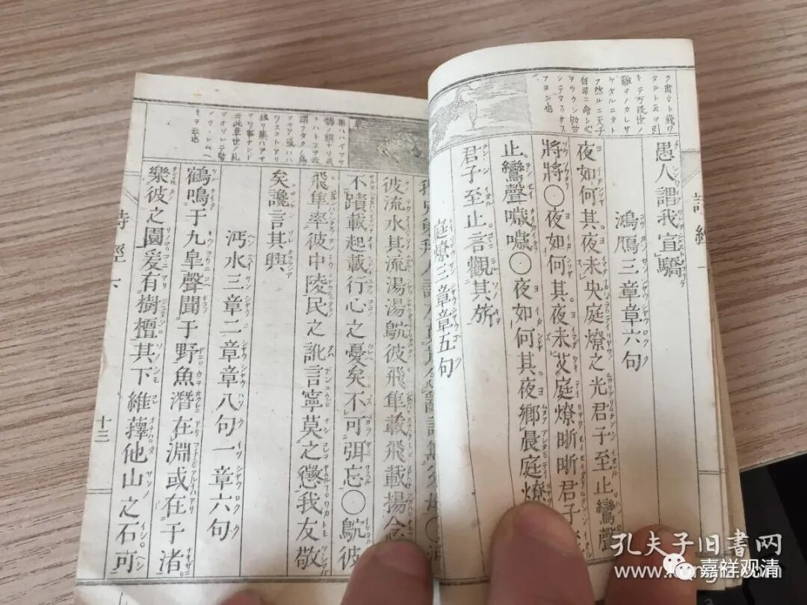

这是《鳌头注解<诗经>》，《诗经》的小注。

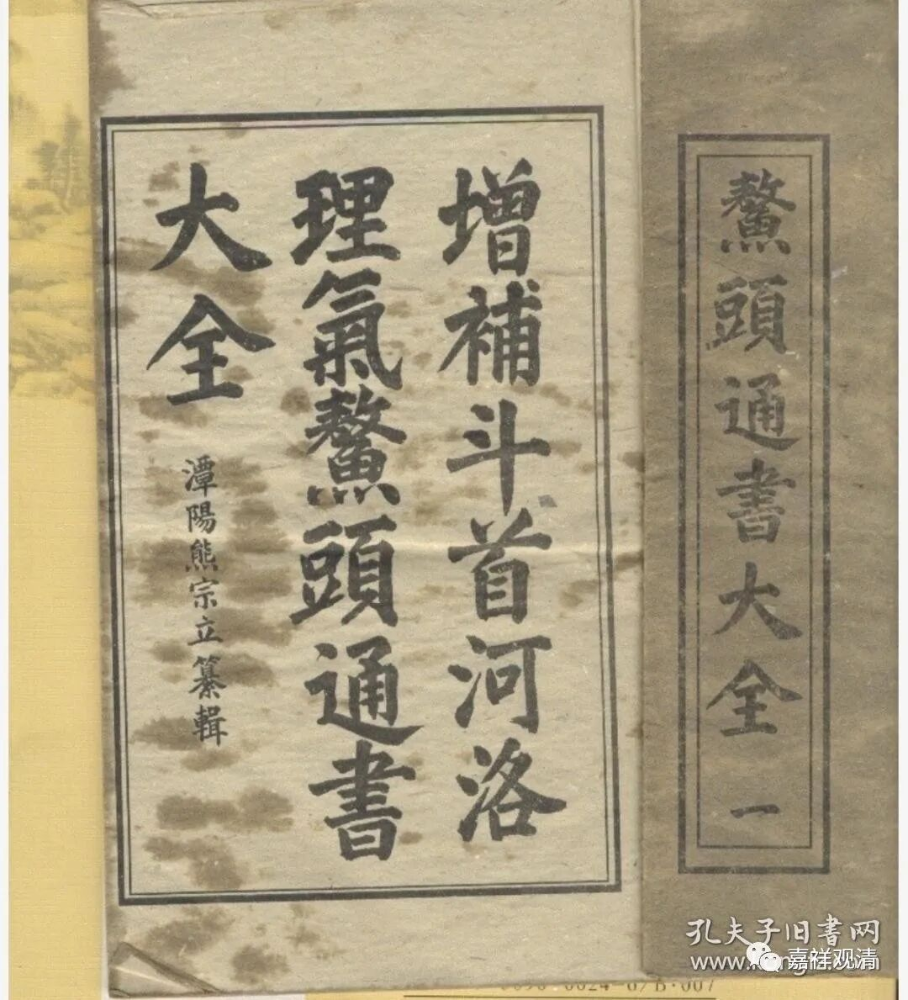

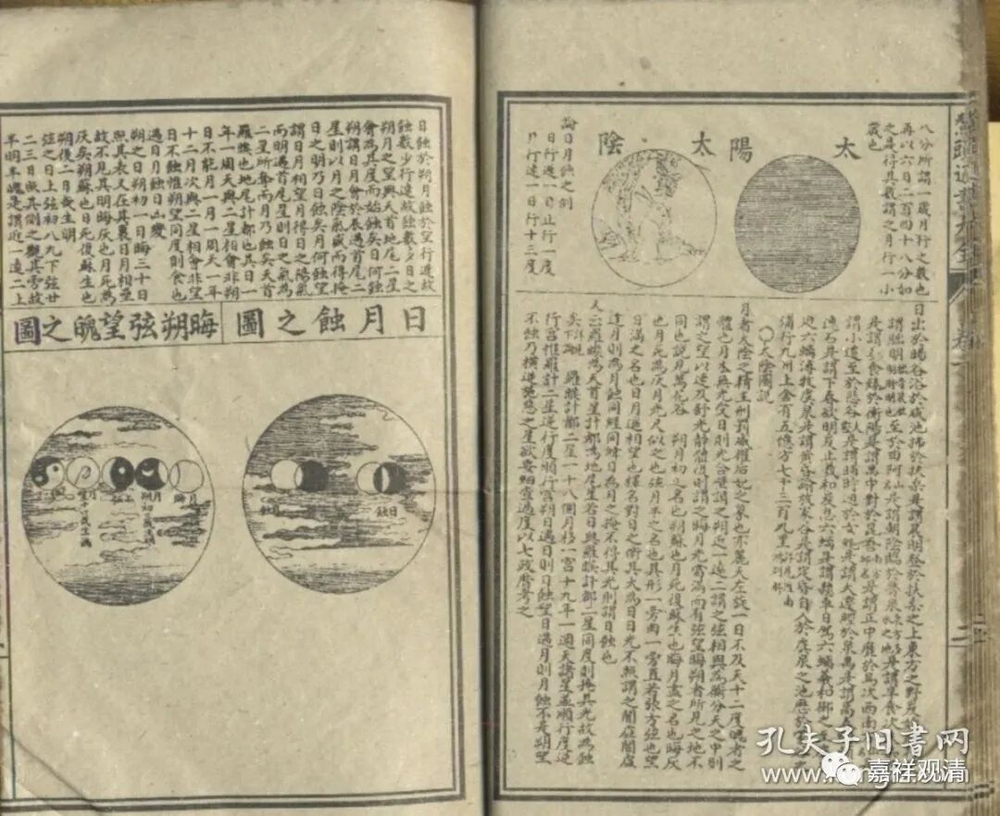

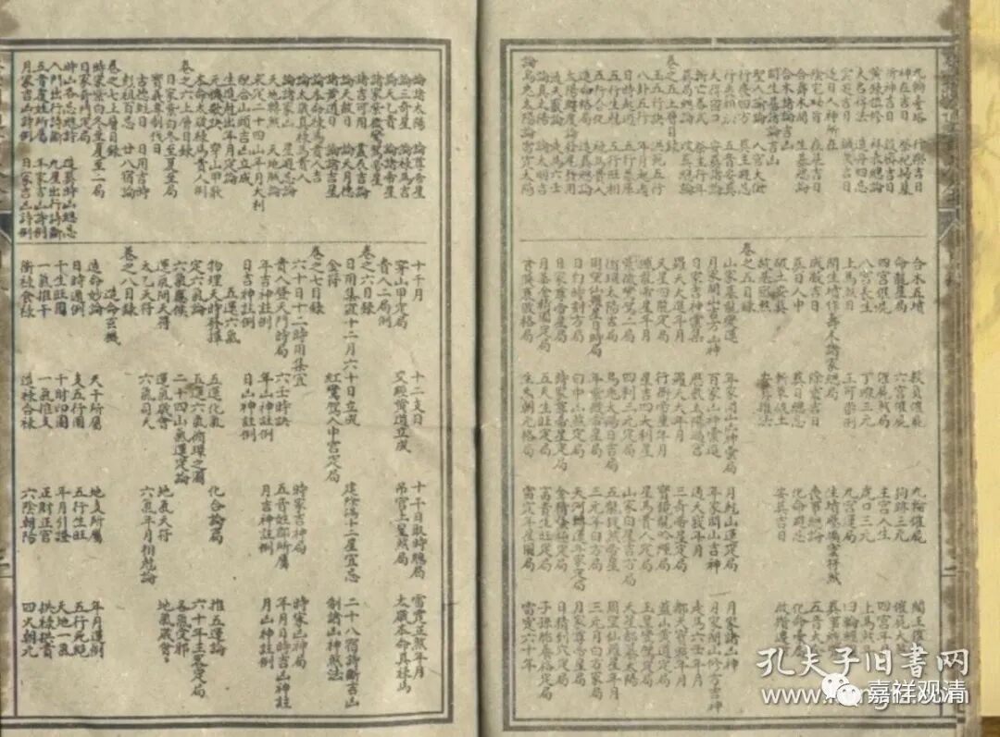

还有一种，叫《鳌头<通书>大全》，新本子已经看不出“鳌头”，老的木刻版还是很明显可以看出“鳌头”的注解方式。前几个都是和刻板，这个似乎不像日本刻的。

