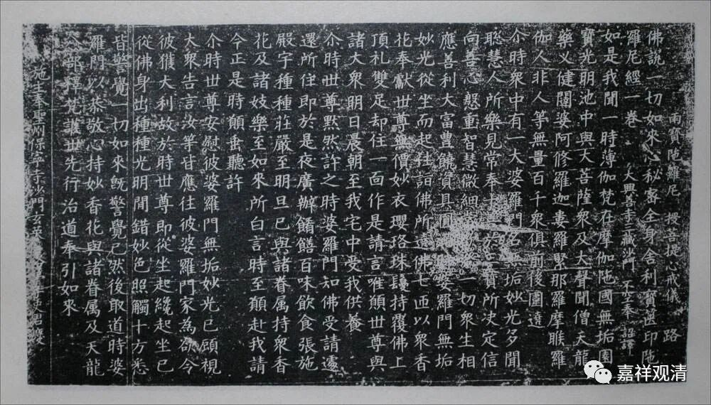
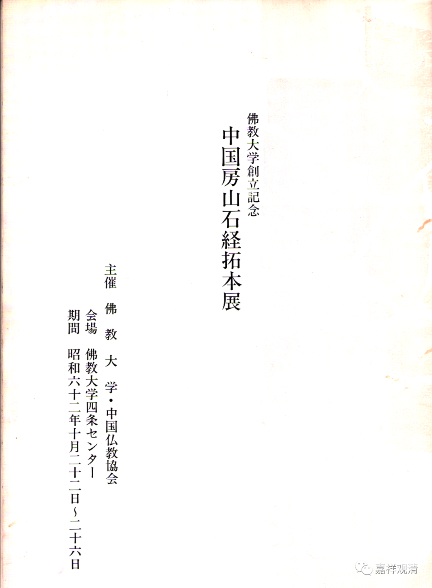
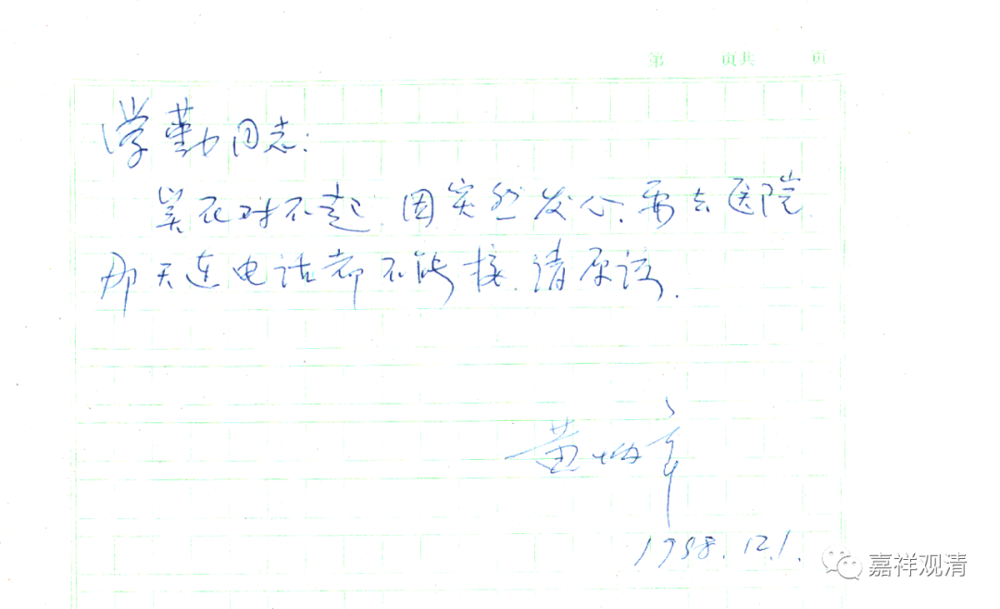
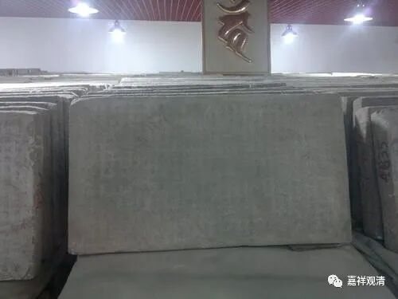
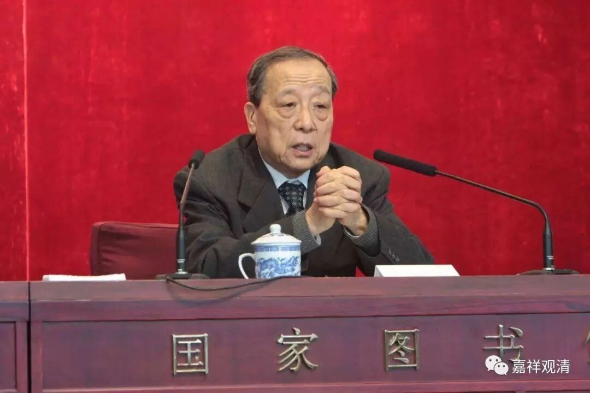

《房山石经》

黄炳章老给李学勤老的信札

最近因为接触到一些大藏经，包括收到几片房山石经的拓片，找一点周边的介绍，就在京东买了件《房山石经拓片展》的小册子。

“房山石经拓片展”是中国佛教协会1987年10月底在日本京都做的一个关于房山石经的展览。

翻看这本小册子的时候，发现有一张纸……

“学勤同志：

实在对不起，因突然发心（脏病），要去医院，那天连电话都不能接，请原谅。

黄炳章

1988.12.1”

咦，这应该是黄炳章老先生写给李学勤先生的信札了。

黄炳章老先生在解放后专门参与整理了《房山石经》，当年协助北京大学考古系教授阎文儒一起挖掘整理房山石经，是亲自参与房山石经项目的见证人。

李学勤是清华大学著名历史学教授，去年仙逝。老先生也对房山石经有过关注，并目睹了房山石经的回填。

这次有幸买到的这件《房山石经拓片展》的小册子，应该就是李学勤老先生收藏过的。当年二老可能有关于石经的合作项目，所以留下了这一纸信笺。

