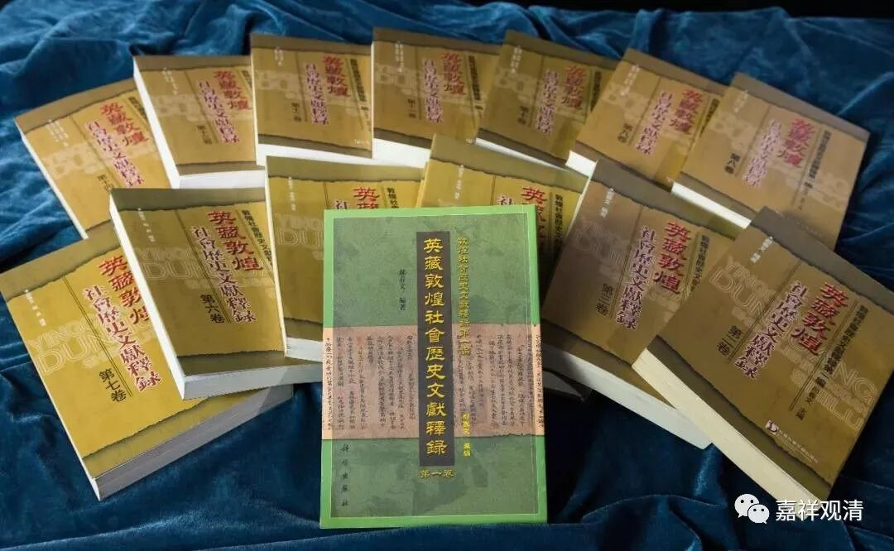
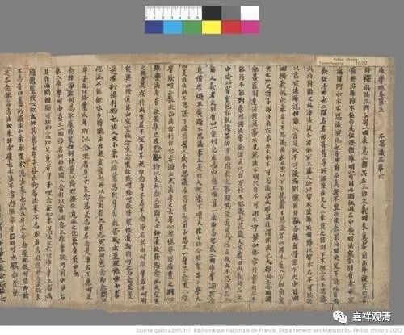

这里的“玄奘法师侄女”，说的是玄奘法师的结拜大哥，高昌王麴文泰（？～640年）的公主。

敦煌文献里，有一篇玄奘法师这位公主侄女出资抄写《维摩诘经》的题记，这件文物当年被斯坦因带走，现在在英国。

我们看一下原文释读：

【斯．2838《维摩诘经卷下》题记：

经生令狐善欢写

曹法师法慧校

法华斋主大僧平事沙门法焕定

(高昌)延寿十四年(637)岁次丁酉五月三日，清信女稽首归命常住三宝。

盖闻剥皮析骨，记大士之半言，丧体捐躯，求般若之妙旨。是知金文玉牒，圣教真风，难见难闻，既尊且贵。

弟子托生宗胤，长自深宫，赖王父之仁慈，蒙妃母之训诲，重霑法润，为写斯经，冀以日近归依，朝夕诵念。

以斯微福，持奉父王，愿圣体烋和，所求如意。

先亡久远，同气连枝，见佛闻法，往生净土。

增太妃之余算，益王妃之光华，世子、诸公，惟延惟寿。

寇贼退散，疫厉消亡，百姓被煦育之慈，苍生蒙荣润之乐。

含灵抱识，有气之伦，等出苦源，同升妙果。】

文里面的“父王”、“王父”，就是玄奘法师的结拜大哥，高昌王麴文泰。

“太妃”，就是玄奘法师的干妈，张太妃。

“世子”，就是玄奘法师的（干）侄子麴智湛。

王妃……没留下名字……

“清信女”，就是高昌公主……呃，她怎么也没留个名字啥的（敲个章多好）……

这是一篇敦煌《维摩诘经》的写经，但不是本文的【题记】

这篇敦煌题记（【斯．2838《维摩诘经卷下》题记】）确实佐证了，高昌王麴文泰崇信佛教并不是一时兴起，而是整个家族的信仰。他抑留玄奘法师、和玄奘法师结拜、资助玄奘法师西行等等，内里都确实有种信仰的力量在支撑。

很可惜的是，抄完此经（《维摩诘经》）的三年之后，唐灭高昌。史料上也没再提及玄奘法师和这一家干亲的往来。

