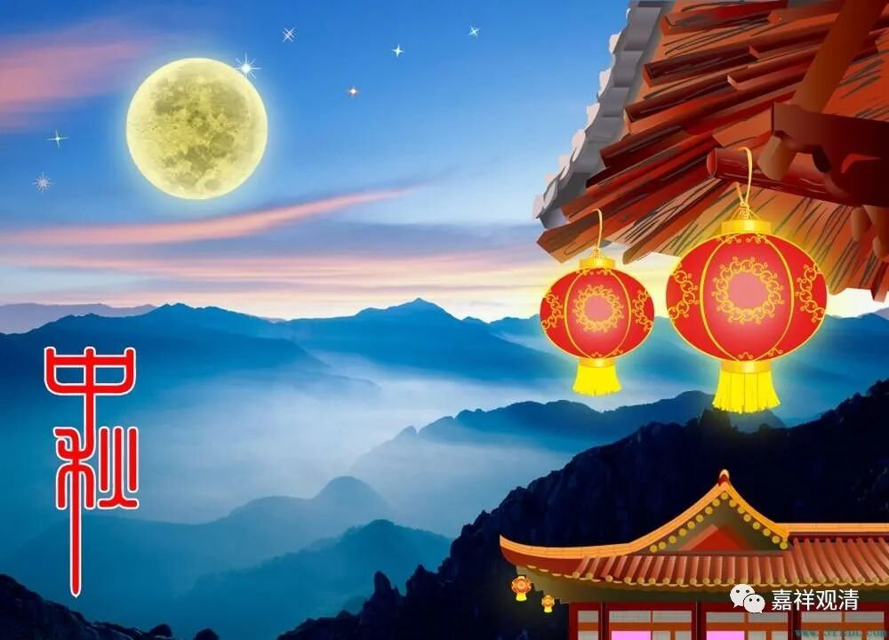
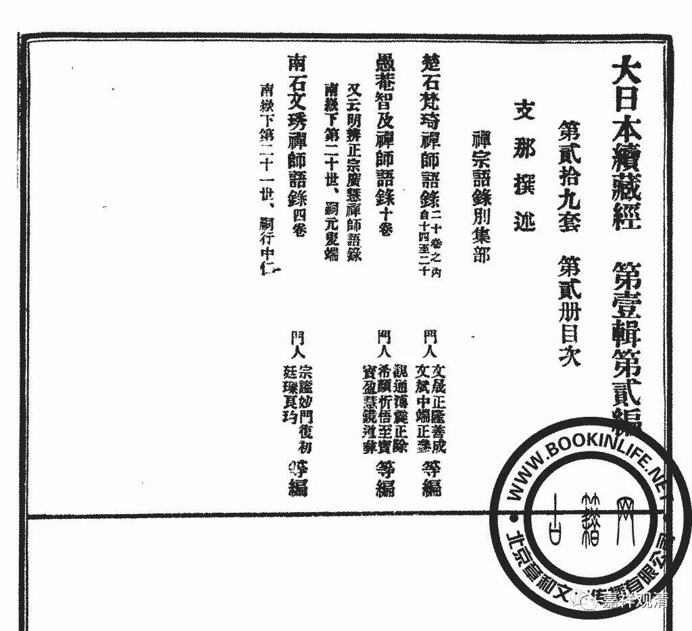

月圆当户莫蹉过

今天是八月十五，又是咱们的国庆节，两个节日集中在一天了，也是很难得的。记得很小的时候有过一次。

“中秋节”不是佛教的节日，但这一天佛教也过节。中国历史上佛教的安居是从四月十五起到七月十五止，但按道理应该是五月十五到八月十五——这是历法转换，也正常啊。也就是说，其实我们中国佛门里七月十五这天的事儿，原先都应该在八月十五的。另外，按汉地的安居日子来算，“后安居”则恰好是五月十五到八月十五这个日子，那么，八月十五也是后安居结束的日子……

今天的丛林里有拜月的传统，这个“传统”是明代（中晚期）进入佛教内部的。“拜月”本来是民俗，祈祷丰收（中秋）、长寿（嫦娥与长生不老的传说）、多子多福（月亮与女子相关的隐喻，以及此时拿来作贡品的当令的花生、石榴、芋艿），佛教把它佛教化了，长寿的部分改编为祈祷药师佛和月光菩萨，于是成为中国化的佛教传统了……这种中国化是佛教自身主动的。

古时（明初以前）禅门丛林里，遇到“中秋节”自也“不免一番罗嗦也”，我经常提到的愚庵智及禅师（元末明初）的语录里就有中秋节上堂的“法语”：

《愚庵智及禅师语录》：

**“上堂。**

** 今朝八月十五，看取月圆当户，**

** 分明无欠无余，只恐诸人蹉过。**

** 不蹉过？**

** 两个拳头一个大！”**

顺便聊个“十一”。十一（以前是农历）在丛林里也是个大日子，也会有大和尚上堂说法。又有一个我常提到的月林师观禅师（南宋）也来了这么一段：

《月林师观禅师语录》：

** “上堂。**

** 今朝十月一，开炉是此日。**

** 赵州宾主话，圣因为拈出。**

** 拈也拈了也，说也说了也，**

** 毕竟如何？**

** 归堂向火去！”**

这两位苏州的名僧在说什么呢？

参！

