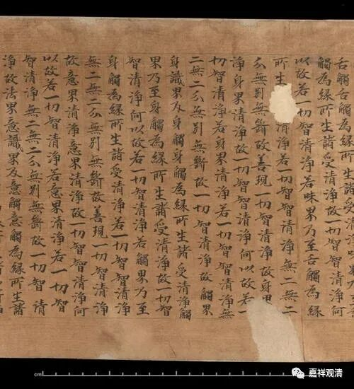

《融禅师定后吟》

一、出处及引用

敦煌本《融禅师定后吟》，【斯二九四四背】：

**“入定觀空有，出定空有吟，**

** 还将出入意，反觀空有心。**

** 离有還歸縛，行空復被侵。**

** 祇交一念裏，迥跨兩邊心……”**

此《定后吟》，尚有【伯二二七九】号，作“命禅师作”。

《卍字续藏经》收入法隆寺本《法華玄贊要集》卷五亦引此诗，作：

** “古詩云：**

** 入定觀空有，出定空有吟，**

** 還將出入意，返觀空有心。**

** 癈有還歸縛，行空復被侵。**

** 只教一念裏，迴跨兩邊心。”**

《卍字续藏经》收入敦煌本《法華經玄贊釋》亦有此诗：

** “故詩云：**

** 入定觀空有，出定空有吟，**

** 送將出入定，復觀空有心。”**

** **

但《卍字续藏经》里的两篇都没有提及作者。

敦煌写本。图文不相关

二、略校

** “入定觀空有，出定空有吟”**

此句诸本无异。

** **

** “还将出入意，反觀空有心。”**

“还”，《玄贊釋》做“送”，当从诸本，释读为“还”。

“意”，《玄贊釋》做“定”，不妥。当从诸本，释读为“意”。“定”、“意”，形近。

“反”，【伯二二七九】、《法華玄贊要集》作“返”，《法華經玄贊釋》作“復”。“返”“復”形近，“返”字最佳。

** **

** “離有還歸縛，行空復被侵。”**

“離有”，【伯二二七九】同。《法華玄贊要集》作“癈”。皆可通。

** “祇交一念裏，迥跨兩邊心……”**

“祇”，【伯二二七九】同，《法華玄贊要集》作“只”，皆可通。

“交”，【伯二二七九】、《法華玄贊要集》作“教”，皆可通。

“迥”，【伯二二七九】同，《法華玄贊要集》作“迴”，“迴”字更善。

