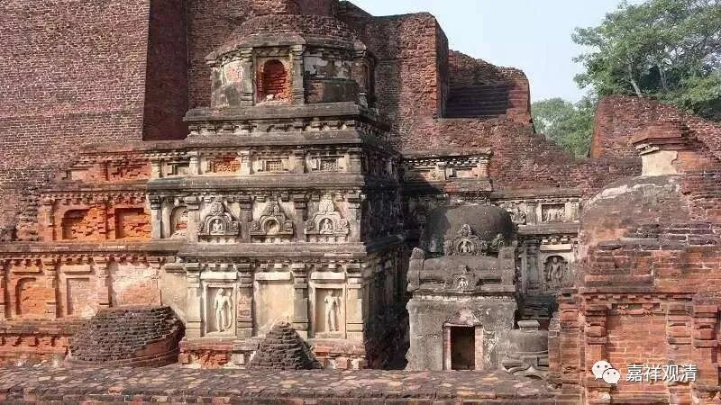

**《微课佛教史》100·1**

我们停课已经很久了。我中间有点事，不太方便。那么我们现在继续吧。

记得我们最后一次讲佛教史的时候，是讲到了玄奘法师，他已经去到了印度。现在已经上映了黄晓明主演的电影《大唐玄奘》，黄晓明其实是很给力的，为什么这么说呢？如果没有他和其他几位有名的演员出演的话，这种片子根本就不会上映的。他能够接这个片子，我们已经很感谢他了。

至于说表演到不到位呢，应该说每个人心中都有自己的玄奘法师。确实，我们都认为玄奘法师本人应该不会是电影中表现的那么柔弱，应该是更坚毅的。老实说，专业人士去看电影总是比较容易找出问题的，比如专业的军迷看战争片也会觉得有很多问题，专业的医生看关于医护人员的电影也会觉得到处都是问题。所以专业的东西我们就不谈（不追究电影的细节）了。

在黄晓明的这部电影当中，玄奘法师在印度的这部分经历其实没怎么讲，而且还出现了一些根本没什么关系的情节，比如大象掉到水里，这些情节好像没什么意义，完全是撇出去的一些东西。事实上玄奘法师在印度比较重要的是他的学习，但这部片子里面摆出来的佛学真是烂得够味——这个话题我们就不提了。（事实上，让一部电影谈特别精深的佛教理论也不太可能。）

那么，我们之前提到过，玄奘法师去印度就是要去学习瑜伽行派的一些内容。恰巧——能不能这么说？那个时代也恰巧是瑜伽行派或者唯识派比较流行，或者说比较占上风的时候。确实有电影里面的这样一位法师——戒贤大师，一百多岁了，是当时那烂陀寺的领袖人物。

这次我们去印度呢，也去了那烂陀寺，确实是一个大学性质的综合性大型建筑。很可惜的是，里面有很多被烧毁的痕迹。据说那烂陀寺就是因为太大，所以吸引了穆斯林过来抢珠宝。佛教的寺院中一般都会使用大量的金银等装饰，而那烂陀寺又特别大，像一个大的城堡。那时候穆斯林就觉得这里像是一个城市，就攻占了寺院，又杀了里面的一些人，然后把寺院里面的东西也都抢走了，最后放了一把大火，据说烧了三个月。烧这么长时间，不知道是不是可能，但今天看到那烂陀寺里面确实有很多被火焚烧的痕迹，真的是非常可惜。不过世间上的事物，莫不是如此啊！都是无常的。

在印度有一个情况其实是比较明显的，就是佛教的这些寺院基本上都是由皇家支持才建设起来的。那烂陀寺也是如此，它最初应该是在公元五世纪初开始建的。所以西藏的有些传说当中说，龙树菩萨或者无著菩萨、世亲菩萨都在那烂陀寺待过，这基本不太可能，至少龙树菩萨不是在这个寺院的——那个时候还没有那烂陀寺。（当然藏人传说就记得那烂陀寺这也说明那烂陀寺的名气足够大。）

