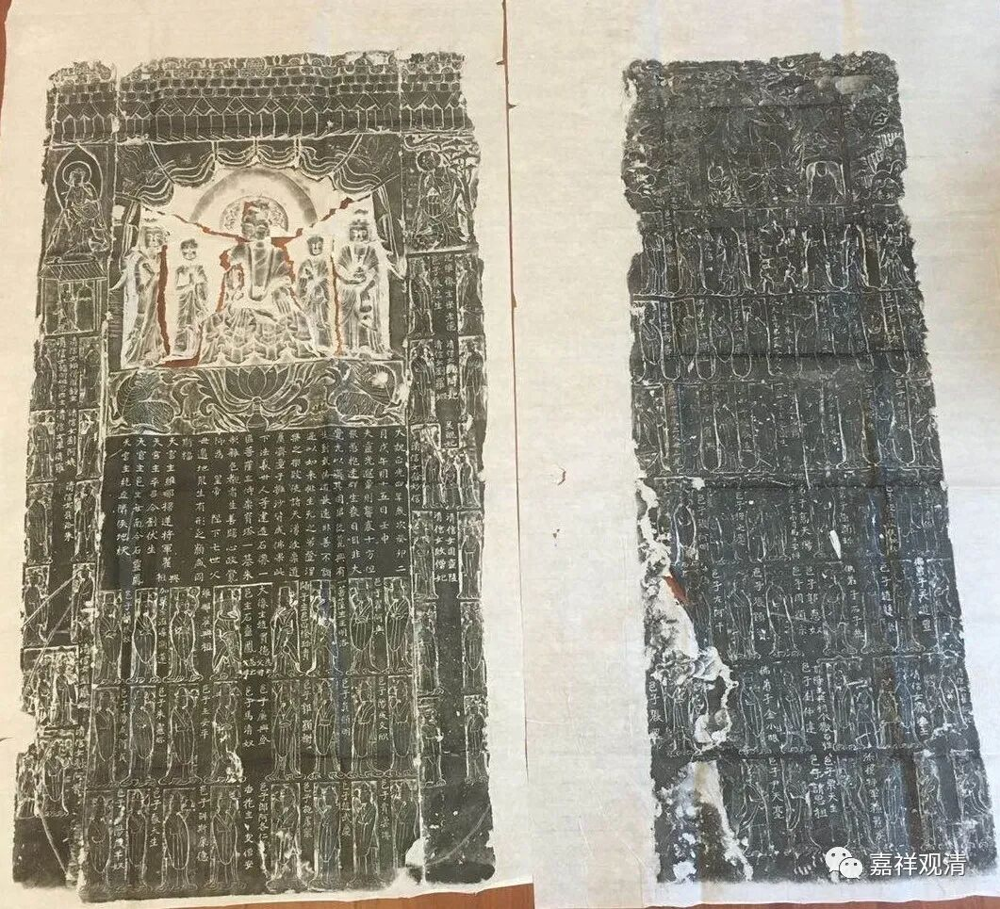
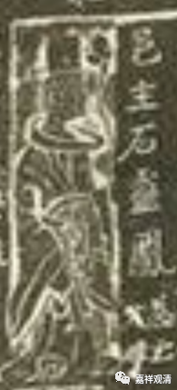
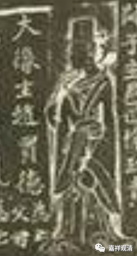
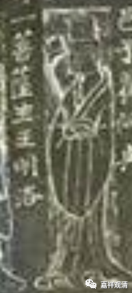
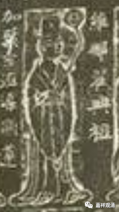
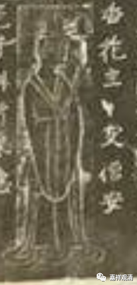
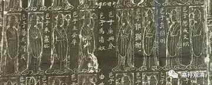
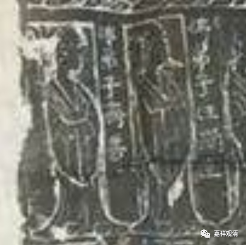
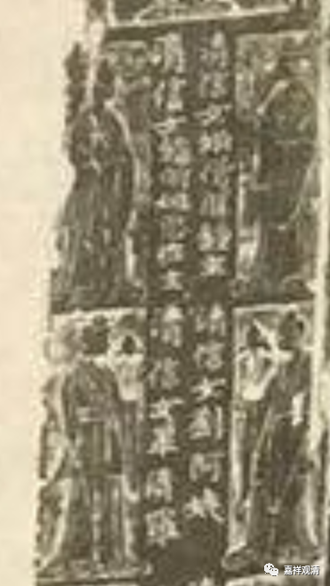

义邑（居士林）

上面这是一个碑文的拓片。

今天佛教界里有一个组织很常见——居士林。居士林就是居士活动的团体、组织。“居士林”这个名称可能是到了近代才用的吧，我没有考证过，不过类似的组织在中国佛教史里是有的。比如这块碑上面所显示的。

碑上面刻了很多供养人，人像边上都有“身份”和姓名。比如：

邑主：这是“义邑”的领导人，类似于今天“居士林”的林长。“义邑”，类似于今天的“（宗教背景的）公益组织”，基本上相当于今天的“居士林”。

大像主：这是说此人是造大佛像的功德主。

菩萨主：可能是造大佛像边上菩萨的功德主。

维那：义邑的管理人员，职能略似寺院的“维那”，原意为领诵师。

香花主：可能是义邑内类似今天寺院的“香灯师”的人员。

邑子：公益组织的一般人物。

佛弟子：很可能不是这个“义邑”而参加这个刻佛像活动的功德主。

清信女：女居士。

“义邑”存在于北魏至隋唐时期，略类似于在家佛教的公益组织，以在家人为核心的佛教活动为主。记得也有道教的碑刻上也有“邑子”的字样，估计是民间的宗教公益组织不是很严格区分佛道教的缘故吧。

