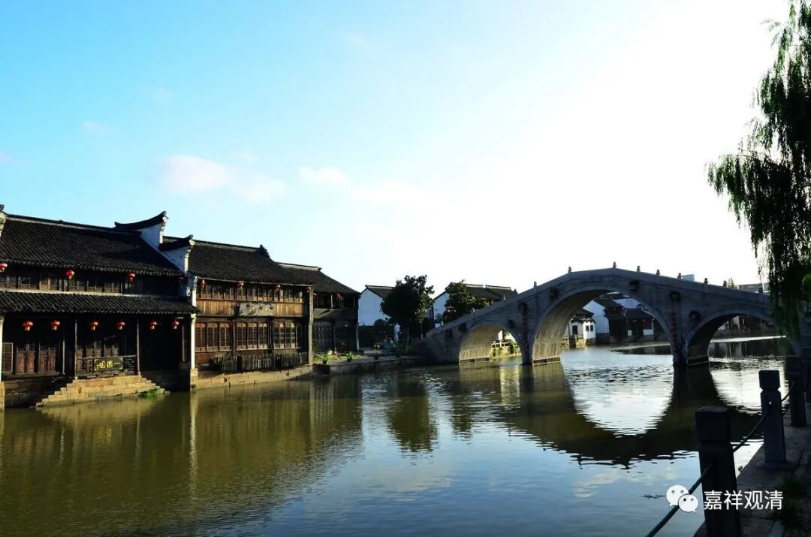
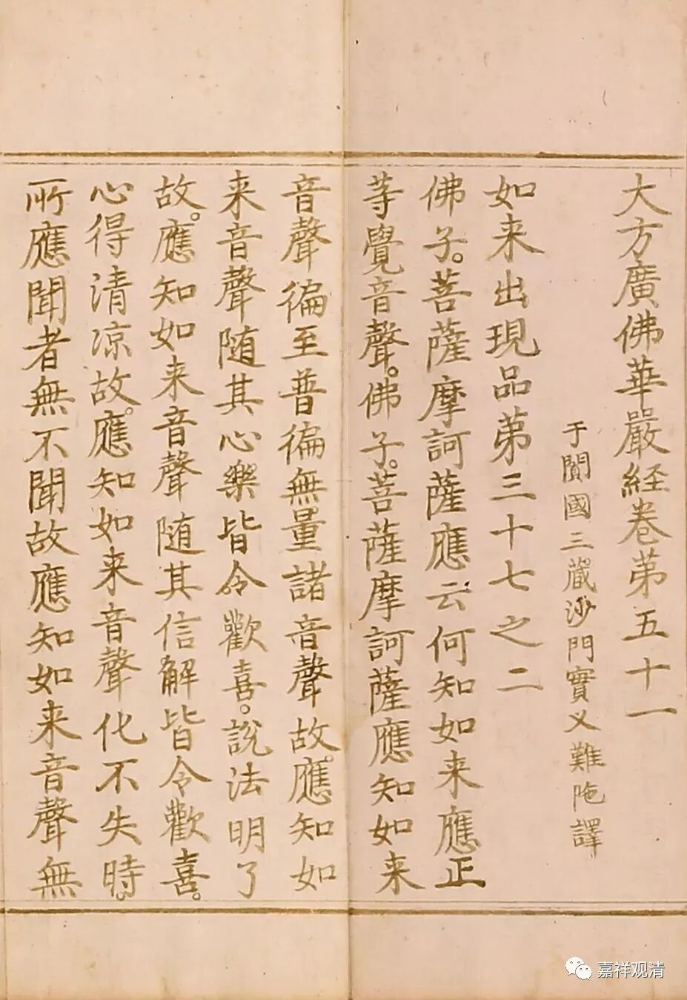
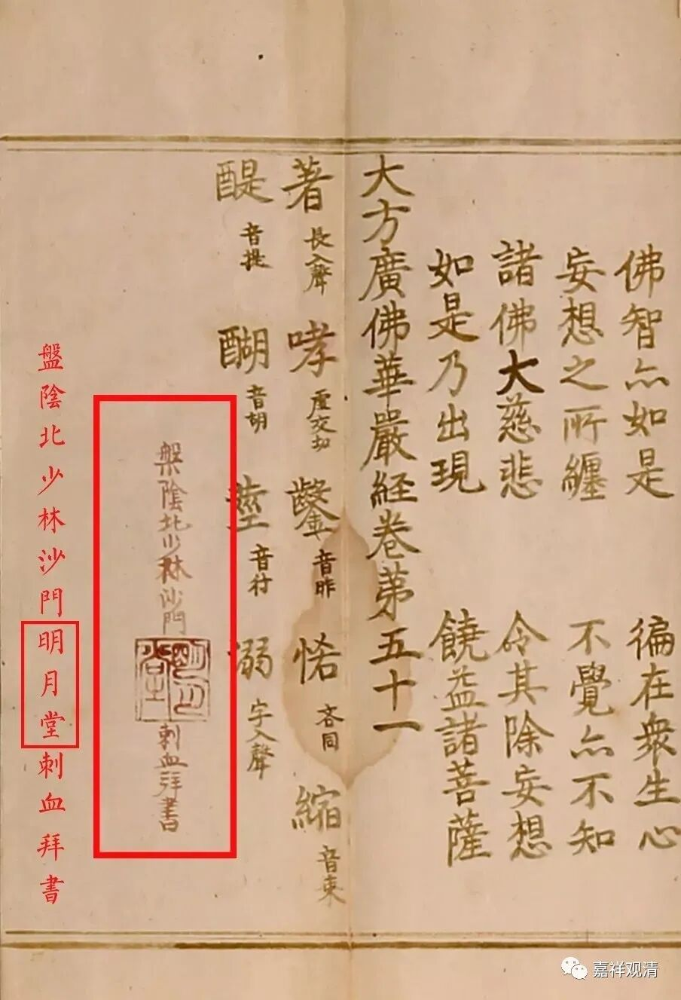

**“捺写本”=刻版+写经**

“捺写本”，实际是一种特别的写本，而很像是刻本。

“捺写本”就是先找来某经的经版，在经版上蒙上（略湿）宣纸，经过（用手、用刷子）按捺（压）之后，在纸上会留下经版的字痕……其实前述步骤，就类似以经版（而不是以石碑等）做传拓（拓片）——除了最后一步省略，不上墨以外，其余照搬传拓技法。这样，最后再把纸揭下、反过来，就有了带经版印痕的纸张。

在这样的纸张印痕上抄经，有类似描红的效果，就像今天很多人抄写心经的那种形式。

“捺写本”是写本，所以最后经文的文字还是要抄经人自己（填）写上去的。“捺写”的好处是，只要经版可靠，就不会抄写错漏——毕竟之上已经有“范本”的痕迹了。

这是一件《华严经》的“捺写本”。（德宝一六年拍卖）

这是一件“捺写本”的血经——刺血写经。这是表示虔诚的一种方式。血经字迹很淡，是因为刺血后要和以中药白芨水，令血不结块以方便抄写……另外，颜色太深了、“血”用得太慷慨了，用不起啊。

此件为盘阴北少林沙门刺血写经，末尾有“盘阴北少林沙门明月堂刺血拜书”题识。

