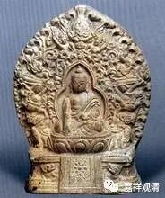
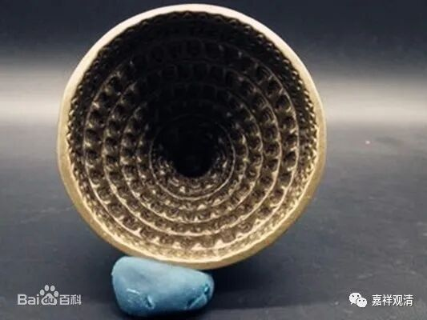
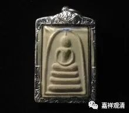

**《微课佛教史》100·2**

玄奘法师去的时候，差不多是那烂陀寺的鼎盛时期。每个寺院的僧寮并不大，围成一个圈，有点像我们今天的学院。整个寺院里面有很多学院，还有一些大型的祭拜场所。看起来占地挺大的，比我们今天中国的一些大学可能还是稍微差一点，但是比起我们今天中国的很多大型寺院，则更多地保留了浓烈的学习背景。今天中国、日本的很多寺院更多的是以观光旅游为主的，而宗教性的、学术性的很少吧。

玄奘法师去到印度以后主要是学习瑜伽行派的一些新内容，他的师父当中最重要的一位大师，就是我们刚才所讲的戒贤论师。戒贤论师的出生要比护法论师更早，虽然护法论师比他年轻，但他是拜护法论师为师的。护法论师呢，去世得有点早，好像三十多岁就圆寂了。戒贤论师是护法大师最重要的弟子，而玄奘法师又是戒贤论师最重要的弟子。

大家知道，根据汉地的说法，在唯识派当中有四位比较重要的大师——安慧论师、难陀论师、陈那论师和护法论师。其中护法大师这一系传到汉地，基本上就由玄奘法师这一系保存了下来，而在印度反而渐渐地没落了。后来印度的唯识派是以安慧大师这一系为主的，而在汉地则主要以护法大师这一系为主。所以学界、教界有一种说法：护法论师这一系经玄奘法师传到汉地以后，印度就没有实力很强的人在延续了。

其实玄奘法师到了印度以后，也不仅仅是学习瑜伽行派，他还拜访了很多的老师，其中包括胜军论师，他也是护法论师的一位重要弟子。前两天还有人在问关于擦擦的问题，如果我没有记错的话，在传记当中说胜军论师做了很多擦擦，十万、一百万地做小佛像。

今天的西藏也还在做擦擦.上面是擦擦和一个塔檫的模具。

南传的佛牌差不多也是这个意思。

中国呢，大家可以去敦煌看一下，也能看见。敦煌千佛洞的壁画上面贴的这些小佛像其实也就相当于擦擦。我们这次去印度的时候，也有一些印度当地人在卖他们自己做的小佛像，装在塑料盒子里面的，好像也不贵，但我们都没有买。

