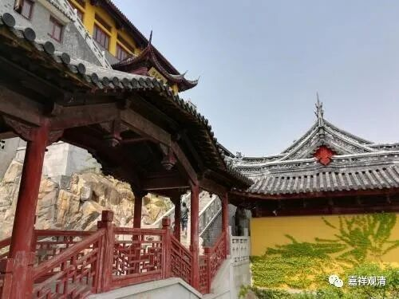

**《微课佛教史》100·3**

我们继续说玄奘法师吧，他在印度应该也是“转从多师”的，他的师兄弟的水平要比电影里描绘的高得多。

在印度玄奘法师也确实出了大名，这里面有多种因素的，其实很重要的一个原因就是当时中国的国力比较强。中国的国力强呢，类似他这样一个留学生也会比较受照顾。确实像电影里面所讲的，印度的一位国王戒日王专门向玄奘法师请问过《秦王破阵乐》的问题。秦王就是李世民嘛，他在军队中有一首《秦王破阵乐》，后来改编成为国家礼乐，而戒日王也专门向玄奘法师请问过这个事情。

另外呢，也牵涉到种姓的问题。在电影里面关于种姓的问题有一个小插曲，就是出现过一个带着面具的男人。种姓的问题其实和玄奘法师去印度也有一点点关系，为什么呢？我们通常知道，对于印度而言，国王一般是属于刹帝利种姓的，而他的这个王权执政的合理性在哪里呢？就是由婆罗门授予他执政的权利，也就是说，神权是掌握在婆罗门手里的。

但在中国的情况是不一样的，假如说印度是刹帝利执政的话，那么中国就类似于婆罗门执政。因为在中国，大家都认为是皇权神授的，什么意思呢？就是皇帝是天子，他其实就是一个大祭司，皇帝家的祭祀就是这个国家最重要的祭祀活动，比如说每年天坛、地坛、先农坛等等的祭祀活动。

对照于印度的种姓制度，印度人可能会怎么理解理解中国的情况呢？中国的君王，比如李世民，他自己说他们的祖先是上古的仙人——老子。那么，印度就会认为，这是一个婆罗门做皇帝。这和后来的武则天作为刹帝利要执政的概念，还是有点不一样的。从印度人的角度看中国的皇帝，他就是皇权神授的一个婆罗门的背景，是一个仙人的背景。

当时还有一个故事，就是东印度的童子国的国王是信奉婆罗门教的，这里就称他为信奉外道。他专门请玄奘法师到他那里去，聊了一些话题，最后就请玄奘法师给他翻译《老子》。为什么呢？因为李世民自己说，老子是他们家的祖先，就相当于要把当时最牛的皇帝的祖先的宗教书翻译出来。后来《老子》这本书是翻译成功的，还被送到了印度。可惜印度并没有保存下来，不过印度没有保存下来的东西太多了，确实没法说。

今天拉拉杂杂的先说这些，明天我们再继续，谢谢大家。

