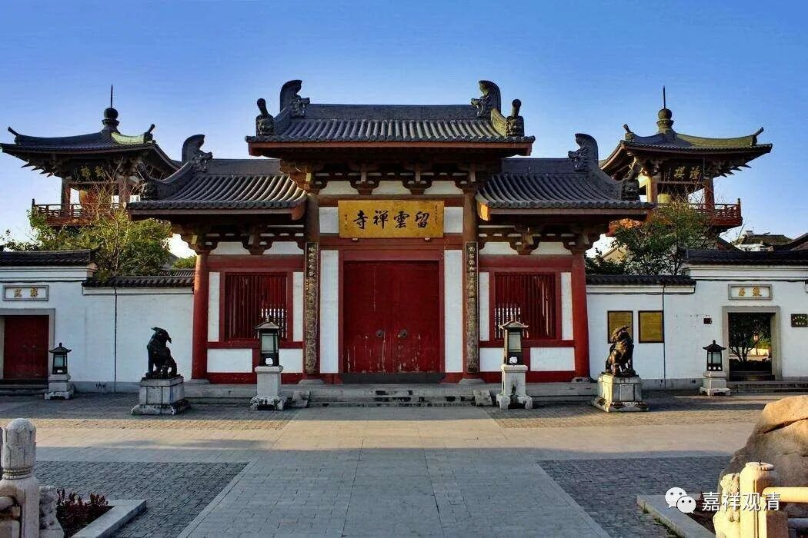
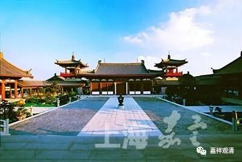
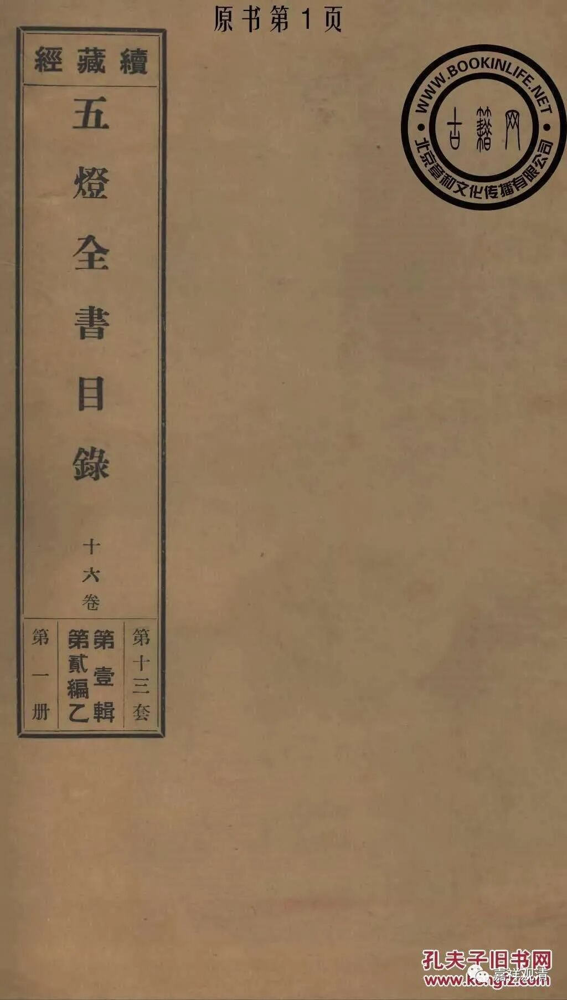

上海嘉定区2000年恢复了云翔寺，介绍说寺院原名“白鹤南翔寺”。

康熙赐名以前，此寺院就叫“白鹤寺”或者“南翔白鹤寺”。

康熙年间，白鹤寺出过一个临济宗的祖师（云翔寺似乎没有打他的招牌），在北京开法授徒，很是有名，他的名字叫“解三洪”（粗粗听起来有点特别有点特别）。

解三禅师（我们按照习惯的称呼来说吧，“解三洪”，按习惯来说，四个字就是“解三某洪”，但这个“某”字史料里暂时没见着）是南翔人，他在嘉定南翔镇（当时南翔地属苏州府）白鹤寺出家，后来到了京城，受戒、闭关、开悟、出山、住持一方，在北京香山洪光寺住持。

解三禅师俗姓葛，号“解三”，禅宗的灯录里称他为“京都洪光解三洪禅师”，得法于大博乾禅师。这里的“解三洪”、“大博乾”都算是略称，类似“观清”而仅称“清”，或者加寺院名字可以称“白云清禅师”。禅宗的灯录《五灯全书》是在“大博乾”、“解三洪”在世时编纂的，记录得略一点，所以没有更多资料知道“解三禅师”的另一个名字是什么“洪”了。

解放后，嘉定县改属于上海市。九十年代，真如镇从嘉定县划归普陀区，整个嘉定县便没有一个寺院了（八十年代末嘉定县真如镇有真如寺刚刚恢复活动）。乃迁上海留云寺一脉恢复嘉定云翔寺。

云翔寺刚恢复的时候我记得陪一个百岁老和尚去过现场（好像住持是他的弟子），记得法堂的天花板有白鹤的形象，老和尚因此讲了白鹤的传说……现在那个老和尚不知道还在不在了……

