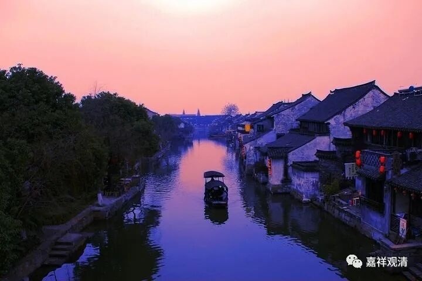

**《微课堂佛教史》101·1**

好，我们继续讲佛教史。

中国佛教史当中的唯识宗，最重要的一位人物就是玄奘法师（玄奘大师）。关于他的片子其实最近挺多的，有几部动画片——我觉得倒是拍得不错的，还有我们也贡献了票房的黄晓明主演的《大唐玄奘》——这个拍得也还可以，我们还是应该点个赞。

昨天我们已经讲到玄奘法师去到印度，今天不妨先回忆一下玄奘法师开头的故事。他小时候家里是官宦，也不是大官啦，算是一个小官的家庭，不过小官也是官，和吏不一样……而可能他的家里信佛的也比较多。

还要补充说的一个情况就是，玄奘法师出生的时代再往前推一点点呢，有过一个灭佛运动，对他们那个时候的佛教徒来说，接连几次的灭佛运动对心理是有一些影响的。玄奘法师的哥哥也出家了，叫长捷法师，也是比较有名的，挺有学问。

我们可以推究一下：玄奘法师为什么要去印度？可以说有很多种原因吧，第一个原因就是之前有人去过。可能我们现在觉得这个事情并不怎么样，但是在当时还是非常重要的。在玄奘法师之前就有法显大师去过印度，他也非常出名。有一本法显大师的传记，叫《法显传》，又名《佛国记》，但是篇幅没有《大唐西域记》长。我记得我在看的时候，这本书还有一个名字叫《佛游天竺记》，这个其实是错的，因为《佛游天竺记》是法显大师翻译的一本书。

后来玄奘法师口述了一本《大唐西域记》，是对印度游历的记录，其中有些地方并不是他本人去过的，而是属于耳闻……不过《大唐西域记》里面大部分的地方是玄奘法师本人去过的。玄奘法师去了印度以后再回来，《大唐西域记》就面世了。可以说，这本书在那个时代就让大家有机会了解西域的情况。在玄奘法师之后，中国对西域的情况就更加了解了，包括在《新唐书》、《旧唐书》里面都有对西域的记载，这都和玄奘法师的口述有关。（还有一个，就是上次我们说过的，王玄策，他也写了书介绍印度，但是这本书现在佚失了）

法显大师去印度是坐船去的，而玄奘法师则是走路过去的。这个事情可以说是当时中国地理的大发现，让大家知道，去印度可以有这样几条不同的路。其实后来又开辟了一条比较重要的通路，就是从长安到西宁，然后从西宁经过青海湖再到拉萨，最后从拉萨进尼泊尔去到中印度。这条路是在玄奘法师之后，王玄策他们走得比较多的就是这条路。

这在当时也可以算是地理大发现吧。虽然这个地理大发现和十五到十七世纪的那个地理大发现是不一样的，但是对当时的人来说，地理概念被大大地扩展了。而玄奘法师在这个地理大发现中，也是一位重要的人物。不止是玄奘法师，在他前后出现过很多人去到西域。今天我们看到《西游记》当中有个猴子叫悟空，是吧？实际上也是有这样一个人的，有一个取经的僧人名字就叫“悟空”的。

这就是第一个原因，就是玄奘法师去印度的时候，当时的地理条件或者说知识条件已经具备了

