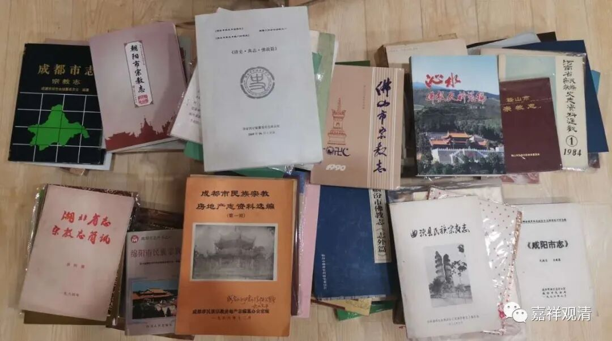
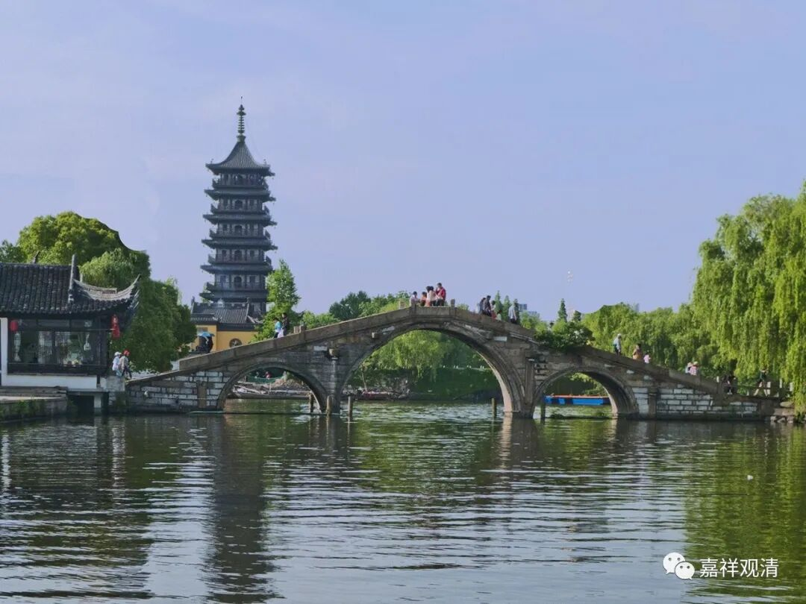

最近读了一点地方志、寺志、名山志之类的书，不得不感叹世事之无常——历史上的这些有名的大寺院，基本上全都是数十年一兴亡，稍微能延续久一点的，一般都需要皇家扶植。但是，皇家的支撑也还是无常啊！

同样的情况，在印度、缅甸、泰国也一样。很多佛教寺院遗址都有一代一代的建筑堆积层，都向我们表明，它们数度兴废的过去……

《一代宗师》里说：“凭一口气，点一盏灯。有灯，就有人！”对寺院来说，“有人，就有寺。”所以禅宗后来把传法和传位（方丈住持的位置）相捆绑——找到人材，最重要的就是要考虑延续寺院的“香火”，这一方面是中国宗族化（也是一种“佛教的中国化”）的思维，一方面是延续传承的压力……老和尚传位、传法时还往往要接任的新住持发誓：“生是寺院的人，死是寺院的鬼！”（来果老和尚故事）

一般我们都知道，佛陀曾经预言过自己的教法传播，正法五百年（也有正法一千年之说）、像法一千年（也有像法五百年之说）、末法一万年。在其他地方，佛陀还曾经授记过，释迦佛灭度以后，教法要经历五个“五百年”——

《大方等大集经》卷五十五：

“……于我灭后五百年中，诸比丘等犹于我法解脱坚固；

次五百年，我之正法禅定三昧得住坚固；

次五百年，读诵多闻得住坚固；

次五百年，于我法中多造塔寺得住坚固；

次五百年，于我法中斗诤言讼，白法隐没，损减坚固……”

两说可以互通：最初五百年，因解脱法（证法）在世而正法住世；

其后一千年（像法）中，因禅定、多闻而得佛法住世；

此后，因造庙、建塔而“住持佛法”；

此后，师徒斗诤，善法隐没，佛法日趋衰减……这也是现在的趋势了。

从这个角度讲，上面一两代的老和尚们心心念念的造庙、建塔，也就有了独挡大势、硬撑残局的悲壮了！

