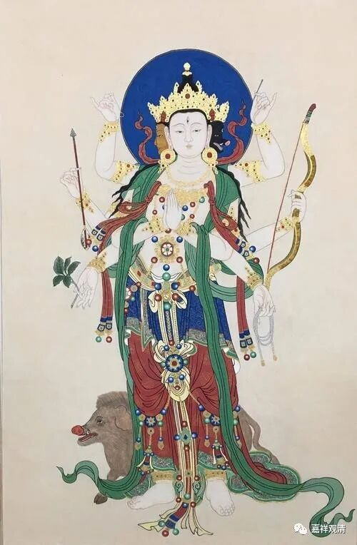
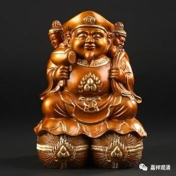
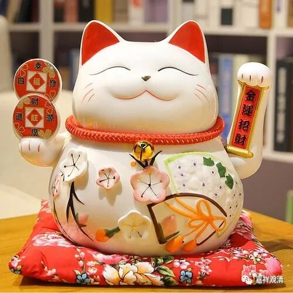
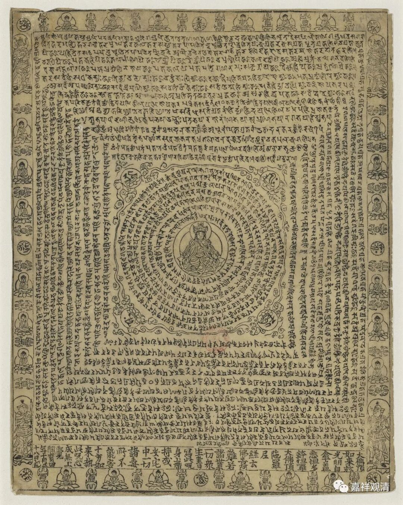
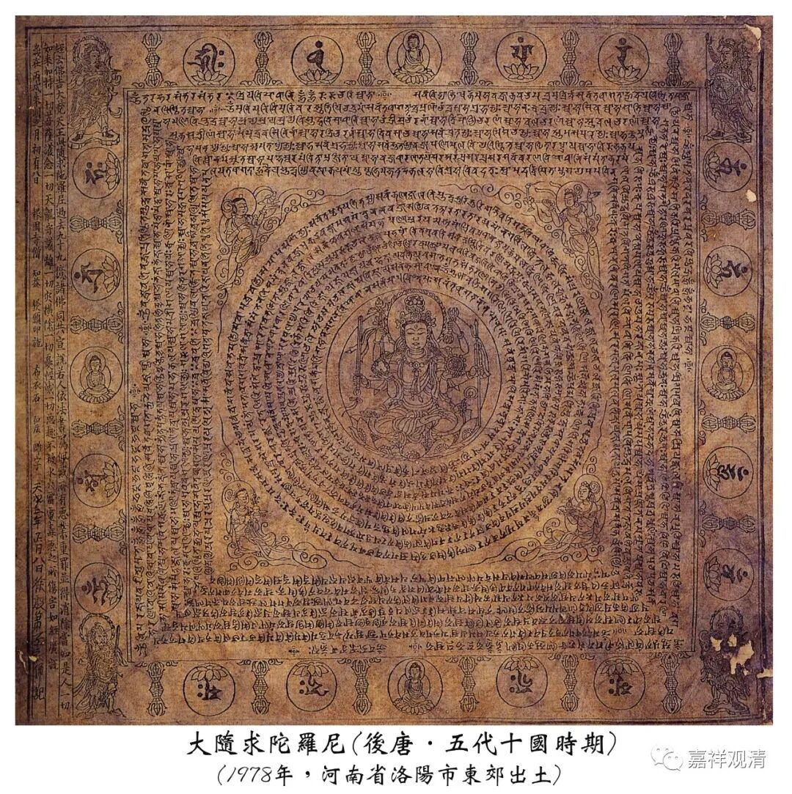

——隐没的摩利支天信仰和大随求陀罗尼

有人说，“刚念了摩利支天就有人还钱”，于是迅速引发大家追星摩利支天……

摩利支天（注意脚下那只猪）

摩利支天信仰曾经在中国相当流行，后来又传到日本（忍者修隐身术就是修的摩利支天），直至今天，日本的寺院几乎没有不供摩利支天的，但今天的“大唐”国内反而很少见到“摩利支天”的形象了，倒是在道教里面还保留着——佛教的摩利支天在道教里以“斗母元君”的名义存在着。（又，元杂剧里，猪八戒元就是摩利支天的座骑。）

日本大黑天

类似的“无常”了的佛教传统还可以举出很多，比如大黑天信仰——今天的云南、日本还大量供奉玛哈嘎啦（就是大黑天），乃至日本的大黑天还有了卡通版——招财猫，但在国内汉族地区则很少见有寺院供奉大黑天的。

招财猫的原型就是大黑天

上述这两位“摩利支天”和“大黑天”在世俗佛教里都略近于有求必应的“财神”。

如果说到佛菩萨，宋代还流行过“不动佛”信仰（今天藏地还有一点痕迹），乃至当年的下层官吏普遍的供奉不动佛以祈祷“坚固”自己的“铁饭碗”……

开宝四年印刷品大白伞盖陀罗尼

再说咒语，隋唐时期，大白伞盖陀罗尼、大随求陀罗尼都曾经引领流行，甚至现存最早的雕版印刷的实物全都是这两种咒语的“护身符”，但是今天却很少有人知道“大白伞盖陀罗尼”、“大随求陀罗尼”了，甚至因为很少有人知道，前几年还闹过一个“小”笑话——有学者在给“大随求陀罗尼”的印刷品断代的时候，直接断句成“大隋（随）·求陀罗尼”……

有人说：“没有不变的传统”（朱维铮），那也就是说，“传统也是无常的”，这应该“放之四海而皆准”。有格西自我嘲讽说：说起来大家都在一个流派里面，还都是“有传承的”。但就是这一个流派里面的号称“最清净无误的耳传”，解释起来也是百家争鸣、万紫千红……他的意思也是——“传，简直是不可避免会有变化（，根本不存在一成不变的传承！）”，毕竟无常是现实世界的真理。

刚学佛时，有一位师兄（现在已经是证券公司老总）要带我去买流行歌曲的磁带，我回了一句“流行的就是无常的”，大获师兄盛赞……

