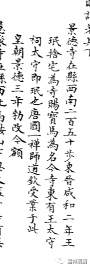
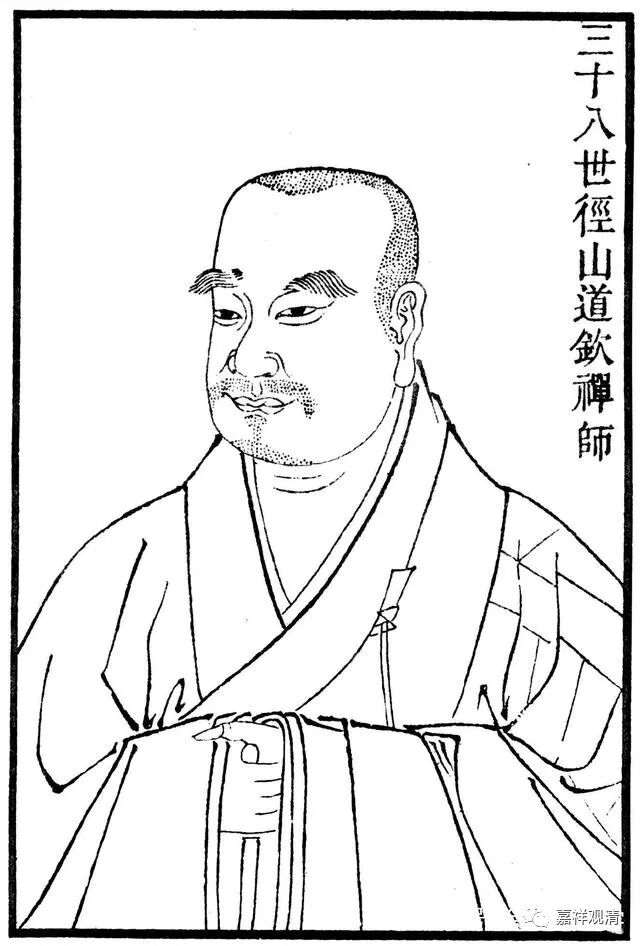

地方志书不可轻信

《玉峰志·寺观》（宋·凌万顷、边实）：

**“景德寺，在县西南二百五十步。东晋咸和二年，王珉舍宅为寺，赐宝马为名。今寺东有王太守祠，太守即珉也。唐国一禅师道钦受业于此。皇朝景德三年敕改今额。”**

按：咸和二年，即公元327年。

查《晋书·王导传》：

** “（王）珉字季琰，少有才艺，善行书，名出珣右……辟州主簿，举秀才，不行。后历著作、散骑郎、国子博士、黄门侍郎、侍中，代王献之为长兼中书令。二人素齐名，世谓献之为大令，珉为小令。太元十三年卒，时年三十八。”**

据《晋书》，王珉三十八岁去世，卒年为“太元十三年”，即公元388年，则王珉当生于永和七年（公元351年），前《玉峰志》“咸和二年（公元327年）”时王珉尚未生，怎么可能“舍宅为寺”呢？！

又，王珉从未担任过地方令守，故亦不得骤称“太守”。《玉峰志》此处全误。

二、道钦遇玄素年岁

此下《玉峰志》又谈及唐·道钦禅师。

按：径山道钦禅师，又作径山法钦，牛头禅系鹤林玄素弟子，唐代宗赐号“国一禅师”，为杭州径山寺开山祖师。《宋高僧传》中谓径山法钦为吴郡昆山人，俗姓朱，年少业儒，二十八岁路遇玄素而出家……亦不闻受业于“宝马寺”。

如此，则《玉峰志》此处之记载全不可信。

又按：

《杭州径山寺大觉禅师碑铭》（唐·李吉甫）、《宋高僧传》（宋·赞宁）皆谓径山道钦二十八岁时遇鹤林玄素，而《径山志》（明·宋奎光）、《武林梵志》（明·吴之鲸）皆谓二十二岁，不知何据。今人冷晓《径山寺志》，则将“道钦遇玄素”事系于开元二十四年（公元736年），则又更误为二十三岁。

