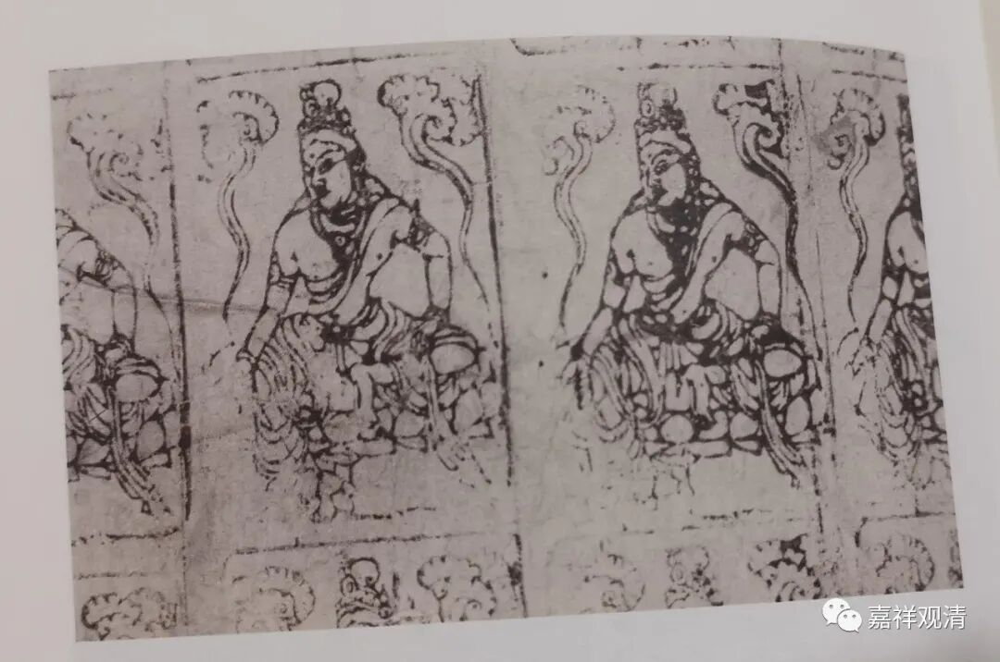

**“捺印千佛”与“十万加行”**

今天下午又有一个居士用我刻的印章完成了捺印十万佛像。这是这四天的第五个了。

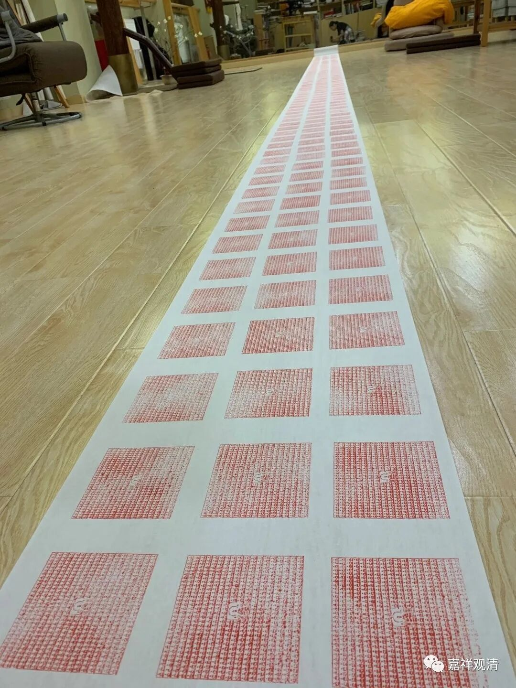

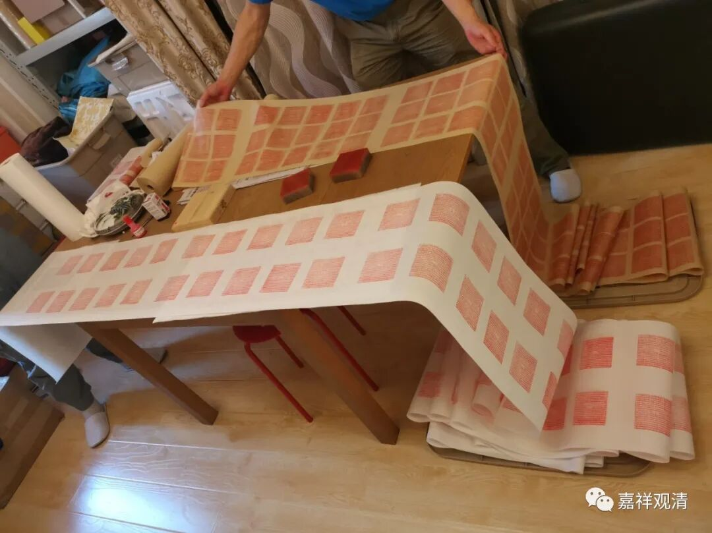

我刻的佛像——

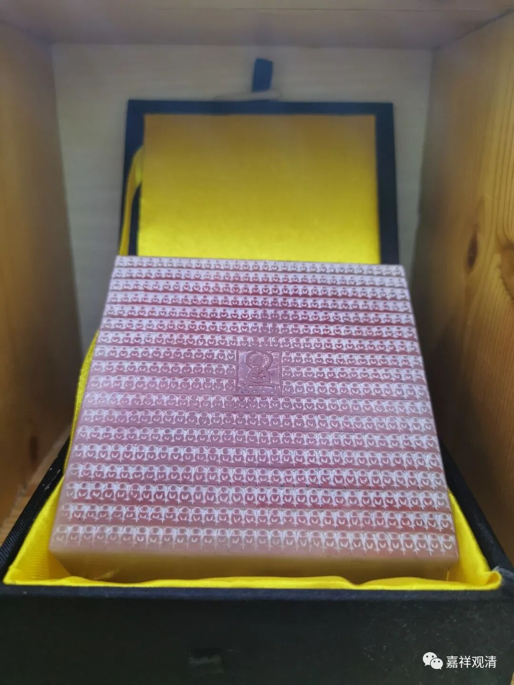

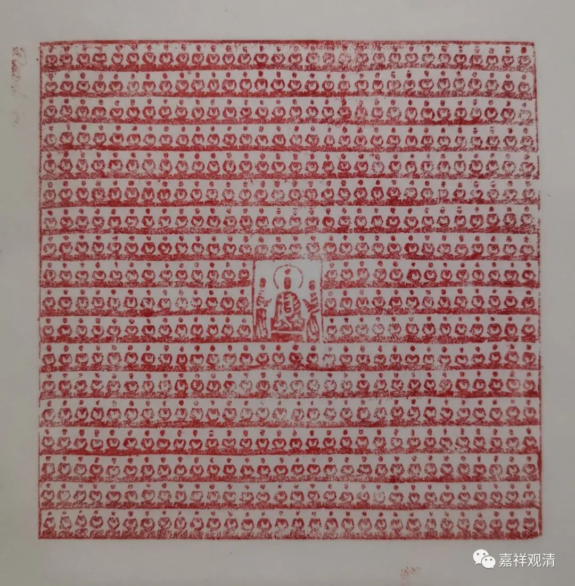

小衲只是业余石匠，刻工不必谈。好处是多呀。五百多尊。大家省事儿了。

捺印佛像是大约是从印度传来的“传统”，自唐代便已经有流行。

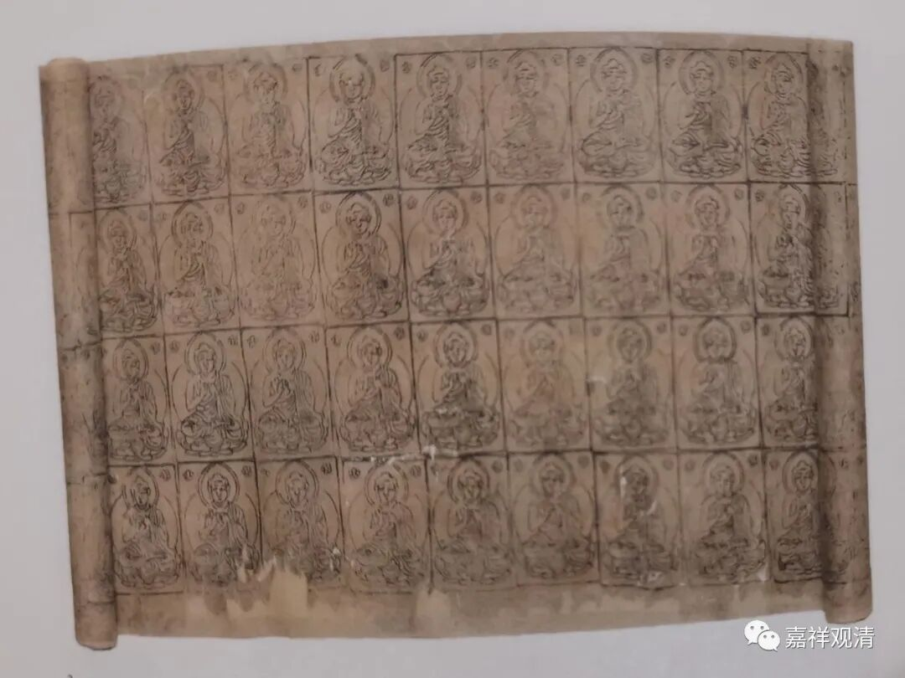

这是公元八世纪的捺印千佛，成卷轴装。

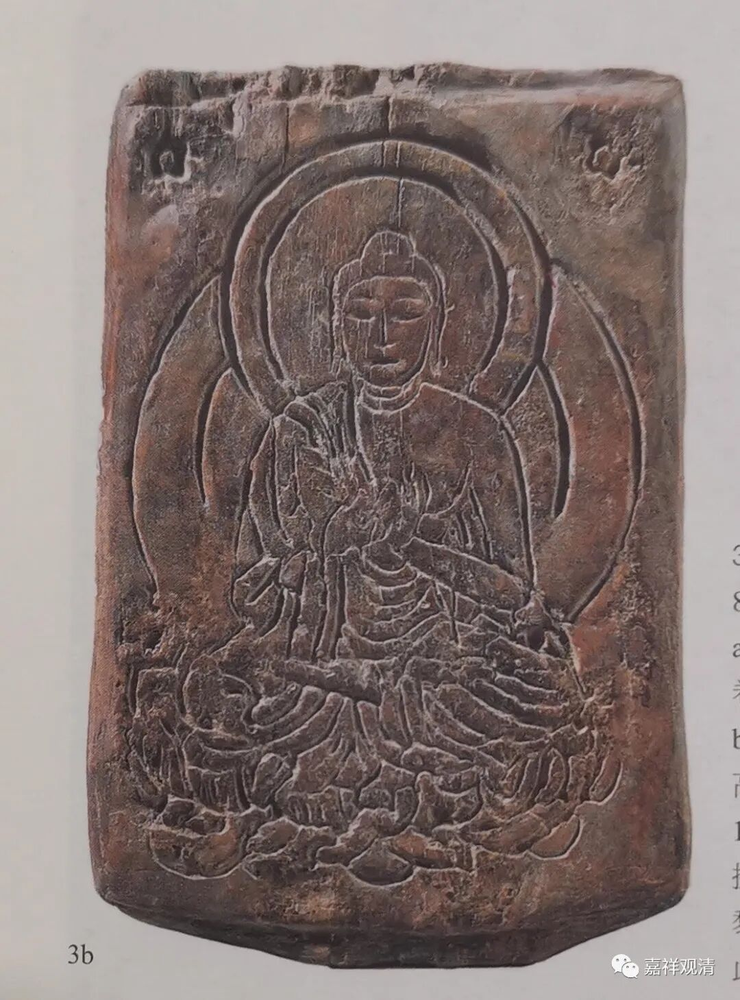

这是捺印佛像的母版。上面类似阳纹，木板现存的这个是阴文、白文。想来应该是朱文印更多见，但朱文印不便保存，白文印更容易保存，所以此枚存世至今。

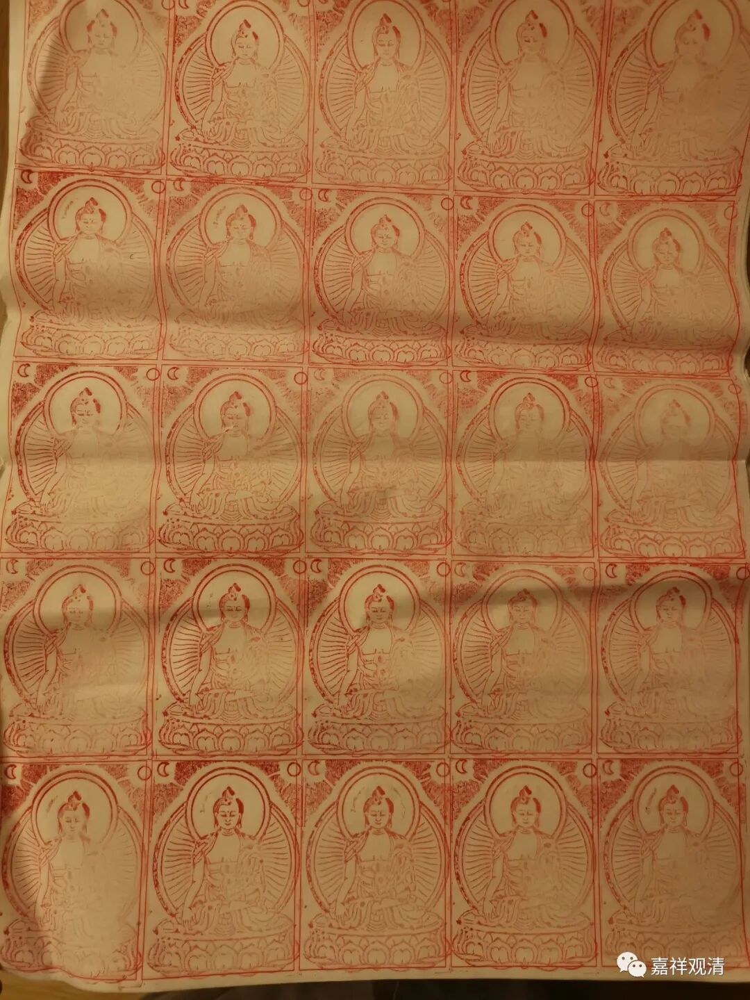

这是前几年我们印的“十万佛像”。

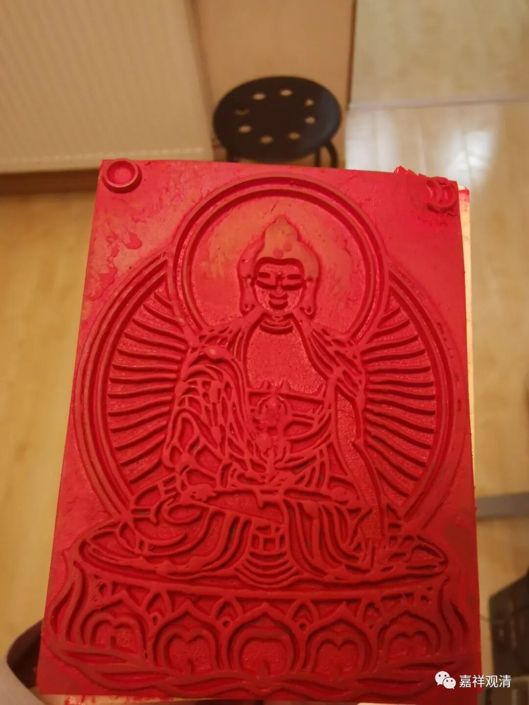

这是用的橡皮印。

这一件是公元九～十世纪的“捺印千佛”的菩萨像。照片上可以看见图版上下还有菩萨像。

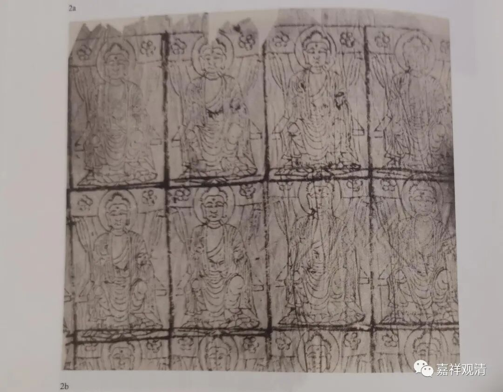

这一件也是公元九～十世纪的“捺印千佛”的佛陀坐像。此两件都出自敦煌，由斯坦因带去英国，现藏于不列颠博物馆。

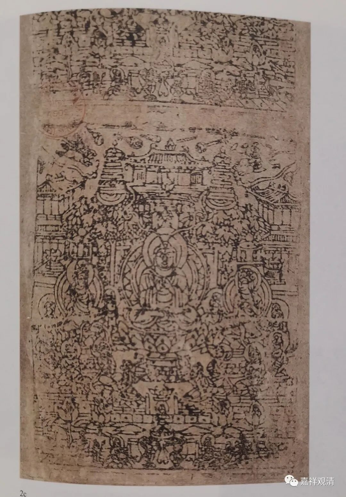

《西方净土变》。这一件比较大，照片上方可以看出有和核心图一样的纹路，所以也是一件“捺印千佛”的“成品”。此件由伯希和带往法国，现藏于法国巴黎国立集美美术博物馆。

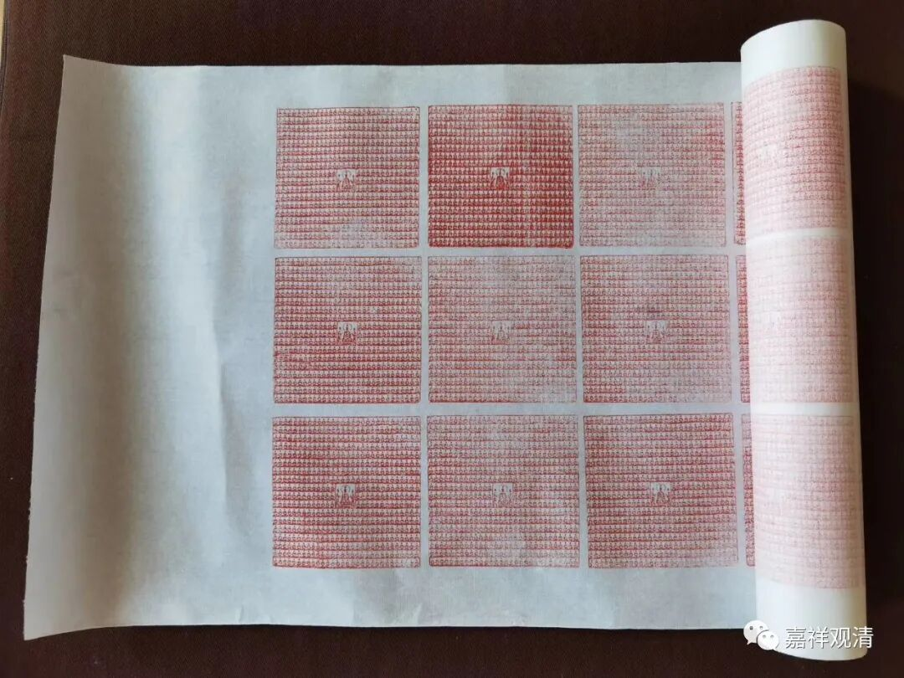

据说现在流行的“十万加行”云云，此前的数量并非“十万”，而是“万”一级的，后来因为善知识们感叹末世众生福德寡少、障碍滋生的缘故，遂增作“十万”。假如这是真实的话，那么，由千（“捺印千佛”）而万，进至“十万加行”，这是逐步加码，渐渐增上的一个过程了。

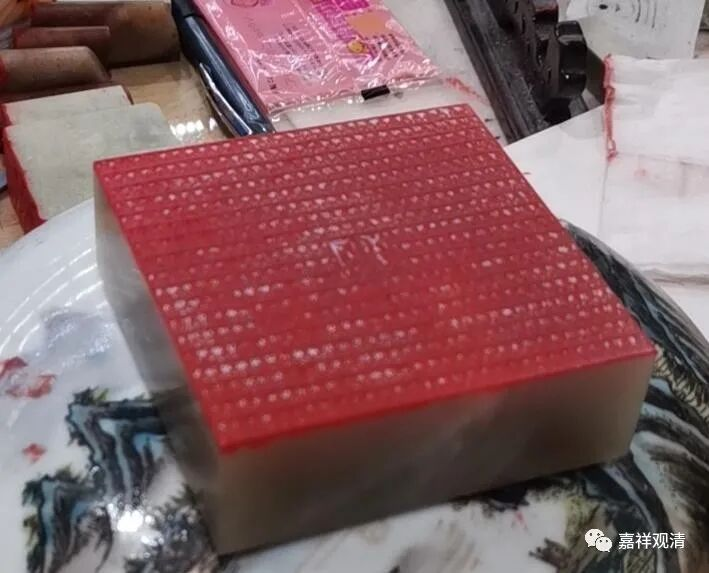

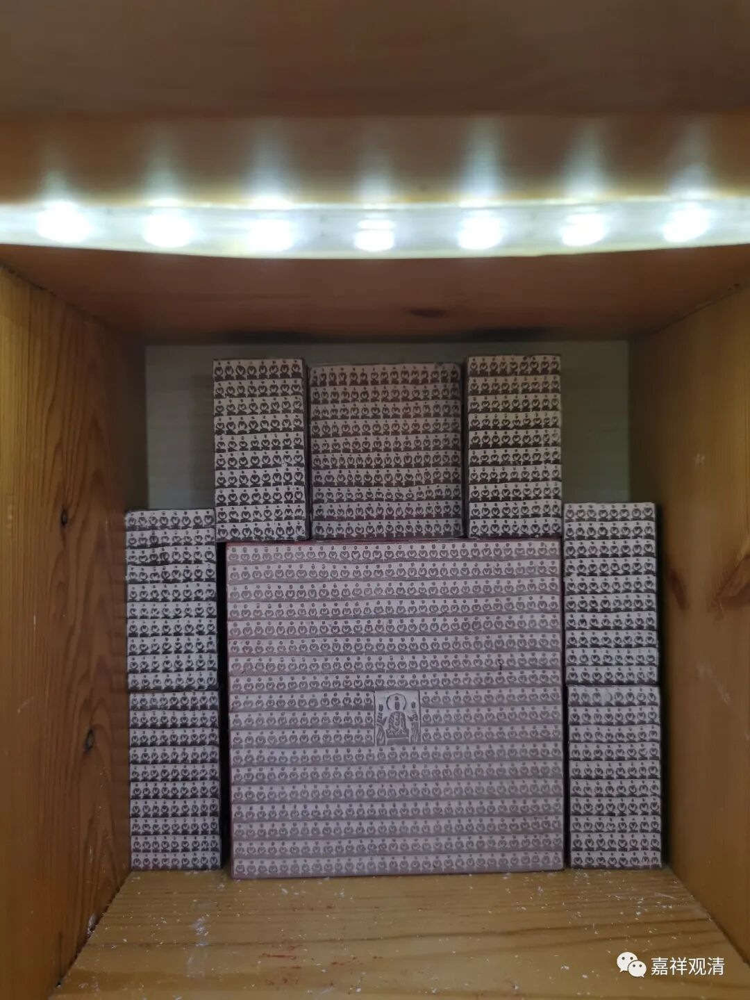

弟子们印十万佛像，我是考虑刻十万了。今年应该可以完成两万，五年可圆满矣！

