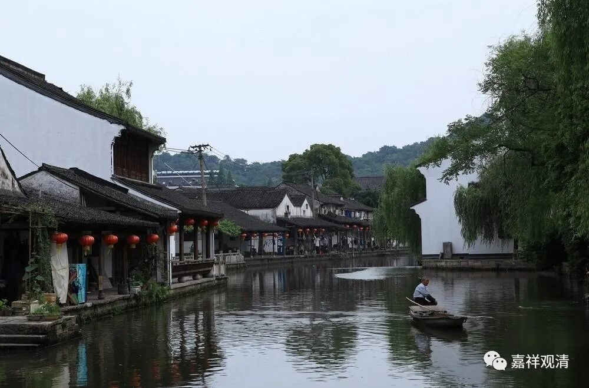

**《微课佛教史》102·2**

那么，玄奘法师在汉地学习的时候，也比较多的是学习有部和唯识为主。也许我没注意，但是我记得我专门去查阅过，相对仔细地查阅过玄奘法师的求学经历。我没发现他专门学过中观，特别是在汉地，好像没怎么专门学过中观。他去印度之后，我看他好像也没怎么接触过中观，比如说在某个地方专门学过一段中观，看起来不是很像。

我说专门学习中观不是指仅仅学习中观的论典就算，因为唯识也会学习一些中观的论典。比如说，我们会看到，唯识也会有对中观的解释，这个不能完全算是中观。我想说的就是，玄奘法师在国内也好，在印度也好，他的学习方向是有部和唯识为主的。

我们从他回来中国以后主要翻译的经典当中也可以发现这一点：一个就是《瑜伽师地论》，光这部论典就是一百卷，还有其他比较庞杂的瑜伽行派的经典也非常多；第二个呢，是玄奘法师翻译了大量的有部系统的论著，比如二百卷的《大毗婆沙论》，又重新翻译了《俱舍论》和相应的《六足论》当中的绝大部分。

可以看出，玄奘法师在印度求学的时候也是在有部和唯识这两方面用功比较勤奋的。从时间上也可以看到，玄奘法师在克什米尔待了很长的时间，而克什米尔是有部的重镇。

另外呢，比较重要的就是他跟从戒贤法师学习唯识，戒贤法师主要是在那烂陀寺，所以玄奘法师在那烂陀寺待了好像五年。当然，他在中间又出去过，但主要在那里待了差不多五年。后来玄奘法师又跟着胜军论师学习，胜军论师好像也是护法论师的学生，也挺抢手的。玄奘法师就跟着他学习了唯识方面的一些内容，也包括一些因明的内容等等。

