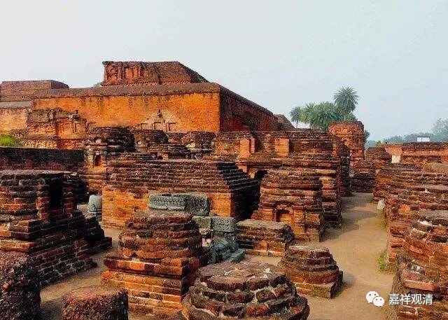
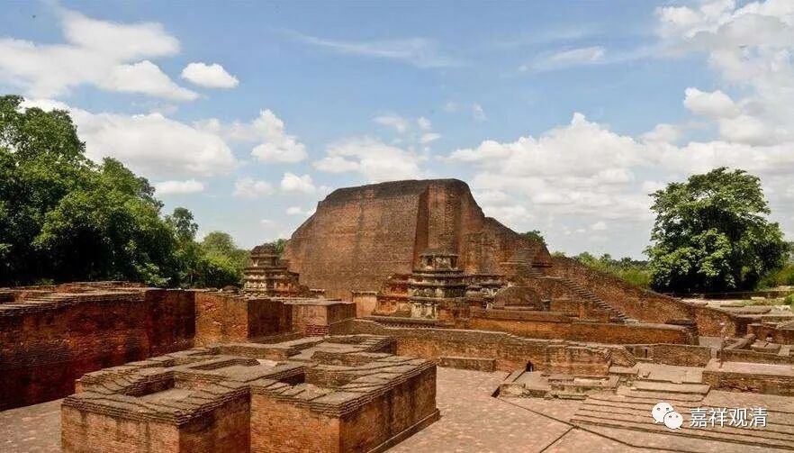

**《微课佛教史》102·3**

那么，玄奘法师在印度学习的主要方面就是这两个——有部和唯识。唯识里面，最重要的就是《瑜伽师地论》。

玄奘法师的故事大家现在已经听得比较多了，电影也看了，我们再来讲讲里面最重要的一个地方——那烂陀寺。

今天呢，那烂陀寺只剩下了废墟。不过这个世界上的废墟多的是，而这个废墟却是因为玄奘法师才出名的，甚至是因为玄奘法师在他的《大唐西域记》中的记载才被挖出来的，才在世人面前展现了这样一个历史上的佛教大学的规模。

藏地说那烂陀寺很早就有，乃至龙树也在这里住过——这是不可能的。那烂陀寺位于中印度摩羯陀国王舍城之北，大约初建于公元五世纪笈多王朝时期，笈多王朝历代国王都有扩建，到公元七世纪时达到鼎盛，此时正是玄奘法师、义净法师来到印度的时候。

那烂陀寺做兴盛的时候，能住下上万人，藏书九百多万卷，据说可以教书的老师可以达到一千五百多人，其中通达三藏的有一千人。那烂陀寺每天能开一百多节课，内容包括佛教的五明：声明（文字学）、因明（逻辑学）、工巧明（建筑、美术）、医方明（医学）、内明（佛教哲学），此外也有开设其他宗教的课程及一些世间学问。

那烂陀寺规模庞大，人员众多、经济上消耗甚巨，基本（完全）靠皇家支持，这为它的衰弱打下了伏笔。笈多王朝衰弱以后，寺院也随之衰弱。所以寺院还是得有自己的“长期饭票”，得经济独立才行。中国佛教禅宗的“农禅合一”，乃至太虚大师提出的“工禅合一”都有经济独立的考量，其中，禅宗的“农禅合一”可以说是在佛教经济史上得到了“颠覆性”的成功。禅宗寺院“自力更生”的经济制度，是禅宗对中国佛教史的一大贡献。另外，禅宗的丛林制度是对旧有的“律寺模式”的颠覆，禅宗的《灯录》是对旧有的《僧传》的颠覆、创新。不断的创新、颠覆以适应时代、适应方土，是禅宗强大生命力的保证！

