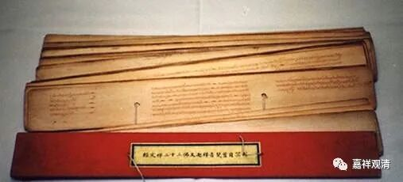

朋友圈有专业售卖《大藏经》的兄弟，经常可以看到他说“梵伽装”。实在忍不住，终于提醒了他，两回。

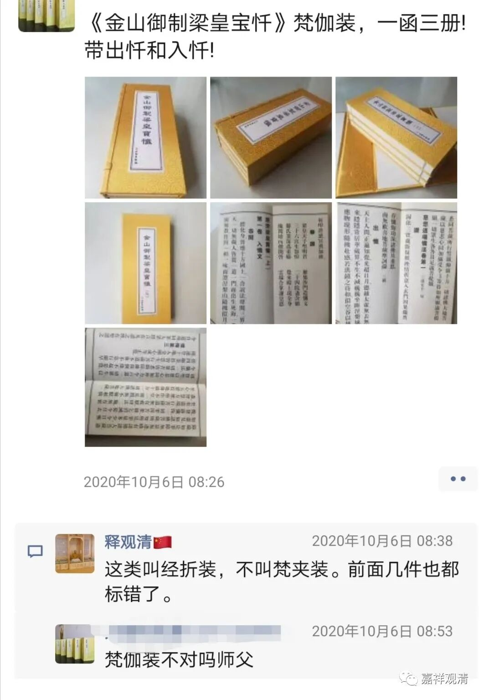

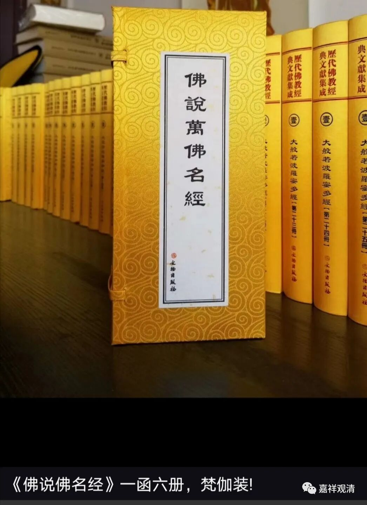

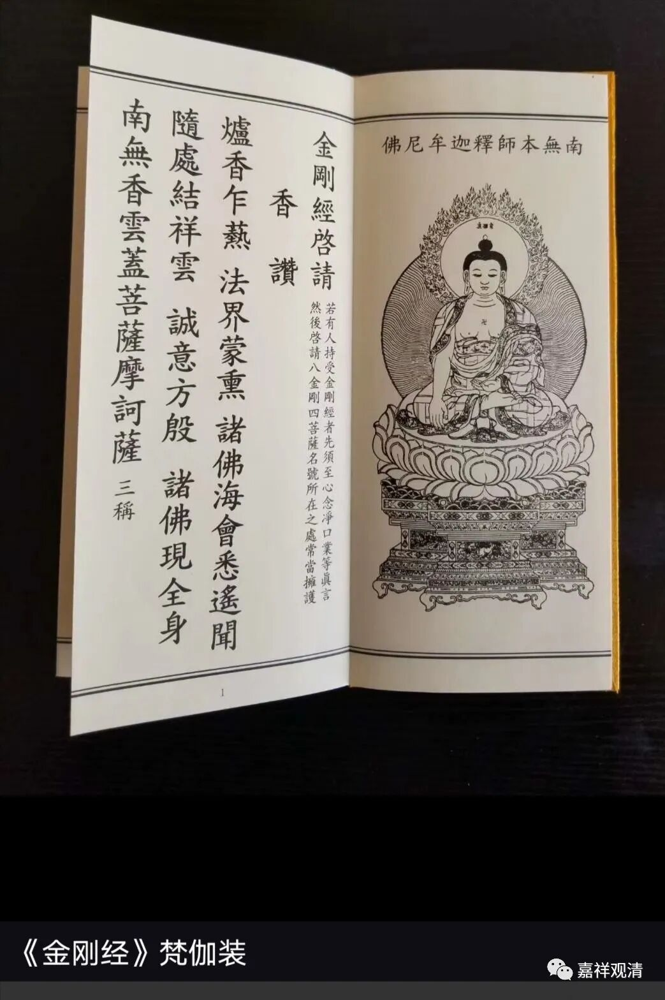

其实他的这个说法是错的。这种书籍装帧的方式，不是“梵夹装”，而叫“经折装”。

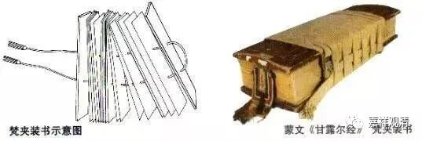

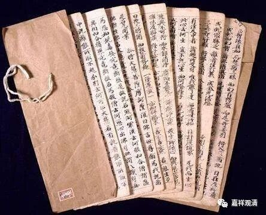

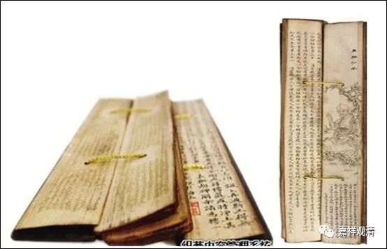

**这是梵夹装**

梵夹装，又叫梵箧装，就是售书兄弟说的“梵伽装”，其实是印度经典的装帧方式，今天南传的贝叶经系统也还有在用的。书写在截成长条的贝叶纸上，中间有两个洞可以把书页穿起来以防止散乱。

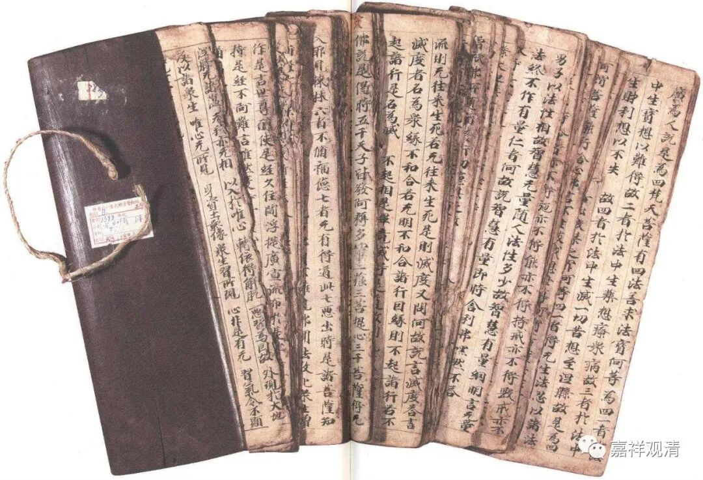

后来，已经不再凿洞，有时候仅留两个点象征一下。

再后来，就是今天藏文大藏经、满文、蒙文大藏经的这种连中间的点都弱化掉的样式。没有了中间的两根绳子，翻捡起来确实容易乱，所以有绳子也有好处。

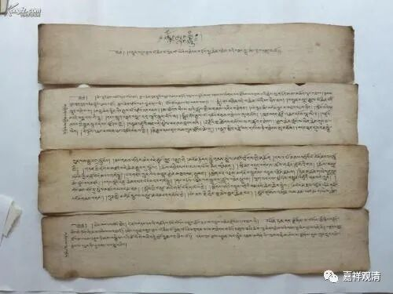

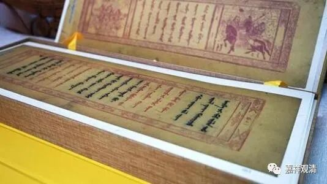

明代末年，紫柏真可大师（最初）把经折装叫做“梵夹装”……

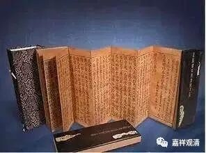

经折装

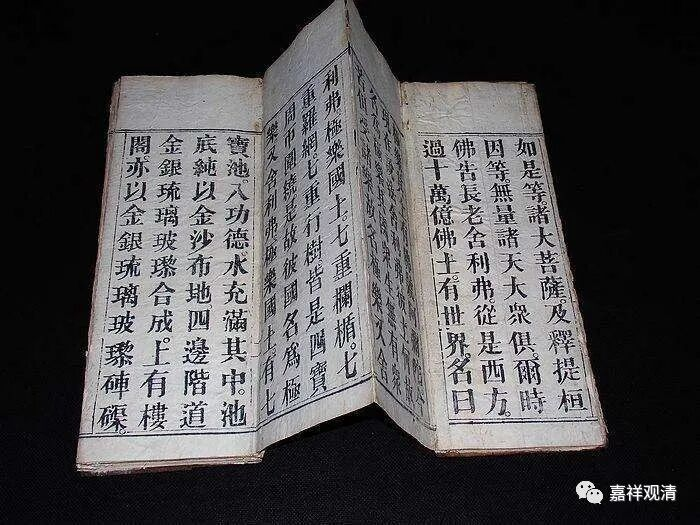

经折装

并写进了书里，于是误导了此后的一串人。所以至今仍旧有“专业人士”管这种经折装叫“梵夹装”。经折装的前后是连在一起的，一般只用一面；梵夹装的每页纸（贝叶）是独立的，靠中间的绳子连缀或者不连缀，一般正反两面都能读。

