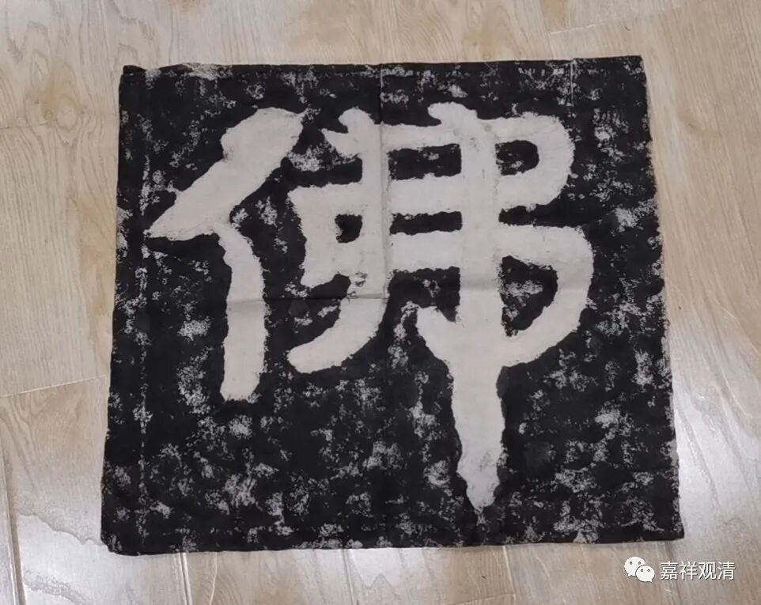

这是一个朋友今天在朋友圈晒的北朝冈山摩崖石刻。

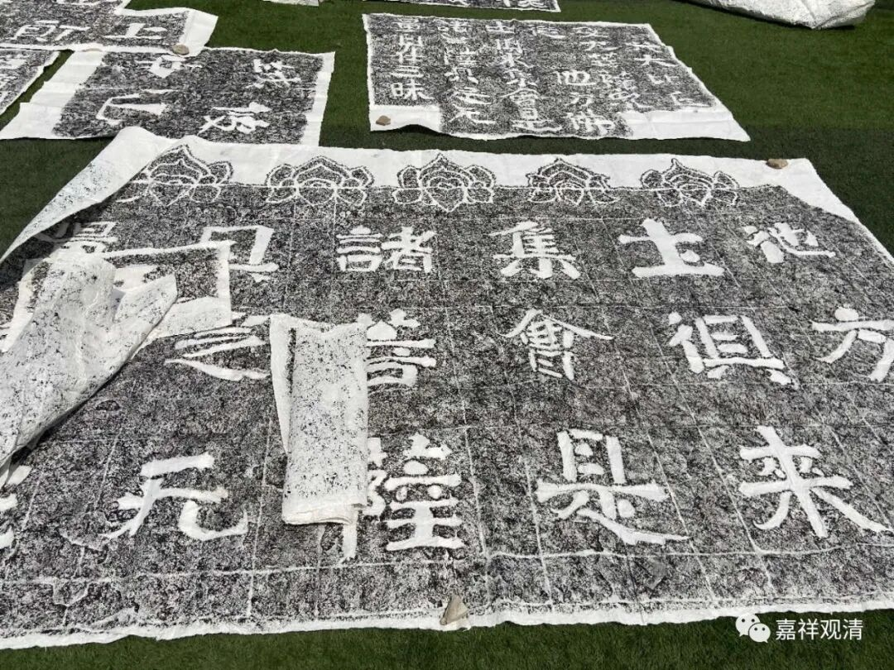

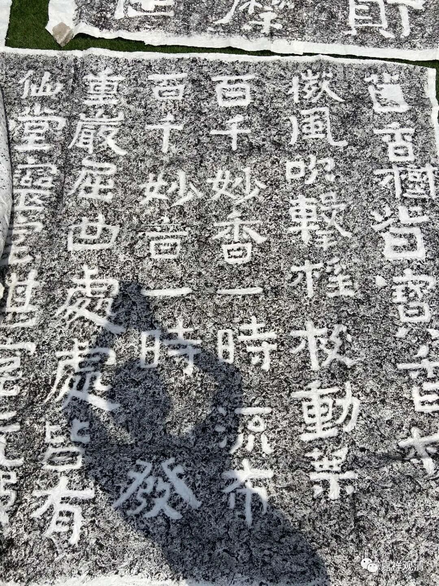

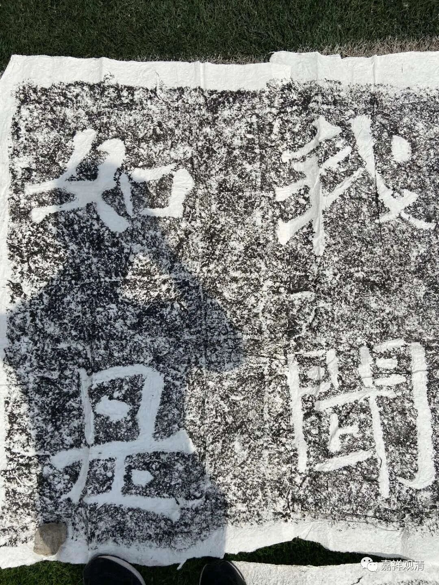

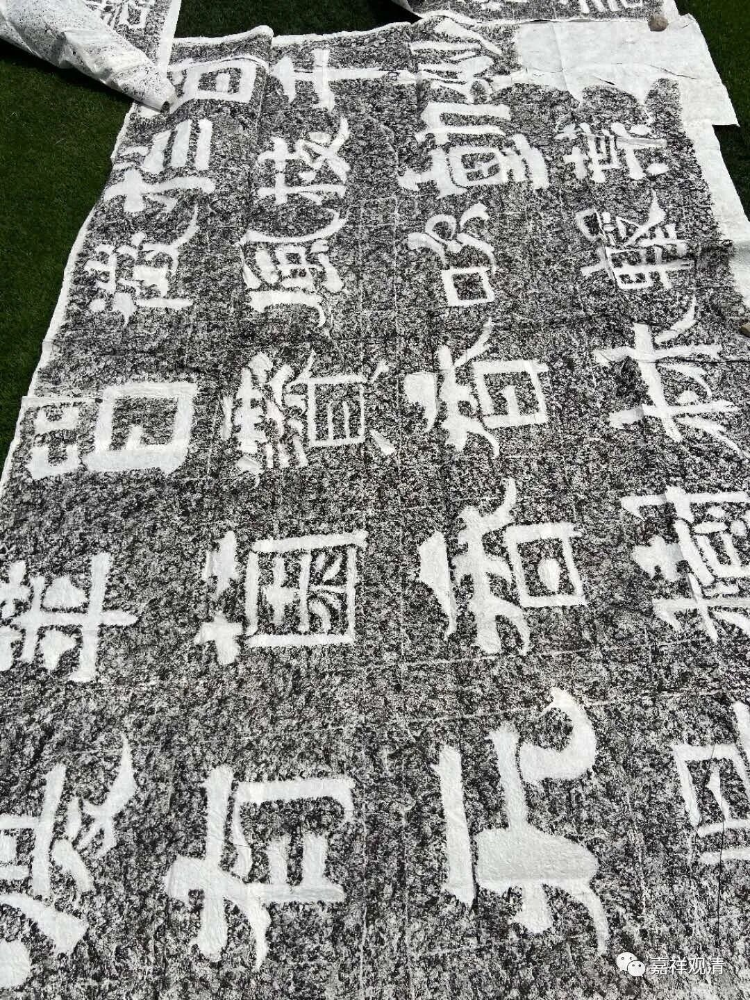

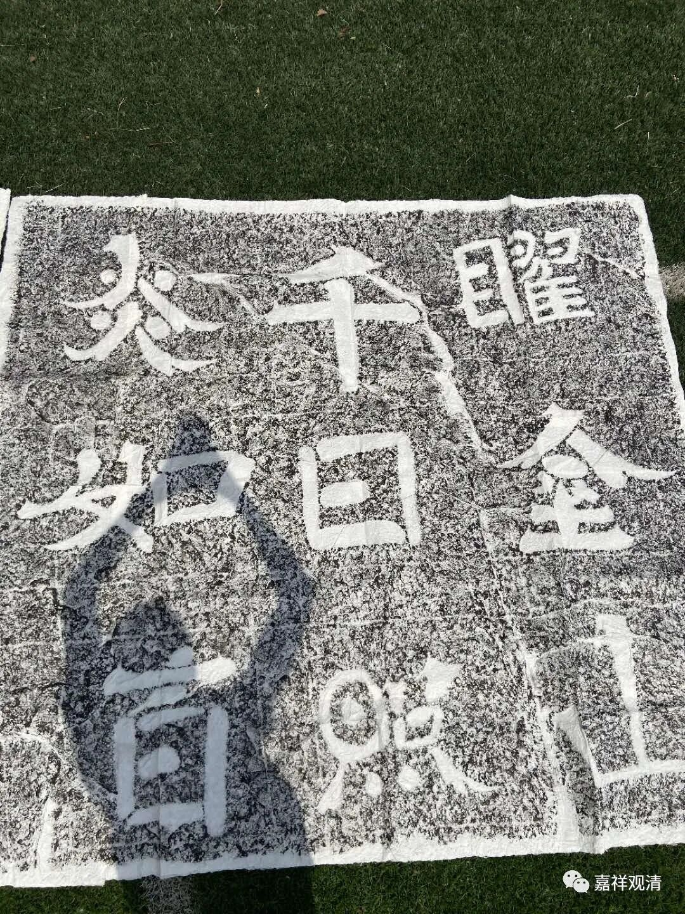

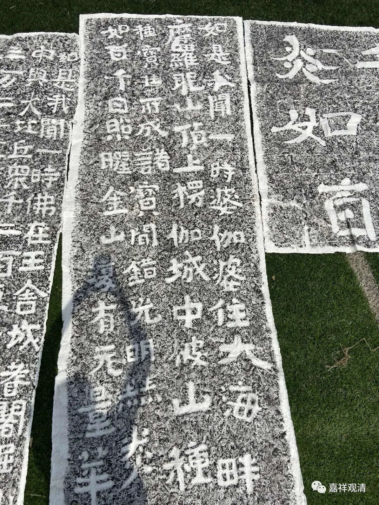

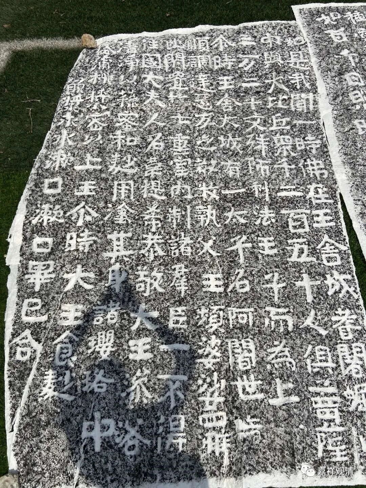

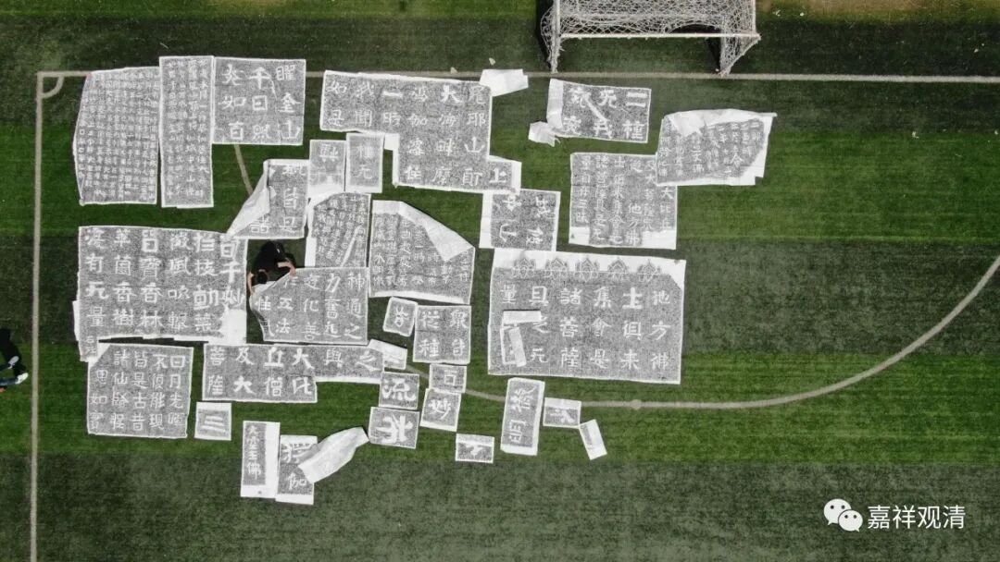

字很大，草地是真实的足球场大小。有点小震撼吧。

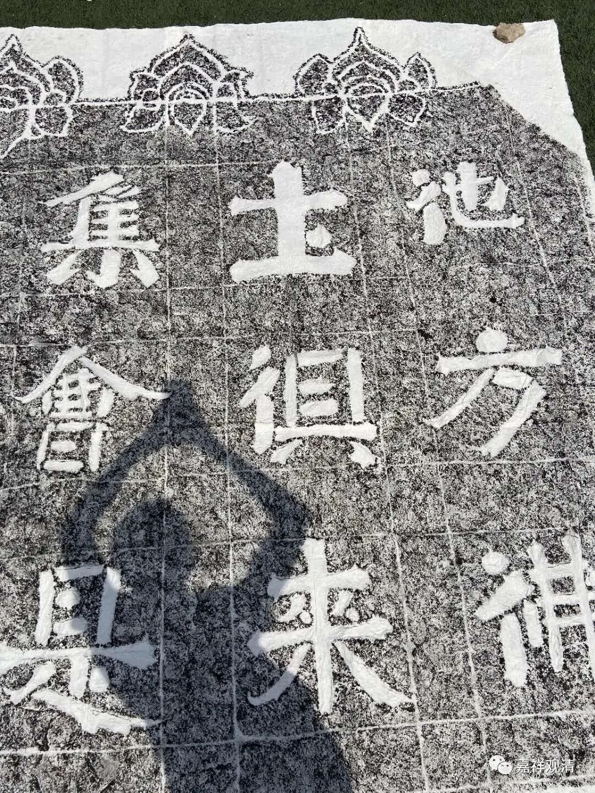

佛教历史上有几次灭佛运动，其中北朝的时候就集中有两次——北魏太武帝灭佛、北周武帝灭佛。

持续来自高层的灭佛运动——勒令僧众还俗、销熔佛像、烧毁经典，这些灭佛行动给当时佛教徒带来了巨大的、负面的“震撼”，僧俗信众们联想到佛教里常说的“末法”思想，于是便想方设法保存经典。

高僧安道壹（应读为僧，安道壹。很多人读破）等就在山东、河北等地开雕了很多摩崖石刻：相比较于纸张之容易焚毁、铜铁便于熔化，摩崖石刻则本身没有什么经济价值（比起铜铁），也相对难以破坏（比起纸张、书籍），所以便在各地做了大量的摩崖石刻。

山东境内，除了上述岗山的摩崖石刻以外，还有铁山的摩崖石刻，河北还有响堂山的石刻（也是安道壹法师的手笔。）

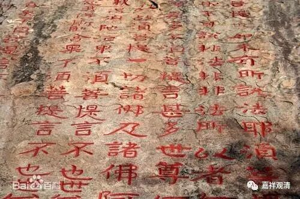

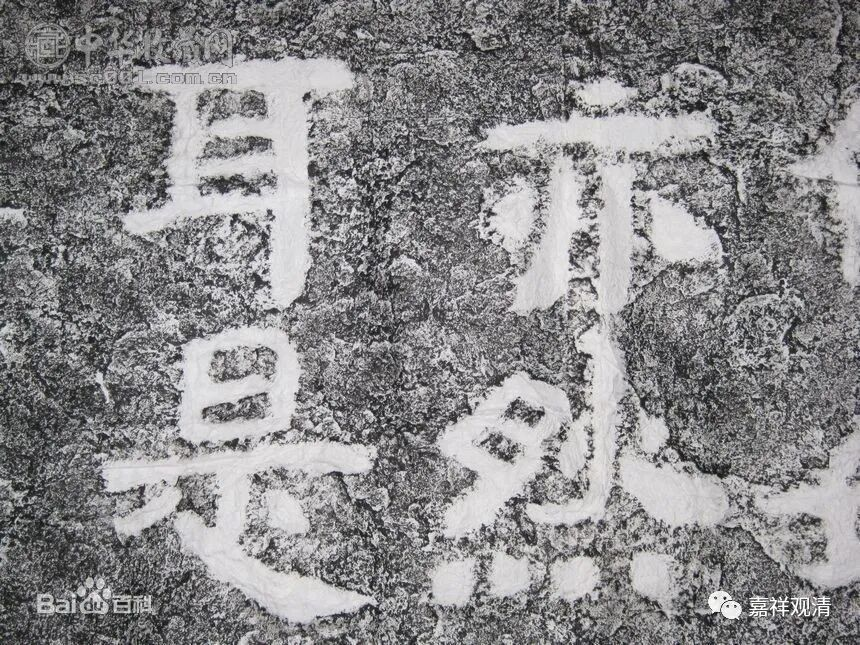

河北响堂山摩崖石刻

我有一副大字的“佛”字摩崖石刻的拓片，忘了是哪里的了。

发现河北响堂山和山东岗山等地都有“大空王佛”的字样。

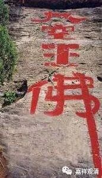

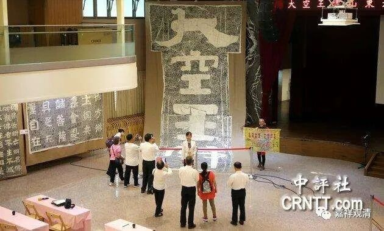

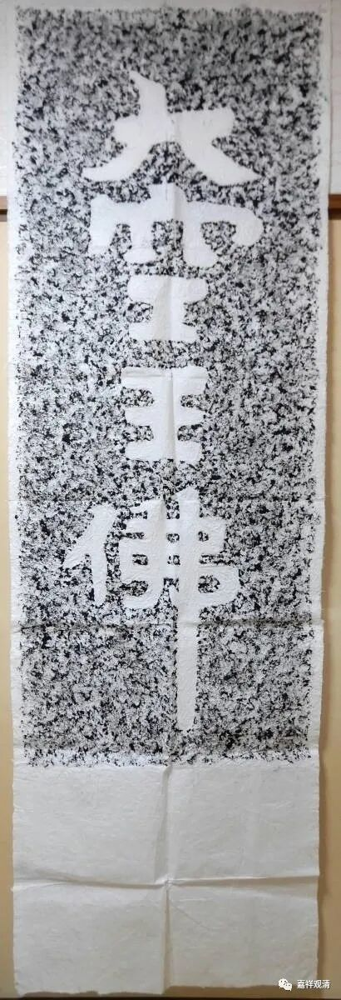

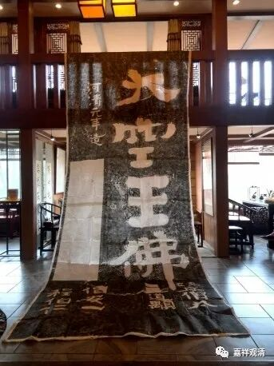

此后，河北房山又有了更大规模、持续时间更久的刊刻石经的“千年工程”，这就是《房山石经》了。去年去了房山“瞻仰”——石经已经重新窖藏，有窗口可以观看排放的情况。

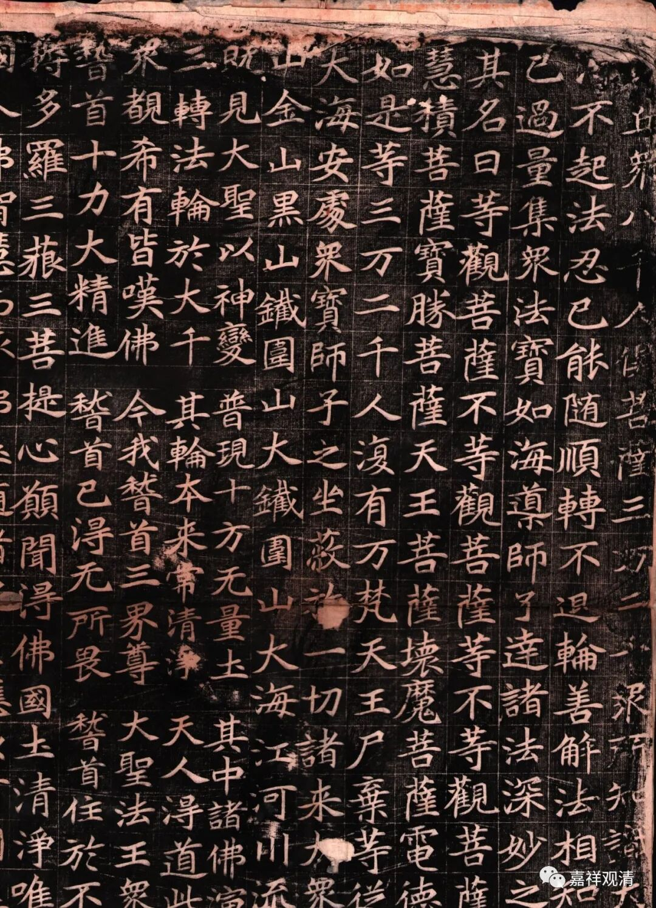

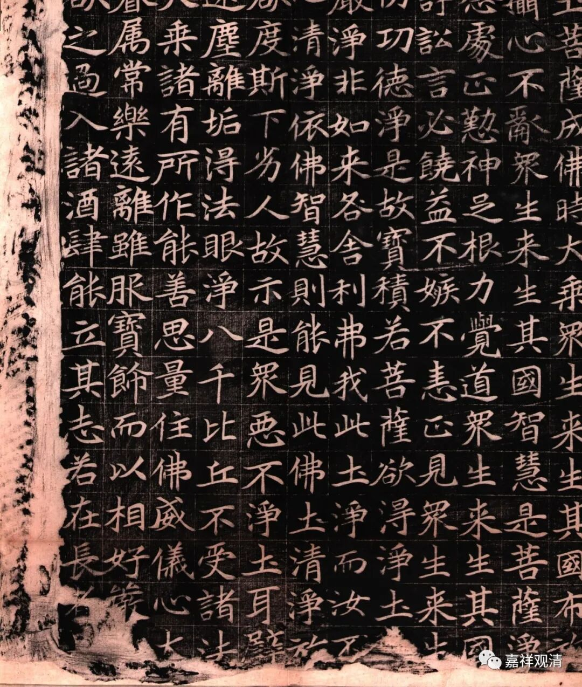

清拓本房山石经

