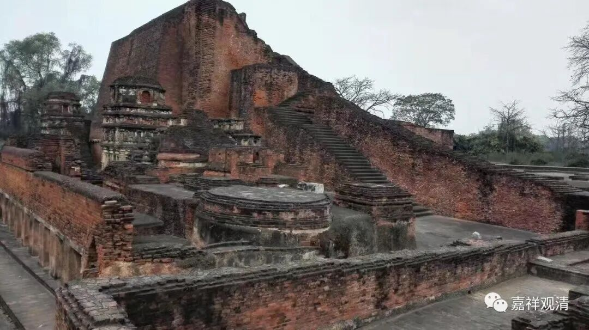

**《微课佛教史》103·2**

玄奘法师也在其中，他是十个人之一嘛，就是通达五十部经论的高僧之一。我们看看玄奘法师收到的供给有多少呢？** “日给瞻步罗果一百二十枚”**，瞻步罗果——不知道是不是我们上次吃到的那个小小的果子，实在是太酸了。但是不管怎么样，一百二十枚啊，一天都不用吃饭了，就算是一百二十个枣好了，每天都给那么多，绝对吃撑了。

** “槟榔子二十颗”**，这个也不少啊，但我没吃过。

** “豆蔻二十颗”**，豆蔻是香料。

** “龙脑香一两”**，龙脑香一两可是不得了啊！这是什么概念？每天啊！真的是什么概念啊！（突然有学习的动力了！）

** “大人米一升”**，也有说是一斗的。大人米，就是去印度的时候我们吃过的很大的那种米。** “其米大于乌豆”**，比一般的豆子还长，而且很香。这个米是唯独供养给国王和这十位大德，只给这些人的。今天我们就有机会了，前段时间我们吃到了。以前是唯独供应给他们的。

然后呢，** “又月给油三升”**，每个月都给油三升。印度人也喜欢吃油炸的……

然后呢，酥油等是想用多少就随便拿！

玄奘法师还有一个净人（居士）和一个婆罗门（高种姓的，有些事情要高种姓的人去安排），供他差使。

玄奘法师自己呢，免除一切僧务——可以不出坡，寺院不派活儿给他。

出有车——出门还有大象乘，我们在电影里也看到了，玄奘法师骑着象。

这什么待遇？顶级白领啊！

以这个待遇挂着，我觉得通达二十部经论、五十部经论的事儿，还是可以拼一拼的！

