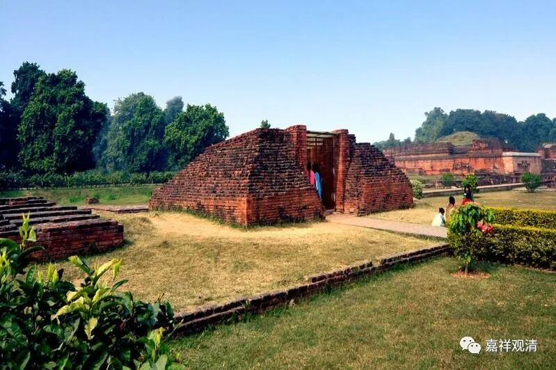
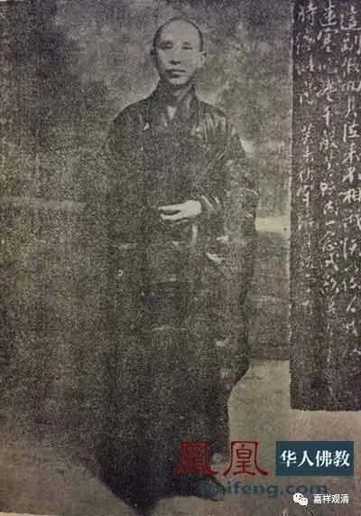

关于中观宗与唯识宗的分流，今天的学者普遍认为：“中观派”、“中（观）宗”的名词源自清辨，此前，龙树、提婆等初期大乘师有“中观”而无“中观派”之称，乃至无著、世亲等也常见注释中观著作（无著有《顺中论》，安慧有《中论释》）。

很有趣的是，差不多半个世纪以前，有一位很老派的法师也已经“孤明先发”地提出相同的说法了。就是解放前和印光法师齐名的守培老法师。

守培法师是当时（江南）佛教界旧势力的代表，面对当时佛教界的新兴势力——支那内学院系统的骤兴，老一辈极其反感，据顾老说，当时在上海，守培法师约战王恩洋，包了大会场，二人辩论某话题，僧俗观战者甚蕃，而以范古农老居士为论辩仲裁——这颇有点像最近特朗普和拜登的辩论会。

我问顾老：胜负云何？顾老说：当时范古老总结的调子是：年轻的王恩洋学问好，守培法师戒律佳……范古老私下评论说：守培法师完全不是对手，哈搅。

代表丛林旧有势力的守培法师对内学院（唯识）一系非常有意见。于是翻阅藏经，悟解非常，写了一篇《空有二宗根本之考究》，提出说：

“**是故余言：龙树不立空宗，无著不立有宗。谓龙树立空宗，则谤龙树；谓无著立有宗，即谤无著……”**

**
**

** “龙树、无著既非空有二宗之主，然则空有二宗从谁而来耶？考印度佛教史云：大乘空有二宗，始于护法、清辨二论师。”**

守培法师的学术能力且不做讨论，但关于中观唯识宗分派的时间点和代表人物却是把握地相当准确的，虽然守培法师此说并非没有来历（好像贤首法藏就曾经提到过），但专门拈出，也不能说是没有所见的。

