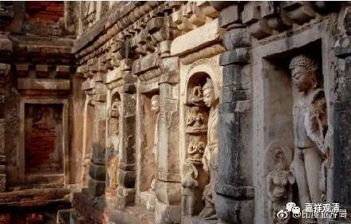

**《微课佛教史》103·3**

在一万个人当中，像玄奘法师这样的人有十个。这种待遇，我觉得放到今天，相当于什么呢？相当于寺院的法师出门，车是劳斯莱斯、林肯，够不够啊？差不多就相当于那个时候的大象啊！

这十个人吃的都是最好的，还有龙脑香的供给，每天要有相当于今天的沉香一两的配给，这个待遇非常好，是国王给的。我们可以想象一下玄奘法师的水平，十个人当中之一啊！那应该是国家科学院院士级别以上了，而且他确实给那烂陀寺挣面子了，有外人来那烂陀寺辩论的时候，他都给顶回去了，甚至把人家的国师都给“干掉”了——此话我们明天再聊，今天我们先聊到这里。

哎呀，当时对知识分子真是尊重啊！知识分子的待遇太好了！今天有没有这样来对我的啊？如果我们对知识分子的尊重可以到达这种程度，估计中国的佛教也能够上得来。

我们也许会觉得佛教的兴盛和经济没有太大关系，我虽然不敢说有太大关系，但可以举一个很有关系的例子：某寺院的中观学一直相对于其他寺院是稍弱的。某大佬深以为恨，遂准备“基金”，单独供养中观学习的法会，令学僧学习中观经论时有专门的时间，而且不用担心经济问题……十几年以后，此学院的中观学水平明显上了档次，其他学院再也不能轻视了。

很多年前我和一个武林高手聊过中国武术的现状。大佬说：“其实很简单，把擂台赛奖金提高到四五百万，一定会有能打的人才出来。现在散打的最高荣誉是全运会冠军，是一个奖杯、一张奖状，不可能出最能打的人才……”我觉得这在大部分行业都能说的通，包括现实的佛学、佛教界。

在历史上来说，超高待遇带来的的一个情况就是——很难长久，持续性不强。其实不仅仅是那烂陀寺，我们在印度看到的其他很多只留下遗址的寺院也是如此，皇家的支持一旦削弱了，这个寺院就不行了，就会掉下来。刚才我们讲的，印度其实很少有大型的王朝，所以这样大量地供给，可能时间长不了。还是那句话，如果那个时代就有好的资产管理，有公益信托就好了。（西方的天主教、基督教在这方面绝对走在宗教界的前面，我们是时候该学一学了，不然放开所有禁忌真“打”起来，佛教必无还手之力。）

玄奘法师比较幸运，他去到那烂陀寺的那个时候正好是印度史上相对来说比较兴盛、比较统一的时代，后来的情况应该就没有那样了，所以那烂陀寺就开始走下坡路了。

好，今天的佛教史先到这里，谢谢大家。

