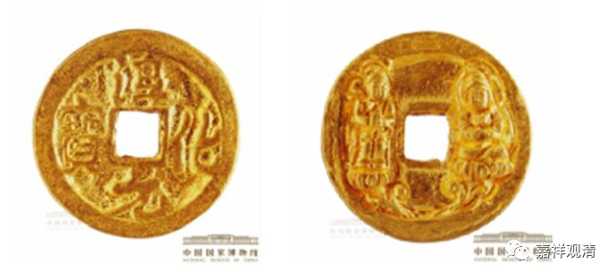
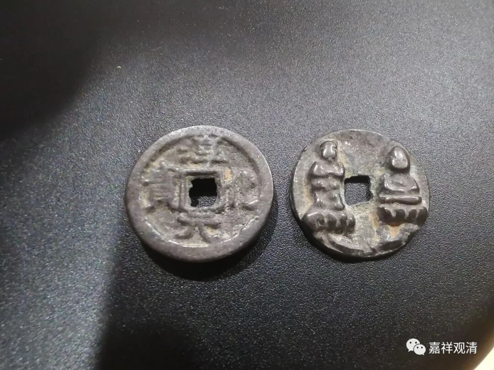
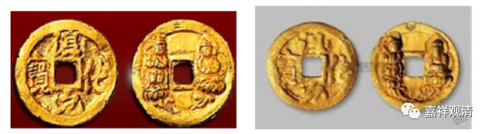
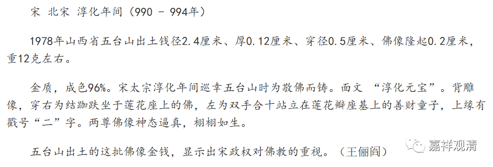
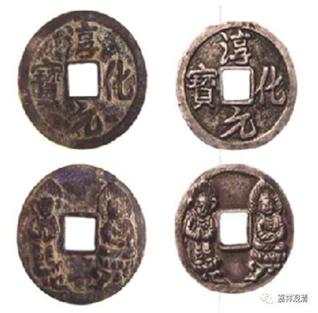
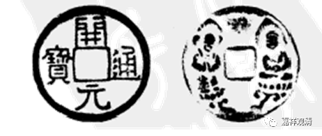
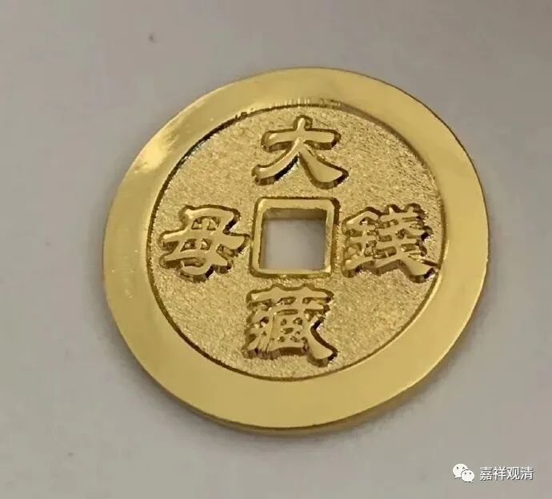

**淳化元宝·礼佛钱和大藏钱母**

从网上买了几枚有趣的“钱”。

正面是“淳化元宝”（淳化，是宋太宗赵光义的年号。），背面是两尊佛像。

网上买来的这几个“淳化元宝”可以断代到上周。（上周铸造，或者是上周发货，或者兼而有之。）

这些“淳化元宝”的原型，是前几年五台山出土的金质的淳化元宝背佛钱，有说，左边立者为文殊菩萨，右侧坐像为毗卢遮那佛。国家博物馆的说明词是这样的——

关于此前背面的佛像，左边有说为文殊菩萨、善财童子、护法天王的，右边有说为大日如来、释迦牟尼的，似乎并无定论。（似乎也很难明确说是哪两位佛菩萨，只是考虑到此钱主要出现在五台山的特殊性质，文殊与毗卢遮那佛的说法可能性略大一些。）

这种淳化元宝背佛钱，也发现有银质的传世。

这就是银质的淳化元宝背佛钱。

后来也发现有铜质的淳化元宝背佛钱，这里说的不是上周出的。

还有一种“开元通宝”也有背佛，形制几乎一样。

这类都可以看作是历史上一种特殊的供养钱，是一种宗教用途、不进入流通领域的私铸的纪念品，类似——

大藏钱母。

我们白云寺要不要也做一点“功德钱”或者“白云钱母”呢？（几百年后给人家挖出来咱白云寺也有点说法不是？……）

** 我觉得可以！**

        修改于