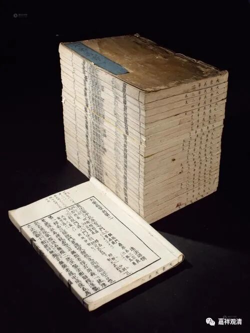

净影慧远建立四宗

依藏地之各种《宗义书》，印度佛教的“宗派建立”有四宗：说一切有部宗、经部宗、中观宗、唯识宗。

汉传在“教分四宗”这一点上几乎和印藏的说法完全一致——大约在中国佛教的南北朝时期，以这四宗为主体的理论辨析已经形成“套路”。不过那时候东土的大师们有自己的名词系统。

净影慧远大师（523年－592年）在《大乘义章》中说：

**“言分宗者，宗别有四：**

** 一、立性宗，亦名因缘。**

** 二、破性宗，亦曰假名。**

** 三、破相宗，亦名不真。**

** 四、显实宗，亦曰真宗。**

** 此四乃是望义名法，经论无名。**

** 经论之中虽无此名，实有此义。四中，前二是其小乘，后二大乘。”**

2013年上海工美拍品《大乘义章》

这里的“立性宗”，就是指的婆沙宗、说一切有部；“破性宗”，就是成实宗，汉传多数断为经部（或者称为经部异师）；“破相宗”，即无自性宗、中观宗；“显实宗”，就是唯识宗、瑜伽行派。

净影慧远大师教承地论师系统，即属于南北朝末期北方的大乘唯识系，所以他对四宗的判教，是大乘优于小乘，唯识胜于中观。所以在四宗里面，他是把唯识宗放在中观宗之后，随顺《深密解脱经》，以“三性三无性”为究竟了义的“性空说”。

《大乘义章》说，此四宗，婆沙通达补特迦罗无我而不立法无我（和《宗义书》基本一致）；经部宗能通达法无我，而仅通达其破析空（此与《宗义书》不同，《宗义书》认为经部不能通达法无我；另外，《成实》的“法无我”是非否仅理解到“破析空”当再观察）；中观通达二无我；唯识则在无我之上显其真实……

汉传后来的说法大致不出此说，所不同者，通常就会再于此四宗之上立“性”门。可是，“性即名无作，不待异法成”啊！

（最上面照片为净影寺。）

