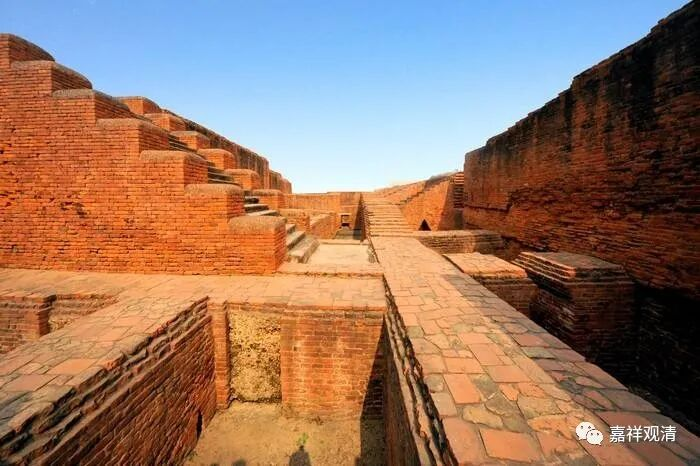
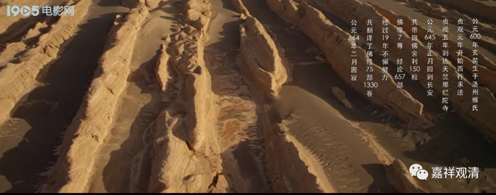
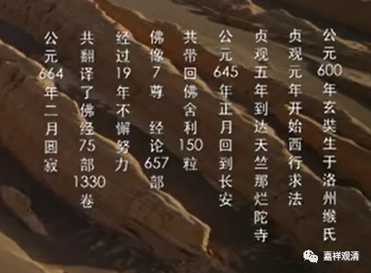

**《微课堂佛教史》104·1**

好，我们继续佛教史。

我找了一张上面的图，这个图是什么呢？是黄晓明版的电影《大唐玄奘》里面摘录出来的，因为当时看到这个就觉得里面有不少错误，正好可以讲一讲。这里面有些是错的，有些是还没有搞清楚的，有些是有几种不同说法的。

玄奘法师出生于哪一年呢？这上面写生于公元600年是吧？关于这个年份的说法很多，公元595年、600年、602年等等都有。玄奘法师西行求法的时间呢，说贞观元年或者二年的好像也都有，然后到达那烂陀寺的时间是贞观五年，这个应该没有很大的区别。公元645年回到长安，这个好像是贞观十九年吧？他这种“夹花”的记载就挺有趣的。

玄奘法师带回中国的佛教经论六百五十七部，这个是对的，差不多这个数字。玄奘法师出去的时候是一个人，回来的时候随从非常多，好像马匹也有二十。我们在前面讲过，他已经成为了当时的民间使节，而且他还和像高昌王这样的国王有点关系。很可惜的是，他和高昌王相约回来以后再见面的，结果后来高昌国出了点内乱，大唐就过去把他给灭了。

玄奘法师翻译了多少部经论呢？这里写的是翻译了七十五部。七十五部这个说法是有的，但是如果说七十五部的话，一般会说是一千三百三十五卷。我以前背出来的说法也是说七十五部、一千三百三十五卷。也有其他的说法，说七十三部或者七十四部的都有。至于说一千三百四十多卷的，就看算不算《大唐西域记》了。其实《大唐西域记》不是玄奘法师自己写的。

玄奘法师于公元664年二月圆寂，这个圆寂的时间是对的。

所以你们看，玄奘法师历史上这么有名的一位人物，关于他的年纪，现在到底有没有定论呢？我也不敢说——就是他到底年纪多大，生于哪一年，现在有好几个说法都不太一样的。中国已经算是对历史很尊重的一个国家了，好像在这件事情上还没有最终的定论，至少还有好多种说法吧。今天到底哪个是定论，可能每个人是以自己师父的说法为定论吧。

