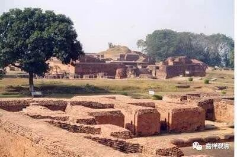

**《微课堂佛教史》104·2**

玄奘法师到了印度以后，他学习了很多部派的经典，在这些学习当中以有部和唯识的内容为主。我们上次也讲了，因为他去印度之前在汉地学习的就是有部和唯识的内容，所以他在印度的学习也是以有部和唯识为主。很可惜的是，玄奘法师虽然在其他一些部派的学习当中也花了很大的精力，但是没有更多的精力去讲解和翻译其他部派的经典，比如说他对大众部和正量部都有很广的涉猎，这里我给大家介绍一下。

玄奘法师到达印度的时候，最初进入印度国界的地方就是迦湿弥罗——克什米尔。克什米尔是有部的重镇，玄奘法师在这里学习了很多有部的经论，首先是《俱舍论》和《顺正理论》。《俱舍论》是世亲论师著作的，而《顺正理论》是众贤论师对《俱舍论》颂文的解释以及对《俱舍论》颂释的一些改正或者批评，是正统的有部经典。

接下去，玄奘法师又在砾迦国学习《百论》，学了一个月。后来呢，又在至那仆底国住了一年多，专门学习《对法论》、《显宗论》和《理门论》。这个《对法论》应该是《集论》和《杂集论》，也可能是《俱舍论》。《显宗论》也是和《俱舍论》是有关的，实际上是《顺正理论》的一个略版。《正理门论》是因明的内容，玄奘法师之前在克什米尔也学习了大量的因明。

然后又学习了《众事分毗婆沙》，还花了差不多四、五个月的时间学习了经部的婆沙。很可惜，经部大的婆沙或者大的阿毗达磨没有翻译过来，当时如果翻译过来就好了，现今的情况就是没有经部的婆沙。接着，玄奘法师又花了三个月的时间学习了《发智论》和有部的一些婆沙的著作。《发智论》是根本说一切有部最核心的论典了。

那么，玄奘法师学习最重要的地方就是在摩揭陀国的那烂陀寺，这个寺院是当时印度的文化中心。玄奘法师在这里待的时间最长，和电影里面一样，他师从戒贤论师，学习什么呢？学习《瑜伽师地论》。玄奘法师总共学了三遍《瑜伽师地论》，还把之前学过的《顺正理论》又学了一遍，《显扬圣教论》学了一遍，《对法》（这个到底《俱舍论》还是《集论》？我怀疑是《集论》）又学了一遍，《因明》、《集量论》、《声明》学了两遍，《中论》和《百论》学了三遍，《俱舍论》、《大毗婆沙论》和“六足论”、阿毗昙等等有部的论著和大家讨论或者学习。还学习了一些当时印度教的《吠陀》等经典。之后又学了一遍《顺正理论》，那么就是三遍《顺正理论》，所以玄奘法师专门把《顺正理论》翻译过来，这是对《俱舍论》批评（有部）的再批评，这是后期根本说一切有部非常重要的论著。

