不动佛印&葛山摩崖石刻

今天又刻完一枚“不动如来”的印。

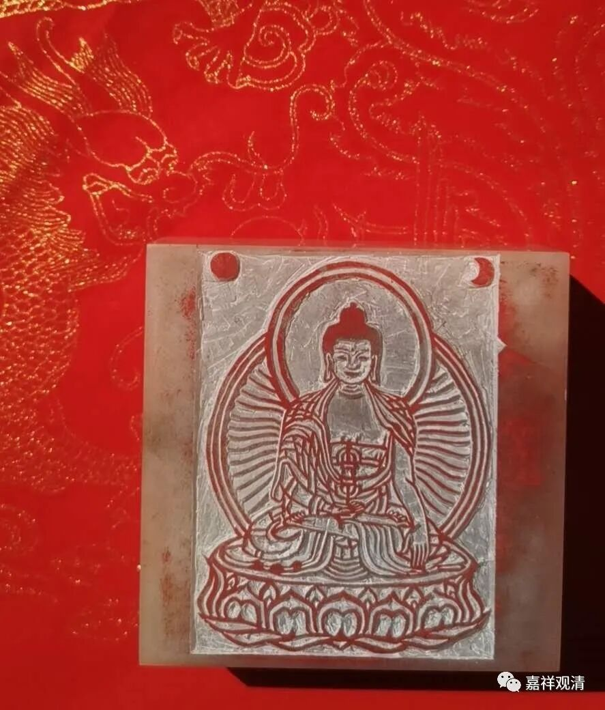

（好像又解锁新功能了，我略略有点小膨胀……）

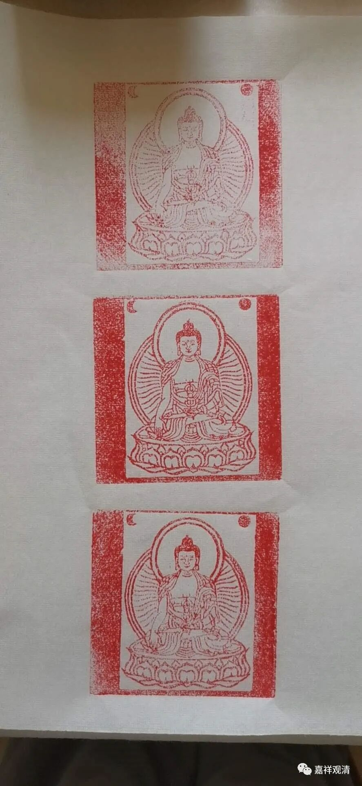

盖的印。

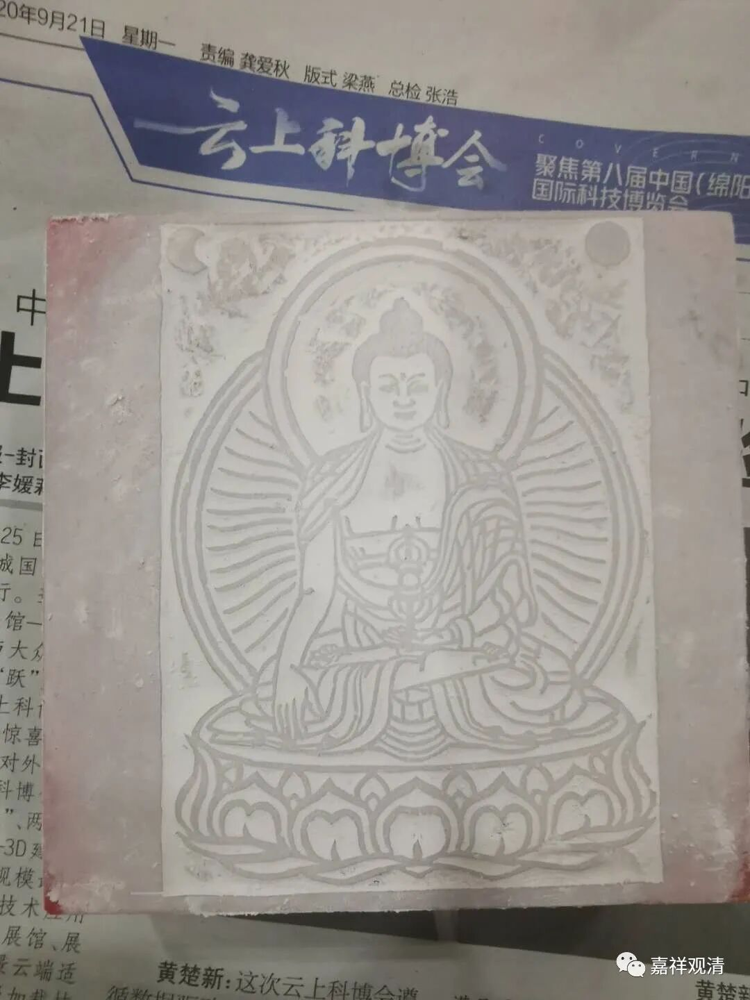

这是前天刻完的不动如来，这是正面的。

不动如来，又称“阿閦佛”，“五方佛”中的东方佛，对应“五智”里的大圆镜智、五蕴中的识蕴。藏经里有《佛说阿閦佛经》。关于不动如来的信仰曾经在汉地很风靡，宋代衙门里往往供有“不动如来”。敦煌也有精美的不动如来像传世。

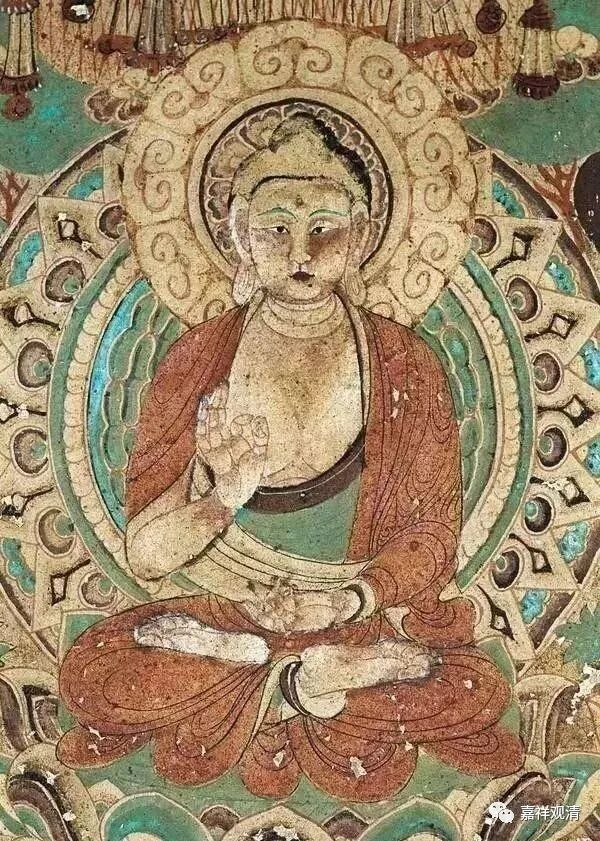

敦煌不动如来像

捺印十万佛像的传统里，最常见的就是以“不动如来”像为模范的。

前几天我们聊到山东邹城岗山的石刻佛经。

离岗山不远，有葛山，葛山也有大型摩崖石刻，内容为《维摩诘经·见阿閦佛品》，此“阿閦佛”，即前面所讲的“不动如来”。

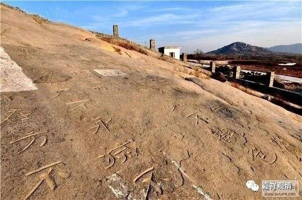

葛山的摩崖石刻《维摩诘经·见阿閦佛品》（有人说是《金刚经》，大概是看到了最后的“如是观”这几个字。）和岗山的摩崖石刻一样，面积很大、字也很大，展览的话，真的需要一个球场（这是一个篮球场）才行。大家上眼——

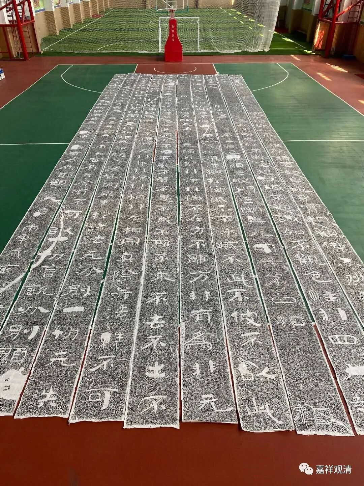

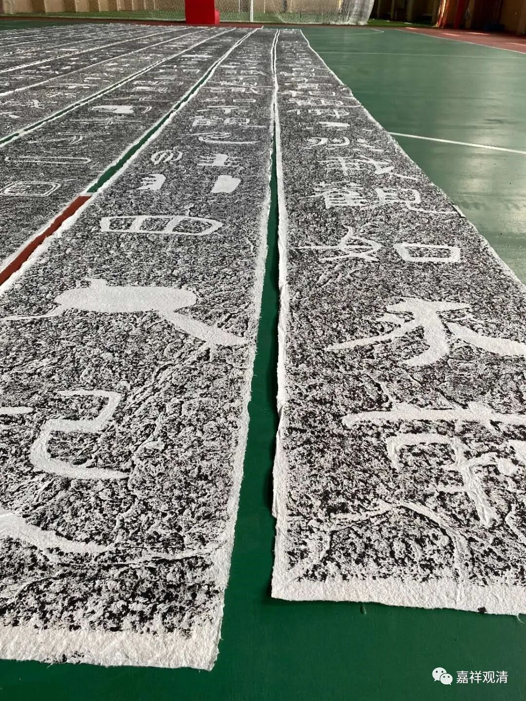

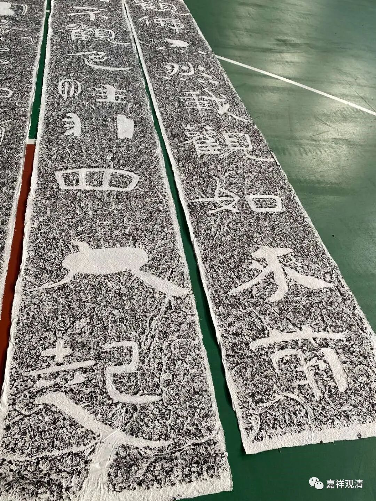

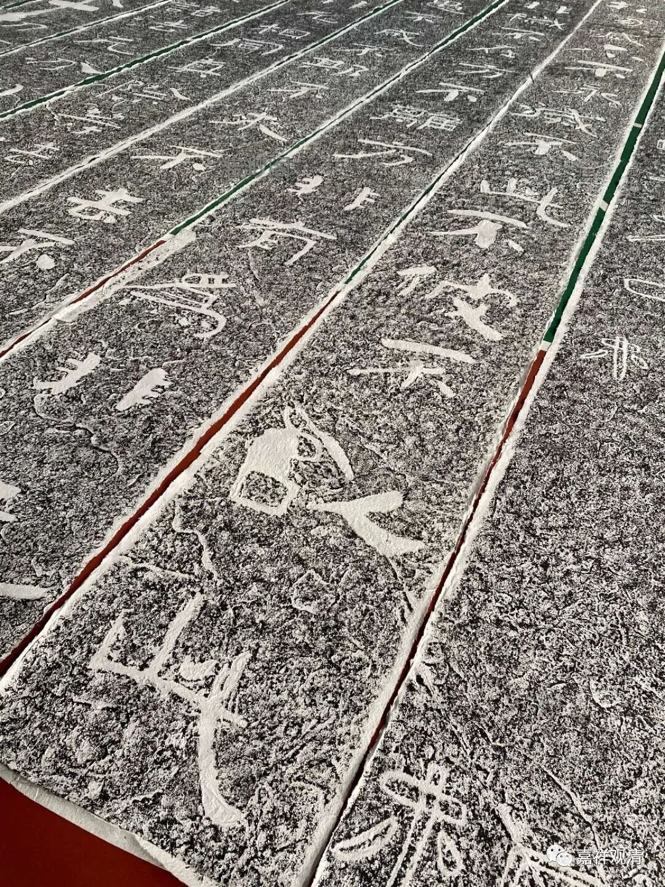

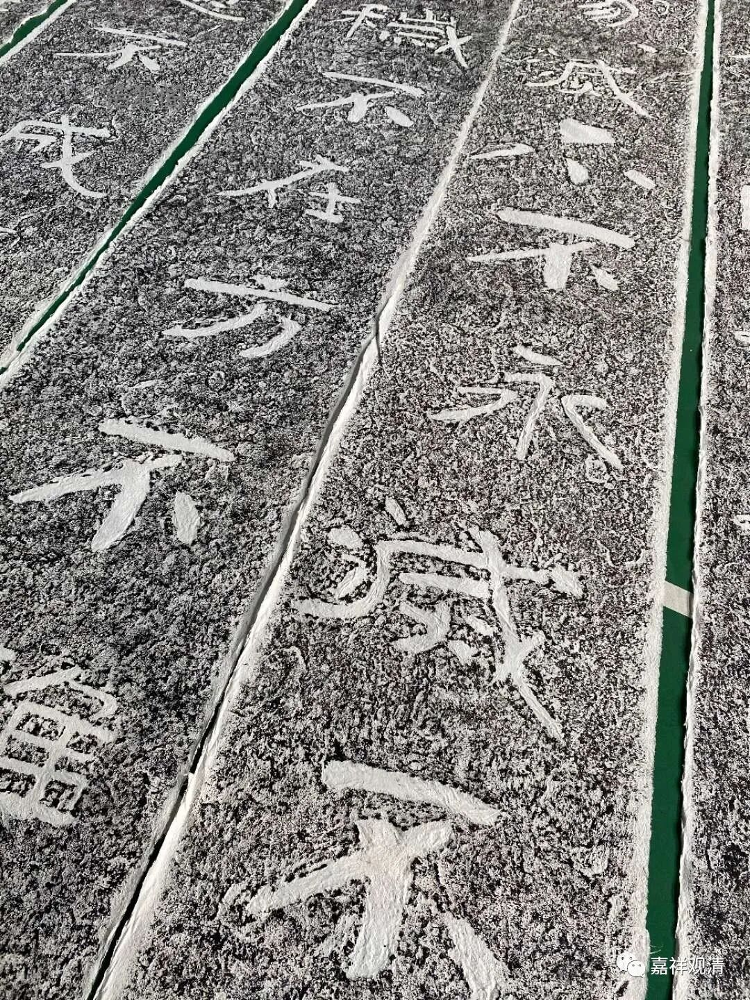

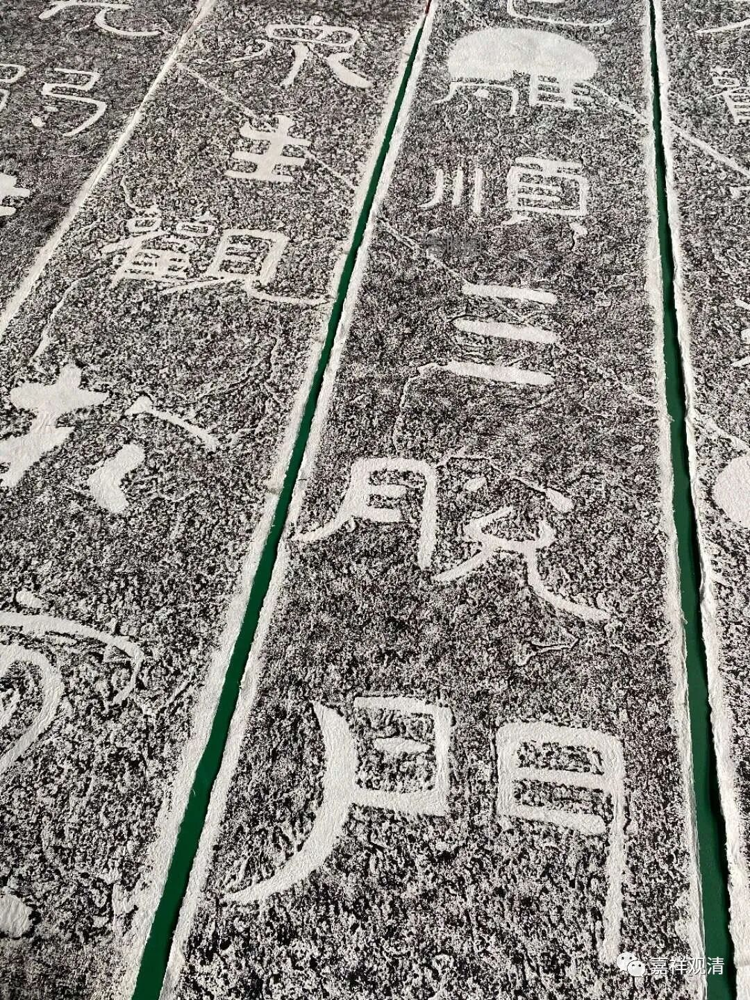

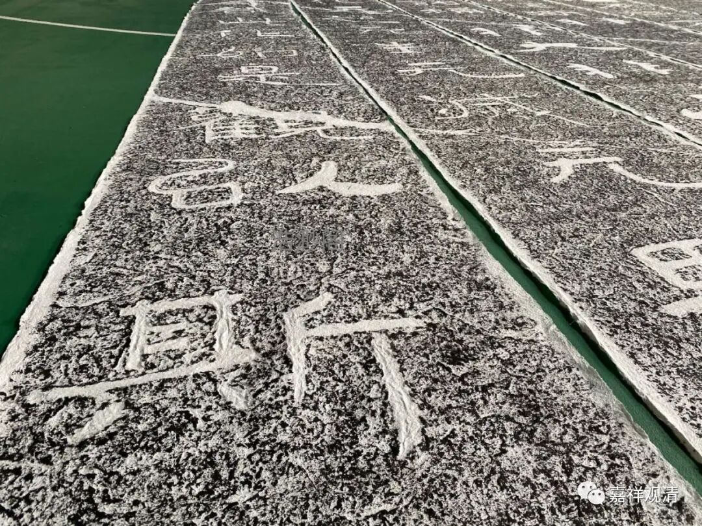

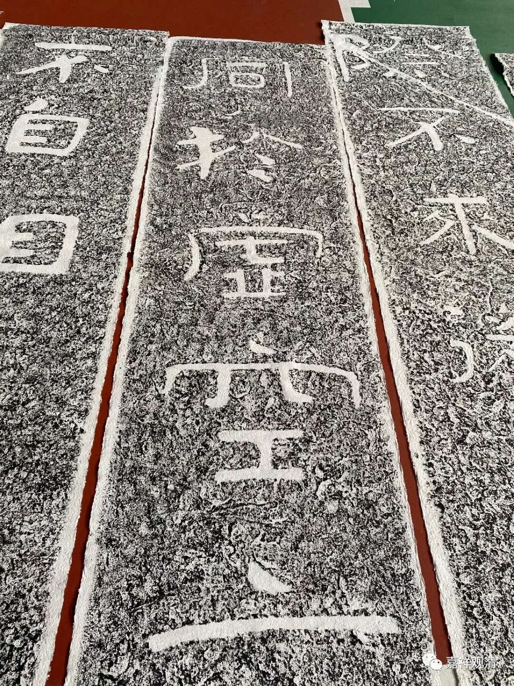

字在隶楷之间。

有朋友要卖给我，十张，每条21米，真的好大一堆，价格也要小几万。

东西不错，但真的不知道怎么展出。

