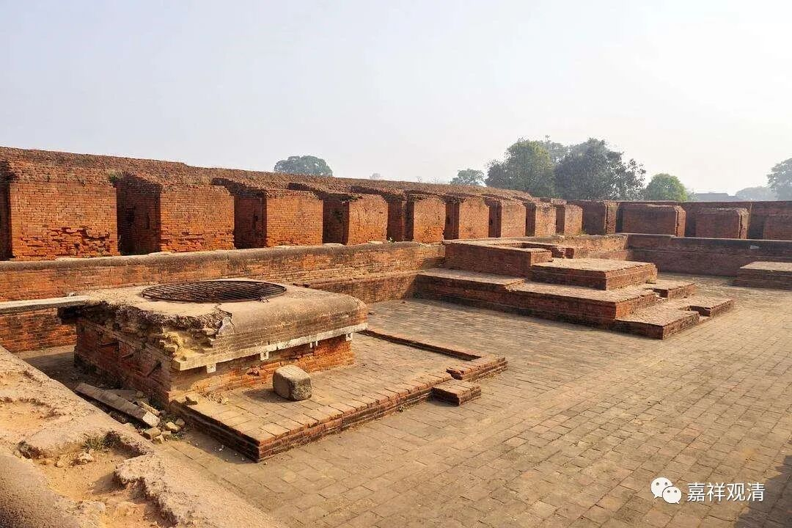

**《微课佛教史》104·3**

同时也很可惜——玄奘法师还有很多可惜的地方（人生总有很多不圆满，其中也包括“大德未完成的著作”），玄奘法师学了好几遍《集量论》的，大概学了有三遍，但是……没有翻译过来。

玄奘法师在印度的时候还有过一次和外道的辩论，当时那个外道已经在很多国家的挑战都赢了，然后到那烂陀寺要挑战，玄奘法师就出去应战。我们前面讲过，玄奘法师是十位通达五十部论的其中之一，他的传记当中说，别人好像不太敢出去或者不太好意思出去，他就出去应战，直接把那个外道给削平了。

根据印度的惯例，辩论输掉了的话是要给别人当奴隶的，于是就给玄奘法师当奴隶。这名外道本来差不多在好几个国家都已经是国师了，是比较有名的。后来又碰到佛教的正量部的人来那烂陀寺挑战，还是没有人敢出去应战，玄奘法师就说：“那我来吧。如果我输了呢，也不丢那烂陀寺的面子，如果赢的话，也是那烂陀寺赢了。”

玄奘法师在之前没怎么学过正量部，那他的正量部的内容是跟谁学的呢？结果是跟刚才讲的那个外道仆人学的，就是他赢了辩论的那个外道。那个仆人说：“我倒是学过一点正量部的东西，但是你跟我学不好意思的，因为我是你的奴隶。”玄奘法师就在房间里把门窗帘子都拉上，两个人悄悄地在那里学习。大家要知道，印度的外道在辩论当中是需要对佛教的内容也非常了解的，这个外道就对正量部比较了解，然后就把正量部的核心内容教给玄奘法师。

玄奘法师学习了以后呢，那场和正量部的辩论没有兴起来，他觉得这个仆人总算是有点帮过忙的，就把他放了，解除了他的奴役。后来这个人外道去了东方的鸠摩罗国——童子国，成为了鸠摩罗国的国师，还给国王介绍了他的主人——玄奘法师，所以那个国王就写信来请玄奘法师过去。在这以后呢，就促成了我们前面讲过的无遮大会的故事。

明天我可能没有时间，那周末我们休息一下吧，礼拜一再说吧。

