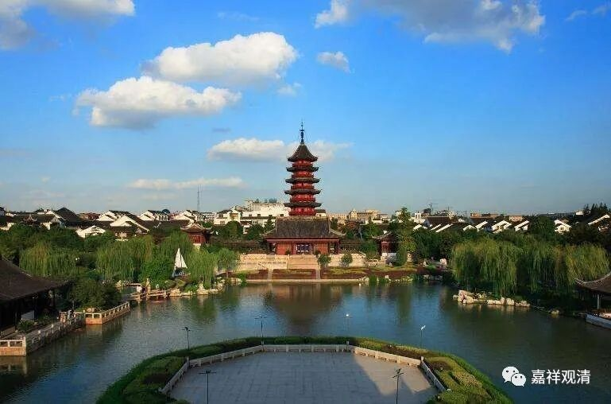
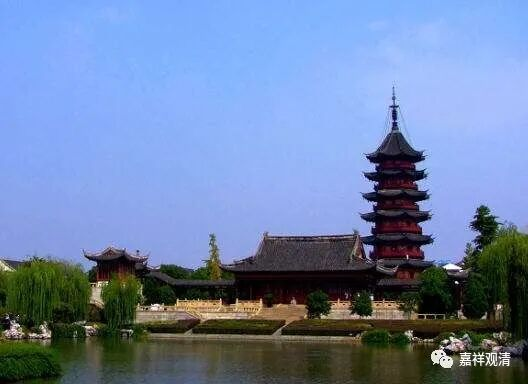
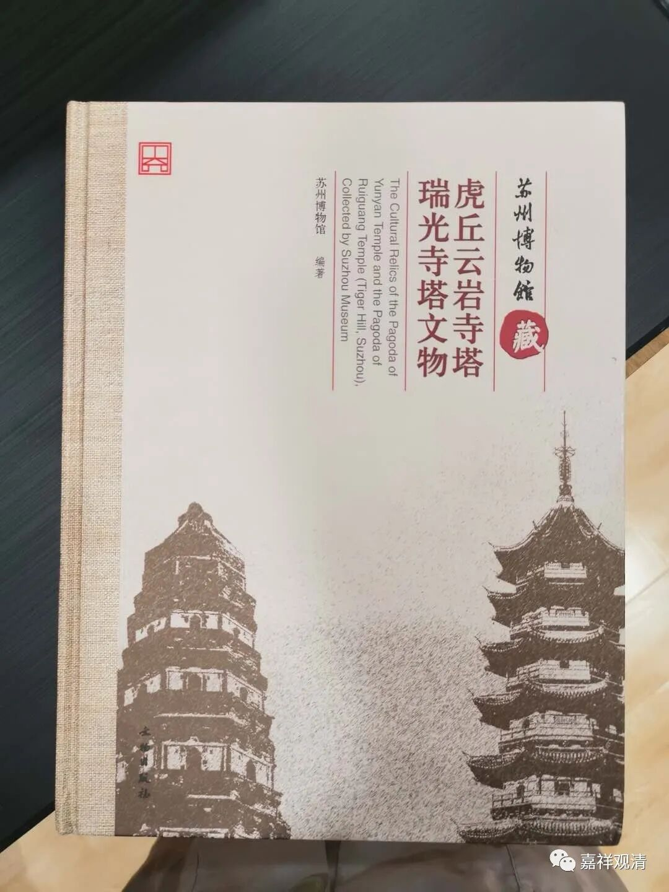
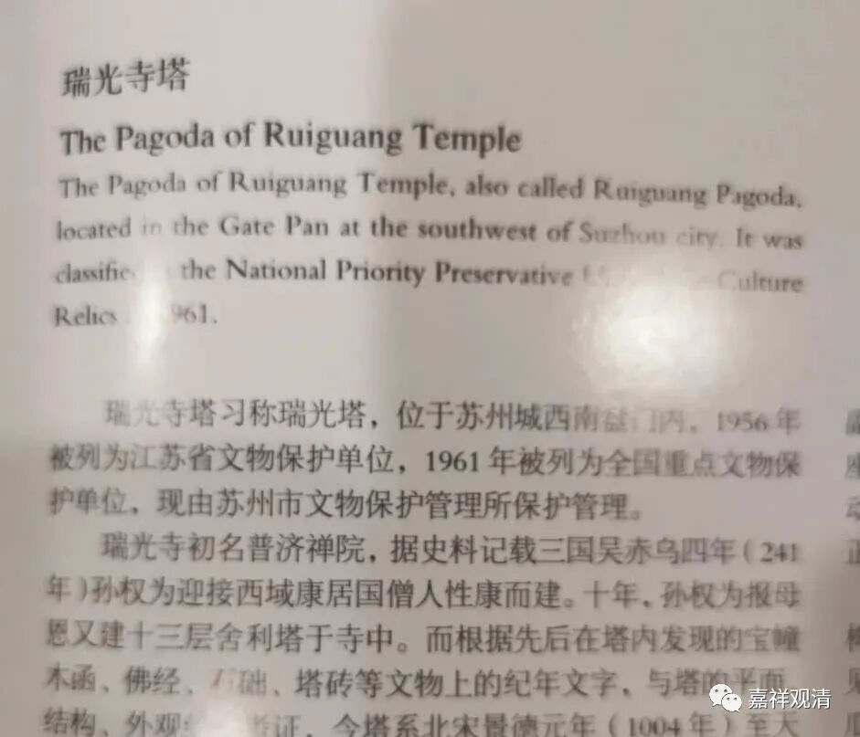

孙权建庙&大师性康

——佛教史料采用别太随便

一、孙权赤乌年间建了多少寺院？

今天的各地方志、寺志史料无聊地追求第一、最早，于是你可以“相信”吴大帝孙权是个建庙狂人！

“静安寺，又称静安古寺，位于上海市静安区，其历史相传最早可追溯至三国孙吴赤乌十年（247年），初名沪渎重玄寺……”

“据传龙华寺是三国时期孙权为其母所建，始建于赤乌三年（公元240年），龙华塔建于赤乌十年……”

“菩提禅寺，位于上海市嘉定区安亭镇，始建于三国东吴赤乌二年（公元239年），孙权为其母吴国太所敕建……”

“北塔报恩寺，是苏州历史最悠久的寺院，距今已有1700多年。始建于三国赤乌年间（238—251年），据史志记载，乃孙权为乳母陈氏所建，始称通玄寺……”

“慈云塔建在江苏省苏州市吴江区震泽镇镇中心偏东，古镇一瑰宝，其历史追溯久远：赤乌三年（公元240年)，在震泽镇东建五级浮屠——慈云塔。”

“大报恩寺位于南京市秦淮区中华门外，是中国历史上最为悠久的佛教寺庙，其前身是东吴赤乌年间（238─250年）建造的建初寺及阿育王塔，是继洛阳白马寺之后中国的第二座寺庙，也是中国南方建立的第一座佛寺……”

此上是我在之前一篇文章里写的江南的“孙权造寺”。如果全都属实，赤乌年间的孙权真的很忙。但是，估计最多只有南京的“建初寺”是确有其事。

二、康僧会和“性康”

今天看书，又看到一个，LOOK——

“瑞光寺，初名普济禅院，据史料记载为三国吴赤乌四年（241年）孙权为迎接西域康居国僧人性康而建。十年，孙权为报母恩又建十三层舍利塔于寺中。”

又是一个赤乌年间孙权为他妈建的寺院。这里还出现了一个我从来没听到过的名字——西域康居国僧人性康。

这里提到的“史料”，有的地方写作“志书”，其实就是《吴都法乘》。《吴都法乘·重修瑞光禪寺記》说：

**“城西南隅盤門之內，吳赤烏間僧性康開山，號普濟院……”**

《吴都法乘·瑞光寺白雲房重修佛亭碑銘》说：

** “若東吳瑞光禪寺，肇建於赤烏之性康”**

《吴都法乘·姑苏志》说：

** “瑞光禪寺，在開元寺南，吳赤烏間，僧性康建，名普濟院……”**

这里《吴都法乘》的“史料”全不可信。此时有康僧会，但查遍僧传也不见有“性康”。

此之“性康”当即“姓康”之误。一般（上面那些寺院）都把赤乌年间孙权建寺缘起系于“康僧会”，作为“康居人”，早期僧传史料习惯上就让他跟国家而“姓康”，“姓康”而“性康”，于是莫名其妙地多出了一个不存在的高僧。

所以，康僧会是有的，“性康”是没有的，而康僧会建的【那么多】寺院，只有佛知道有没有了。

