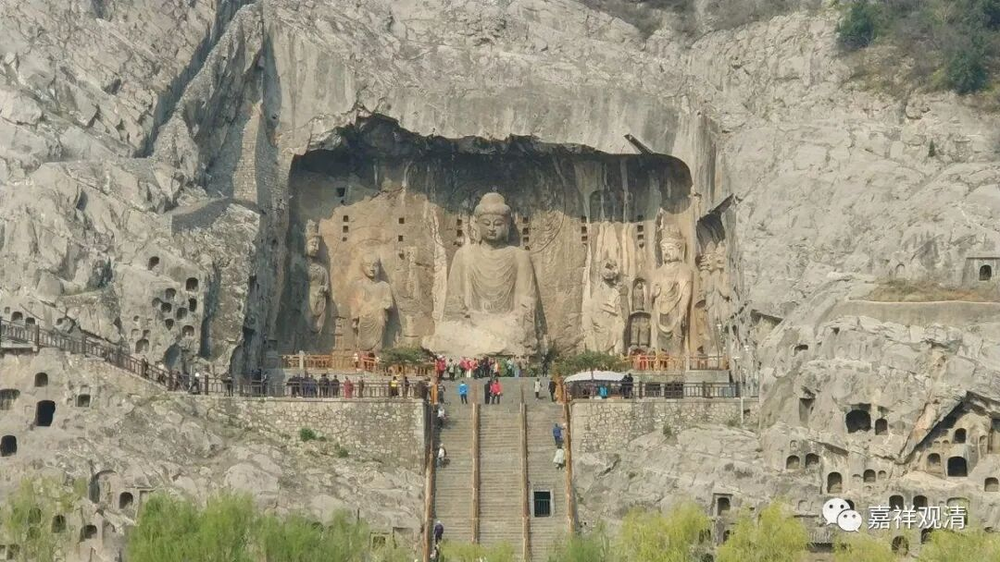

**《微课堂佛教史》105·1**

好，我们继续佛教史，讲玄奘法师的翻译事业。

玄奘法师从印度回来以后，应该是贞观19年，公元645年，从这个时候开始翻译。从公元645年到玄奘法师圆寂的公元664年，这中间有二十年，玄奘法师这二十年基本上都是在翻译，当然其中也有和皇家的交流，包括几方面的交流，其中之一就是大的议事或者大的佛教事件。

其实佛教从印度开始就是这样，需要皇家的支持，我们在印度看到的很多情况都很明显的。那么玄奘法师和印度国王的关系也不错，他也了解这方面的一些情况。

这两天我们也讲过，我在微信推送上也发过一些文章讲述玄奘法师和当时皇家的关系，他和唐太宗李世民的关系很好。李世民在早期的时候还曾经劝玄奘法师还俗，觉得他水平很好。玄奘法师当然不同意，就委婉地拒绝了。后来再碰到唐高宗李治的时候呢（李治的菩萨戒好像是玄奘法师授的吧），相当于他和李治肯定是师父和弟子的关系了。（当然，现在有些人说他们晚期的关系并不是很好，可能也没他们说的那么糟糕。昨天我发的一篇微信推送中就提到了关于佛教在唐代的待遇问题。）

在初唐的时候，玄奘法师也是当朝比较重要的一位人物，但这个时候呢，唐太宗李世民已经颁发了《令道在佛前诏》，已经闹出这么大动静了——杖责一位法师（回寺院以后很快圆寂），又把皇家内道场首座发配（死在路上）……玄奘法师就只能旁敲侧击，不太方便继续去明着处理这个事情，不能继续提出要求了。

等到李世民去世以后，李治上台的时候呢，玄奘法师就利用自己的地位对李治讲，说把你爹的这份诏令取消了吧。但这个事情实际上确实不容易操作的：第一，是人家的亲爹下的诏书，第二呢，李唐至少也要保住一个面子，他们说老子是他们的先人嘛。所以李治就没接这个茬，几次都没接这个茬。一直到武则天当上皇帝的第一天，就发了一个诏书——《令佛在道前》诏，就把这个场子给找回来了，算是中国佛教和道教较量的这一轮就过去了。

起初，李世民是找到和尚委婉地认错了，他说：“今天我们老李家做皇帝所以我让道士排前面（地位高点），啥时候佛家的当权了你们再说了算嘛……”结果武则天是出过家的，她当皇上第一天就“照”李世民的意思把和尚地位提高了。

另外，武则天出家是另有原因的。她原先已经嫁了人（大家都知道她老公是谁），那么，这么出家一下，就相当于把“嫁过人”这个事情抹去了；还俗，就相当于是一个白净的人了（至少当时及一段时间内大家是这么认为的），这样（经过这番“操作”）她就可以名正言顺地再嫁了。也就是说，佛教对她是有恩的。

