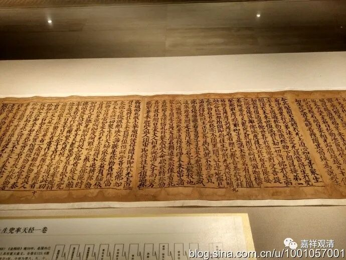
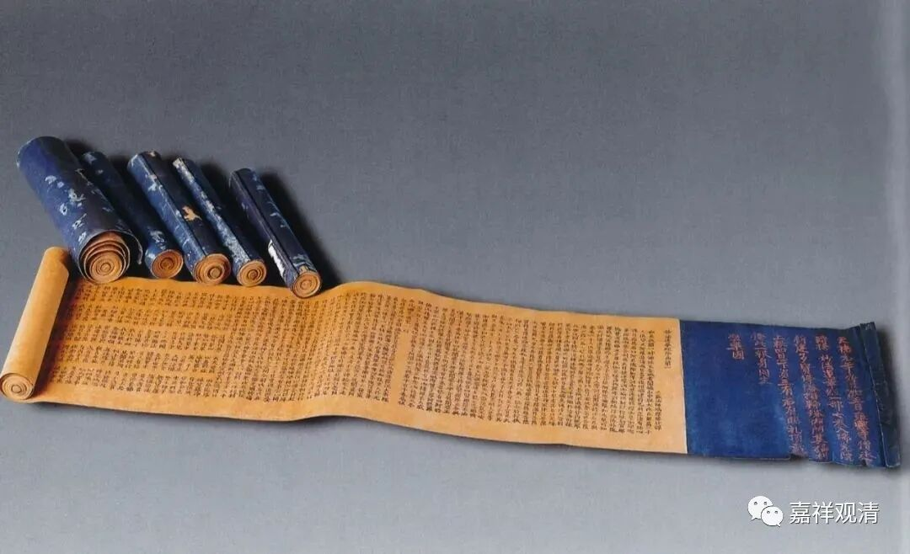
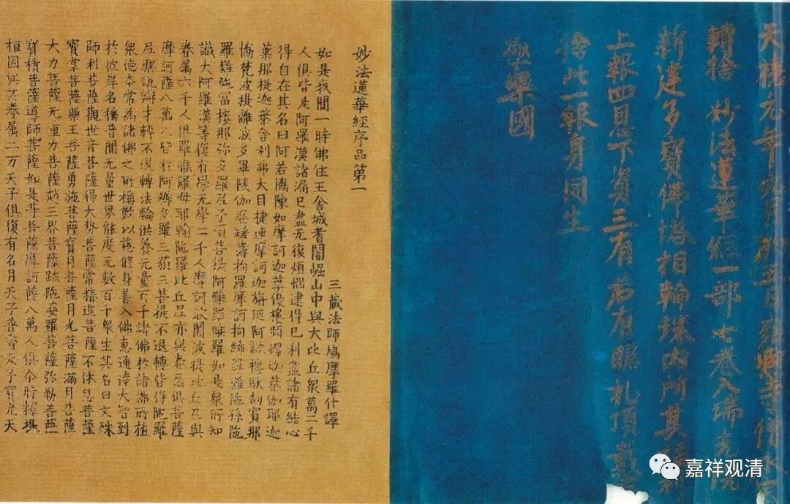
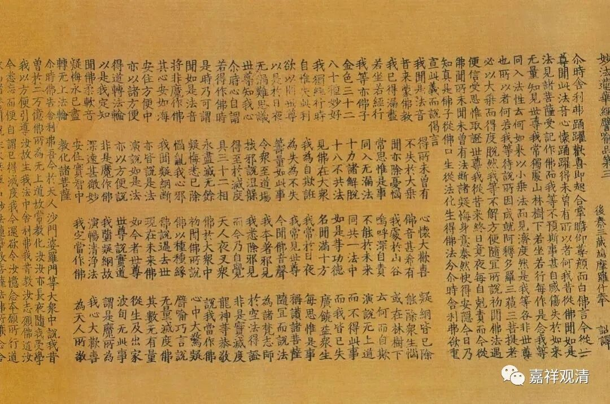
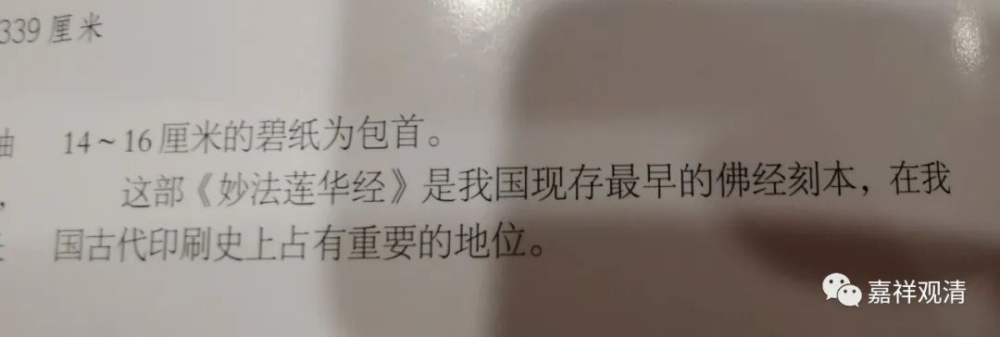
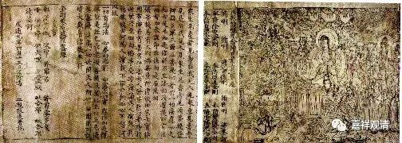
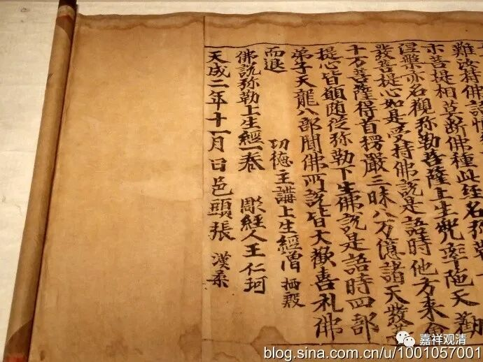
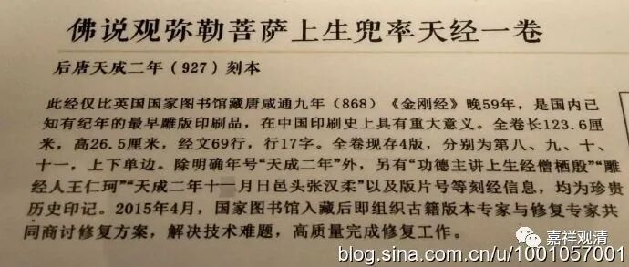
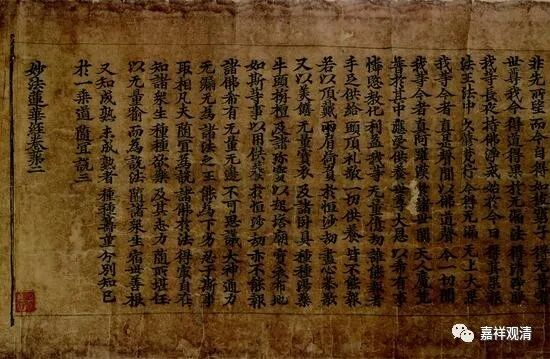

国内现存最早的刻本佛经

继续谈昨天的苏州盘门的瑞光寺。

苏州瑞光寺塔修建整理过程中，发现了很多佛教珍贵文物，今天被收藏、陈列于苏州博物馆。

其中有一件《妙法莲华经》的刻本。

《妙法莲华经》一般为七卷（去年上海博古斋秋拍有一个八卷本的），瑞光寺塔第三层发现的有六卷（卷轴装），缺第六卷（据说“被毁”）。

苏州博物馆出的《苏州博物馆藏虎丘云岩寺塔·瑞光寺塔文物》一书中说：

“这部《妙法莲华经》是**我国现存最早的佛经刻本** ”

这应该是一个失误了。

此部《妙法莲华经》断代为北宋初年（有题记、字体、纤维分析），但在此年代之前，尚有“**我国现存最早的佛经刻本** ”，也有“**目前存世最早的佛经刻本** ”。

**“世界上现存最早的佛经刻本”** 公认为是敦煌出土的咸通九年的《金刚经》

唐·咸通九年（公元868）《金刚般若波罗蜜经》是世界上现存最早且有明确题款纪年的雕版印刷品。出自敦煌藏经洞，现存英国国家图书馆。（稍后我们会推出此件《金刚经》的覆刻版、卷轴装，有兴趣的弟兄们敬请期待。）

另外，还有五代时期后唐天成二年（公元927年）《佛说观弥勒菩萨上生兜率天经》为**国内现存最早、世界第二的现存有纪年的雕版印刷品** 原件。2002年国图入藏。

此外，尚有有晚唐五代刻本的《金刚经》（国图藏），一七年伍伦秋拍的五代刻本《妙法莲华经》都要早于苏州瑞光寺的这一件北宋初年刻本的《妙法莲华经》。

一七年伍伦秋拍的五代刻本《妙法莲华经》

《苏州博物馆藏虎丘云岩寺塔·瑞光寺塔文物》一书出版于2006年，虽说后出的那些文物可以不论，但是中国国家图书馆在2002年入藏的这件天成二年（公元956年）《佛说观弥勒菩萨上生兜率天经》，是不应该缺漏的专业知识。

